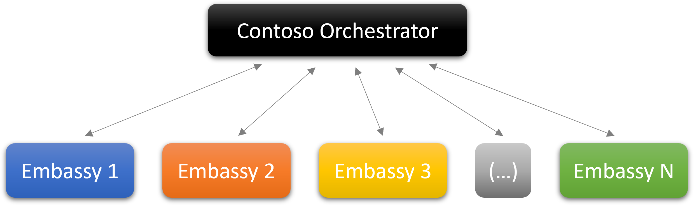

# Proposal for a Federated Learning Solution between Contoso and DataProvider 

## Summary

This document outlines a Federated Learning (FL) solution for data sharing between DataProvider and Contoso. We propose a plan that will enable leveraging DataProvider's data for improving Contoso's model accuracy without compromising any private data. The partnership will utilize DataProvider's data to adapt Contoso's pretrained model to a new domain (healthcare, finance...). Additionally, Contoso plans to fine-tune the service model based on the data that the company provides. Both training settings will utilize FL. In this document we suggest an architecture and implementation guidelines. 

## Motivation

Due to privacy regulations and limitations created due to trust boundaries, not all data used for training Machine Learning (ML) models can be gathered in a central location to train a model on all available data (_e.g._, some highly sensitive user data located in the DataProvider embassies). This constraint makes it hard to leverage the data for training models in classic training techniques. 

An ML technique called Federated Learning (FL) does just that: train the various models locally on the data available in the clients (_a.k.a._ the silos, and in our case _embassies_), then combine the different models on a central server (_a.k.a._ the _orchestrator_) without data ever leaving the embassy. 

## Implementation Proposal

### High-level Architecture Diagram

  

### Definitions

**Embassy**

The embassy is a separate cloud tenant (Azure or other) that stores the provider organization data as well as compute resources that are all managed by DataProvider. Each provider organization has a dedicated embassy with exclusive access.  

In the context of this proposal, the embassy will hold IP separated computing instances and datastores for the purpose of FL. Also, a copy of the model will be imported into each embassy to enable training.  

**Orchestrator**

The orchestrator is a single Azure tenant responsible for executing the pre-processing procedure, fanning out the model weights to the embassies, triggering FL jobs, and aggregating the weights updates. The orchestrator will access storage resources only within the tenant and will not have access to embassies' data. 

In our proposal, the orchestrator will be owned by the Contoso tenant and will manage the FL training using the Azure ML framework.  

### Communications

Between an embassy and the orchestrator, only 2 types of communications will occur: 

- Embassy &rarr; Orchestrator: only transfer model weights and System Metadata (SM). 
- Orchestrator &rarr; Embassy: trigger FL jobs and transfer model weights and SM. 

To ensure that only SM can cross embassy boundaries, code signing and pre-approved subgraphs will be used. This means that to exfiltrate data, one will have to either use a pre-approved subgraph provided by the platform, or to use components that were code-signed (thus putting the burden of verifying the component does not export what it’s not supposed to on the data scientists, who will need to sign their code after peer review). 

Code signing is a way to ensure that: 

- the code hasn’t been tampered with; 
- some constraints were fulfilled to begin with. 

### Guarantees

The following guarantees will be enforced. 

- Only people with the appropriate permissions are allowed to submit FL pipelines.  
- No data besides model weights and SM can cross embassy boundaries. 
- Data reconstruction that could lead to singling out of individual records is made extremely difficult thanks to the FL principles and high volume of training data.

Individuals should be able to access, view, process, and annotate data in the Embassy.

### Resource Landscape

Computer instances and storage accounts will be set up separately in each embassy and secured by a restricted VNET that will allow only privileged access.  

All computing instances within the embassy will be grouped into Kubernetes clusters, which will be attached to an [Azure Arc](https://azure.microsoft.com/en-us/services/azure-arc/) deployed under the Contoso tenant. Azure Arc allows management of different computing clusters in different tenants without compromising the privacy of the instances. The service will trigger jobs through an Azure ML workspace. 

The user content will be accessible only to the embassy’s computing cluster during training and will not leave the embassy. Additionally, the models' updates will be stored in another Azure Data Lake connected to Contoso's Azure Data Factory. The Azure Data Factory will be used to store the model updates and enable the aggregation of models. 

### Job Triggering

- Each embassy will run a dedicated service that listens to the orchestrator signal to start training. 
- After the signal is sent, the model will be pulled to the embassy data lake and training on local data will begin. 
- At the end of each learning round the model updates from each embassy will be aggregated by the orchestrator.  
- This process will repeat till the model is converged, and then it shall be fine-tuned on Contoso tasks. 

The training job orchestration will be managed by the Contoso tenant. The jobs will be triggered in the different embassies using Azure Arc-enabled Kubernetes cluster.
