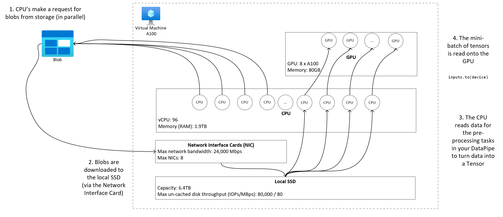

[](https://github.com/Azure/azureml-examples/actions/workflows/smoke.yml)
[](https://github.com/psf/black)
[](LICENSE)
# Efficient data loading for large training workload

One key business objective when training AI models is to ensure the GPU on your compute is fully utilized in order to keep costs as low as possible (no idle compute). Serving training data to the GPU in a performant manner goes a long way to ensure you can fully utilize the GPU. If the serving of data to the GPU is slow relative to the processing of an epoch, then the GPU may idle whilst it waits for the data to arrive.

This document is designed to describe best practice on how to access data in a performant manner under different constraints and workloads when running high scale AI workloads. There are many storage options in Azure and setting up scenarios with customers in a manner that best trades off job success rate with cost is the guiding principle. 

**Table of contents**

<!-- TOC -->

- [Efficient data loading for large training workload](#efficient-data-loading-for-large-training-workload)
    - [How can model training performance be impacted by data loading?](#how-can-model-training-performance-be-impacted-by-data-loading)
    - [📐 Planning](#-planning)
        - [Co-locate your storage and compute](#co-locate-your-storage-and-compute)
        - [Estimate your neural network size](#estimate-your-neural-network-size)
        - [Storage choice](#storage-choice)
        - [Calculate your anticipated storage load](#calculate-your-anticipated-storage-load)
            - [Calculate bandwidth limits](#calculate-bandwidth-limits)
        - [Scaling across multiple storage accounts](#scaling-across-multiple-storage-accounts)
        - [Ensure files on storage are ***at least*** 4MB larger is better](#ensure-files-on-storage-are-at-least-4mb-larger-is-better)
        - [Decide whether to separate pre-processing from training](#decide-whether-to-separate-pre-processing-from-training)
        - [Plan to use the AzureML data capabilities](#plan-to-use-the-azureml-data-capabilities)
    - [🎓 Learn Mount vs Download](#-learn-mount-vs-download)
        - [Download](#download)
            - [When to use download](#when-to-use-download)
            - [Download settings to tweak](#download-settings-to-tweak)
            - [Download performance metrics](#download-performance-metrics)
        - [Mount](#mount)
            - [When to use Mount](#when-to-use-mount)
            - [Mount settings to tweak](#mount-settings-to-tweak)
            - [Block-based open mode default](#block-based-open-mode-default)
                - [When to use block-based open mode default](#when-to-use-block-based-open-mode-default)
            - [Whole file cache open mode](#whole-file-cache-open-mode)
                - [When to use it](#when-to-use-it)
                - [Usage](#usage)
            - [Mount: Listing files](#mount-listing-files)
    - [🚅 Optimum mount settings for common scenarios](#-optimum-mount-settings-for-common-scenarios)
        - [Reading large file sequentially one time processing lines in csv file](#reading-large-file-sequentially-one-time-processing-lines-in-csv-file)
        - [Reading large file one time from multiple threads processing partitioned csv file in multiple threads](#reading-large-file-one-time-from-multiple-threads-processing-partitioned-csv-file-in-multiple-threads)
        - [Reading millions of small files images from multiple threads one time single epoch training on images](#reading-millions-of-small-files-images-from-multiple-threads-one-time-single-epoch-training-on-images)
        - [Reading millions of small files images from multiple threads multiple times multiple epochs training on images](#reading-millions-of-small-files-images-from-multiple-threads-multiple-times-multiple-epochs-training-on-images)
        - [Reading large file with random seeks like serving file database from mounted folder](#reading-large-file-with-random-seeks-like-serving-file-database-from-mounted-folder)

<!-- /TOC -->

## How can model training performance be impacted by data loading?

To help understand the different data access factors at play in AI training, we will use the following example. 

Imagine you have define the following PyTorch DataPipe that reads data from a remote blob store and does some additional processing (e.g. uncompress, process data into a tensor). 

```python
from torchdata.datapipes.iter import IterableWrapper

dp = IterableWrapper(iterable=["azureml://"]) \
    .open_files_by_fsspec(mode='rb') \
    .load_from_tar() \
    .filter(is_data_file) \
    .map(unpickle) \
    .read_cifar(labels_key="labels")
```

The DataPipe is passed into a `DataLoader`:

```python
dl = DataLoader(dataset=dp, batch_size=5, num_workers=32, prefetch_factor=10)
```

The `DataLoader` sets:

- `batch_size`: How many samples per batch to load.
- `num_workers`: How many subprocesses to use for data loading.
- `prefetch_factor`: The number of batches loaded in advance by each worker (for example, if this is set to `10` then a total of `2 * num_workers` batches is prefetched).

When the epoch is executed using:

```python
device = torch.device("cuda:0")

for epoch in range(2000):  # loop over the dataset multiple times

    running_loss = 0.0
    for i, data in enumerate(dl):
        # get the inputs; data is a tuple of [inputs, labels]
        inputs, labels = data
        inputs, labels = inputs.to(device), labels.to(device)
```

The DataLoader will (concurrently):

- fetch the data from the remote store and pre-processes the data into a tensor for the current batch *and* 
- pre-fetch and pre-process the next 320 batches (`10 * 32`) as a background task on the CPU.

The data is cached on the local disk (SSD) so that subsequent epochs do not need to fetch from remote blob storage.

This high-level diagram shows how your data sitting in a blob account is processed into a tensor on your GPU machine (we show the key hardware of an [NDm A100 v4 VM](https://learn.microsoft.com/en-us/azure/virtual-machines/ndm-a100-v4-series)): 



The diagram shows there a several factors related to data that can influence how quickly you can train your model, including:

- Storage Choice
- VM Choice 
- Neural Network Size
- File Size
- Data location
- Efficiency of client code accessing storage

## 📐 Planning

At the beginning of your project, you'll need to make a few design decisions to ensure that you do not hit any unnecessary bottlenecks during training.

### Co-locate your storage and compute

It is important that your storage location is in the *same region* as your compute. If your storage and compute are in different regions, your costs will increase significantly and performance will degrade. 

If your data is stored in a different region to your Azure ML Workspace, then we recommend copying the data to a storage account in the same region using the [azcopy](https://learn.microsoft.com/azure/storage/common/storage-ref-azcopy) utility. AzCopy uses server-to-server APIs, so data is copied directly between storage servers. These copy operations don't use the network bandwidth of your computer. You can increase the throughput of these operations by setting the value of the `AZCOPY_CONCURRENCY_VALUE` environment variable. To learn more, see [Increase Concurrency](https://learn.microsoft.com/azure/storage/common/storage-use-azcopy-optimize#increase-concurrency).

### Estimate your neural network size

The *size* of the neural network (number of parameters) will impact the GPU utilisation. If the network is *small* then the *tensor processing time* (time taken to forward and backpropagate) is fast. If this tensor processing time is faster than the time taken to fetch and pre-process the next batches of data, the GPU will be *starved of data* leading to under utilisation. 

If your neural network size is small, and the data can fit on a single node, then we recommend using the `download` mode in your job:

```yaml
$schema: https://azuremlschemas.azureedge.net/latest/commandJob.schema.json
command: python train.py --data ${{inputs.data}}
environment:
  image: library/python:latest
compute: azureml:gpu-cluster
inputs:
  data:
    paths: azureml://datastores/workspaceblob/paths/my_data
    type: uri_folder
    mode: download
```

See [Mount vs Download](#🎓-learn-mount-vs-download) for more details.


### Storage choice

Azure ML offers two options for storage:

| Storage | Scenario |
|---------|----------|
|Azure Blob - Standard (HDD)| Recommended when your data is larger blobs of data - images, video, etc |
|Azure Blob - Premium (SSD) | Recommended for scenarios with high transaction rates or that use smaller objects or require consistently low storage latency |

We recommend standard storage for most scenarios *except* if you have many small files (KB magnitude) and cannot make those files 'fewer and larger' (by compressing batches into a `tar` file). In the case of 'many small files' we would recommend using *premium storage* since the [cost of storage](https://azure.microsoft.com/pricing/details/storage/blobs/) is less expensive than the [costs of running GPU compute](https://azure.microsoft.com/en-us/pricing/details/machine-learning/).

> We have not found any training performance improvements can be gained from using other storage products (for example, Lustre) over standard Azure Blob storage. This advice may change in the future with new technologies, but for now we recommend using Azure storage.

### Calculate your anticipated storage load

If you are planning on using many GPU nodes in a cluster, then a single storage account can start to become throttled once the data is accessed by multiple compute nodes at the same time. In this section we show you the calculations to understand if throttling will be an issue in your workload and how to approach reducing throttling.

#### Calculate bandwidth limits
An Azure Storage account has a *default* egress limit of 120Gbit/s. Different VM sizes, have different expected network bandwidths which impacts the theoretical number of compute nodes it takes to hit the maximum *default* egress capacity of storage:

|Size |	GPU Card|	vCPU	 | Memory: GiB	| Temp storage (SSD) GiB|	Number of GPU Cards |	GPU memory: GiB	|Expected network bandwidth (Git/s)|	Storage Account Egress Default Max (Gbit/s)* |	Number of Nodes to hit default egress capacity |
|----|----|----|----|----|----|----|----|----|----|
|Standard_ND96asr_v4|	A100|	96|	900|	6000|	8	|40	| 24| 	120|	5|
|Standard_ND96amsr_A100_v4|	A100|	96	|1900	|6400	|8	|80|	 24| 	120|	5|
|Standard_NC6s_v3|	V100|	6	|112|	736	|1	|16|	 24| 	120|	5|
|Standard_NC12s_v3|	V100|	12	|224	|1474	|2	|32	| 24 	|120|	5|
|Standard_NC24s_v3|	V100|	24|	448|	2948|	4|	64	 |24 |	120|	5|
|Standard_NC24rs_v3|	V100|	24|	448|	2948|	4|	64|	 24| 	120|	5|
|Standard_NC4as_T4_v3|	T4|	4	|28	|180|	1	|16|	 8| 	120|	15|
|Standard_NC8as_T4_v3|	T4|	8|	56|	360	|1	|16	 |8 |	120|	15|
|Standard_NC16as_T4_v3|	T4|	16	|110	|360	|1	|16	| 8 |	120|	15|
|Standard_NC64as_T4_v3|	T4|	64	|440	|2880	|4	|64	 |32 	|120|	3|


Both the A100/V100 SKUs have a maximum network bandwidth per node of 24Gbit/s. So, if each node reading data from a single account is able to read close to the theoretical maximum of 24Gbit/s it would take 5 nodes to hit egress capacity. Using 6 compute nodes or more would start to degrade data throughput across all nodes.

If your workload requires more than 6 nodes of A100/V100 and you intend to maximize the egress capacity of storage you have two options:

1. Contact support (via the Azure Portal) and request to increase the storage egress limit.
1. Spread your data across more storage accounts and spreading access from nodes across them to maintain maximum throughput. See [Scaling Storage Accounts](#scaling-storage-accounts) for more informtion.

### Scaling across multiple storage accounts

If you anticipate exceeding the maximum egress capacity of storage and/or hitting the request rate limits, then we recommend you contact support *first* to increase these limits on the storage account. This is the simplest approach.

If you cannot increase the maxiumum egress capacity or request rate limit, then you should consider using multiple storage accounts. There are two main approaches:

1. **Replicate the data to multiple accounts and access different ones from each node.** Copy the Data to multiple accounts using ADF, Azure Storage Explorer, or `azcopy` and *mount* all the accounts in your training job. Only the data accessed on a mount is downloaded, so your training code can read the `RANK` from the environment variable and use this in combination with `WORLD_SIZE` to pick which of the multiple input mounts to read from. Your job definition passes in a *list* of storage accounts:
    ```yaml
    $schema: https://azuremlschemas.azureedge.net/latest/commandJob.schema.json
    code: src
    command: >-
      python train.py 
      --epochs ${{inputs.epochs}}
      --learning-rate ${{inputs.learning_rate}}
      --data ${{inputs.cifar_storage1}}, ${{inputs.cifar_storage2}}
    inputs:
      epochs: 1
      learning_rate: 0.2
      cifar_storage1: 
        type: uri_folder
        path: azureml://datastores/storage1/paths/cifar
      cifar_storage2: 
        type: uri_folder
        path: azureml://datastores/storage2/paths/cifar
    environment: azureml:AzureML-pytorch-1.9-ubuntu18.04-py37-cuda11-gpu@latest
    compute: azureml:gpu-cluster
    distribution:
      type: pytorch 
      process_count_per_instance: 1
    resources:
      instance_count: 2
    display_name: pytorch-cifar-distributed-example
    experiment_name: pytorch-cifar-distributed-example
    description: Train a basic convolutional neural network (CNN) with PyTorch on the CIFAR-10 dataset, distributed via PyTorch.
    ```
    Your training python code can then use `RANK` to get the storage account specific to that node:
    ```python
    import argparse
    import os

    parser = argparse.ArgumentParser()
    parser.add_argument('--data', nargs='+')
    args = parser.parse_args()

    world_size = int(os.environ["WORLD_SIZE"])
    rank = int(os.environ["RANK"])
    local_rank = int(os.environ["LOCAL_RANK"])

    data_path_for_this_rank = args.data[rank]
    ``` 

1. **Stripe data across multiple accounts so that each piece of data only exists on one account.** A job that needs to access all data will therefore spread load across the accounts.

### Ensure files on storage are ***at least*** 4MB (larger is better)

Reading files from storage involves making requests for each file, the number of requests per file varies based on a files size and the settings of the software doing file reading.

Usually, files will be read in 'chunks' 1-4MB in size. Files smaller than a 'chunk' are read with a single request (GET file.jpg 0-4MB) and files larger than a 'chunk' will have one request made per 'chunk' (GET file.jpg 0-4MB, GET file.jpg 4-8MB).

Given the above, having (say) 2 million 500KB files means 2 million requests to storage (at least). This is signficantly more than the 256,000 requests needed to read 1,000 files each 1GB in size with a 'chunk' size of 4MB.

- We recommend archiving (zip/tar) small files together so they are stored as a larger file that can be read in multiple chunks. These larger archived files can be opened on compute and the smaller files extracted using [PyTorch Archive DataPipes](https://pytorch.org/data/main/torchdata.datapipes.iter.html#archive-datapipes).
- If your data is not already on Azure Storage, then we recommend archiving the data *ahead* of uploading. 

If possible it's usually more performant, for network throughput, to have larger files in storage which can be read in multiple chunks. The large files can be opened on compute and the smaller files extracted to be passed through to training.

### Decide whether to separate pre-processing from training
You'll often need to pre-process your unstructured data (text, images, etc) into Tensors or Numpy arrays - for example, for images you might:

1. read the image into a 3-dimensional numpy array using (say) `PIL` library
1. crop the image
1. re-size the image
1. label the image

If your data is subject to frequent change, you can make this pre-processing part of your training script. This will not particularly impact model training performance because the CPU does the pre-processing. However, if your data is static there may be some benefit to separating the data processing from training: You can access more CPUs to download/mount data making loading faster.


### Plan to use the AzureML data capabilities

The client code to fetch data from storage can impact training performance. In particular, we have seen throughput constrained when the client code uses Azure Storage Python SDKs and `asyncio` due to the Python [Global Interpreter Lock (GIL)](https://wikipedia.org/wiki/Global_interpreter_lock).

We recommend that you *avoid* creating your own data loading capability using:

- Python Azure Storage APIs - you will likely hit issues with the Python GIL that will throttle throughput.
- `blobfuse` and `blobfuse2` - better performance is achievable (see below).

Instead, we recommend that you use the in-built data runtime capability in Azure ML - it is fast and highly efficient for machine learning tasks, key benefits include:

- Written in [Rust](https://www.rust-lang.org/), which is known for high speed and high memory efficiency. Avoids issues with Python GIL when doing concurrent data downloading.
- Lightweight; there are *no* dependencies on other technologies - such as JVM - making the runtime fast to install, and does not drain additional resources (CPU, Memory) on the compute target.
- Multi-process (parallel) data loading.
- Pre-fetches data as a background task on the CPU(s) to enable better utilization of the GPU(s) when doing deep-learning.
- Seamlessly handles authentication to cloud storage.
- Provides options to mount data (stream) or download all the data (see [Mount vs Download](#mount-vs-download).
- Seamless integration with [fsspec](https://filesystem-spec.readthedocs.io/en/latest/) - a unified pythonic interface to local, remote and embedded file systems and bytes storage.
- Faster than `blobfuse` and `blobfuse2` - see [Common scenarios and best mounting settings](#common-scenarios-and-best-mount-settings) for more details.


Also, we recommend you use Azure ML datastores because authentication to data is automatically taken care of. You can choose between two different authentication methods:

- **Credential-based** - authenticate data access with a service principal, shared access signature (SAS) token, or account key. Users with Reader workspace access can access the credentials without exposing them in scripts.
- **Identity-based** - use your Azure Active Directory identity or managed identity to authenticate data access.

## 🎓 Learn Mount vs Download
Training jobs support mounting (`ro_mount`) or downloading (`download`) files of any format using the `mode` field in your inputs:

```yaml
inputs:
    my_mounted_data:
        path: azureml://datastores/myblobstore/path
        type: uri_folder
        mode: ro_mount
    my_downloaded_data:
        path: azureml://datastores/myblobstore/path
        type: uri_folder
        mode: download
```

### Download
Download input copies all the data to a local hard drive before beginning of the training. The AzureML Common Runtime won’t start the user training script before all data are copied to the local hard drive. When user script starts it reads data from a local folder pretty much like any other files.

| Advantages | Disadvantages |
|------| -----|
| When training starts all data are local to the training script. No storage / network interaction required. | Dataset must completely fit on a compute’s hard drive.|
|After user script is started it does not depend on storage / network reliability. |Entire dataset is downloaded (if training needs to randomly select only a small portion of a data a big chunk of download work can be wasted).|
|Runtime can parallelize download (big difference on a lot of small files) and max network / storage throughput.|Experiment won’t start until all data are downloaded (so GPUs that are not needed for download won’t start doing useful work until download is done).|
|No unavoidable overhead added by the FUSE layer (roundtrip: userspace call in user script → kernel → userspace fuse daemon → kernel → response to user script in userspace) | Storage/remote changes are not reflected on the data after download is done. |

#### When to use download

- Dataset is small enough to fit on disk without interfering with other training.
- All or most of the dataset is used during the training.
- Training will read files from a dataset more than once.
- Training needs to jump to a random positions of a large file.
- It is OK to wait until all the data are downloaded before starting training.

#### Download settings to tweak
You can tweak the download settings using the following environment variables in your job:

| Environment Variable Name | Type | Default Value | Description |
|---------------------------|------|-------------- |------------ |
| `RSLEX_DOWNLOADER_THREADS` | u64 | `NUMBER_OF_CPU_CORES * 4` | Number of concurrent threads download can use |
| `AZUREML_DATASET_HTTP_RETRY_COUNT` | u64 | 7 | Number of retry attempts of individual storage / `http` request to recover from transient errors. |

In your job you can change the above defaults by setting the environment variables, for example:

```yaml
$schema: https://azuremlschemas.azureedge.net/latest/commandJob.schema.json
command: python train.py --data ${{inputs.data}}
environment:
  image: library/python:latest
compute: azureml:gpu-cluster
inputs:
  data:
    paths: azureml://datastores/workspaceblob/paths/my_data
    type: uri_folder
    mode: download
environment_variables:
    RSLEX_DOWNLOADER_THREADS: 64
    AZUREML_DATASET_HTTP_RETRY_COUNT: 10 
```

#### Download performance metrics

|Data structure | Download only (secs) | Download and calculate MD5 (secs) |
|---------------|---------------------|----------------------------------|
|1 x 100GB File | 96.13 | 300.61 |
|10 x 10GB Files | 55.74 | 260.97|
|100 x 1GB Files | 58.09 | 259.47|


### Mount
In mount mode, the AzureML data capability uses a Linux feature called [FUSE (filesystem in userspace)](https://www.kernel.org/doc/html/latest/filesystems/fuse.html) to create an emulated filesystem. This way instead of doing download to a local disk we can react to the user’s script actions (like “open file”, “read 2KB chunk from position X”, “list directory content”) etc *in real-time* and adapt to the user’s script requirement.

| Advantages | Disadvantages |
|-----------|-------------|
|Dataset larger than compute’s hard drive can be used (no limit by compute hardware)|Added overhead of the Linux FUSE module.|
|No delay at the beginning of training (unlike in download mode).|Dependency on user’s code behaviour (if training code reading small files sequential in a single thread mount does the same thing requesting data from storage and may not max network / throughput).|
|More ways to tweak it depending on usage scenario.| No windows support.|
|Only data needed for training is read from storage.| |

#### When to use Mount

- Dataset is large and can’t be fit on compute’s hard drive.
- Training or each individual node does not need to read the entire dataset (random file or rows in csv file selection, etc).
- Waiting for all data to be downloaded before starting training is not OK / expensive (wasting GPU time).

#### Mount settings to tweak

You can tweak the mount settings using the following environment variables in your job:

| Env variable name                             | Type | Default value | Description                                                                                                                                                                                                                                                                                                                                          |
|-----------------------------------------------| --- | --- |------------------------------------------------------------------------------------------------------------------------------------------------------------------------------------------------------------------------------------------------------------------------------------------------------------------------------------------------------|
| `DATASET_MOUNT_ATTRIBUTE_CACHE_TTL`             | u64 | Not set (cache never expires) | Time in milliseconds for how long to keep results of getattr calls in cache and not to request this info from storage again                                                                                                                                                                                                                          |
| `DATASET_RESERVED_FREE_DISK_SPACE`              | u64 | 150 MB | This setting is intended for a system configuration to keep compute healthy. No matter what other settings are we will not touch the last `RESERVED_FREE_DISK_SPACE` bytes of disk space.                                                                                                                                                              |
|`DATASET_MOUNT_CACHE_SIZE`                      |  | Unlimited | This is the first thing customers can tweak to adjust cache settings options. It controls how much of a disk space mount can use. Positive value sets absolute value in bytes. Negative value sets how much of a disk space to leave free. See disk cache options below for more details. I also supports (KB, MB and GB modifiers for convenience). |
| `DATASET_MOUNT_FILE_CACHE_PRUNE_THRESHOLD`      | f64 | 1.0 | Volume mount will start cache pruning when cache is filled up to `AVAILABLE_CACHE_SIZE * DATASET_MOUNT_FILE_CACHE_PRUNE_THRESHOLD`. Should be between 0 and 1. Setting it < 1 triggers background cache pruning earlier.                                                                                                                               |
| `DATASET_MOUNT_FILE_CACHE_PRUNE_TARGET`         | f64 | 0.7 | Pruning cache tries to free at least (`1-DATASET_MOUNT_FILE_CACHE_PRUNE_TARGET`) of a cache space                                                                                                                                                                                                                                                      |
| `DATASET_MOUNT_READ_BLOCK_SIZE`                 | usize | 2 MB | Streaming read block size. When file is big enough we will request at least `DATASET_MOUNT_READ_BLOCK_SIZE` of data from storage and cache even when fuse requested read operation was for less.                                                                                                                                                       |
| `DATASET_MOUNT_READ_BUFFER_BLOCK_COUNT`         | usize | 32 | Number fo blocks we will try to prefetch (reading block k triggers background prefetching of blocks k+1, ..., k+`DATASET_MOUNT_READ_BUFFER_BLOCK_COUNT`)                                                                                                                                                                                               |
| `DATASET_MOUNT_READ_THREADS`                    | usize | `NUMBER_OF_CORES * 4` | Number of background prefetching threads                                                                                                                                                                                                                                                                                                             |
| `DATASET_MOUNT_BLOCK_BASED_CACHE_ENABLED`      | bool | true | Enable block-based caching                                                                                                                                                                                                                                                                                                                           |
| `DATASET_MOUNT_MEMORY_CACHE_SIZE`               | usize | 128 MB | Block-based caching only. Size of RAM block-based caching can use. Setting it to 0 disables memory caching completelly                                                                                                                                                                                                                               |
| `DATASET_MOUNT_BLOCK_FILE_CACHE_ENABLED`        | bool | true | Block-based caching only. When set to true block-based caching will use local hard drive to cache blocks.                                                                                                                                                                                                                                            |
| `DATASET_MOUNT_BLOCK_FILE_CACHE_MAX_QUEUE_SIZE` | usize | 512 MB | Block-based caching only. Block-based caching writes cached block to a local disk in a background. This setting controls how much memory mount can use to store blocks that are waiting to be flushed to the local disk cache.                                                                                                                       |
| `DATASET_MOUNT_BLOCK_FILE_CACHE_WRITE_THREADS`  | usize | `NUMBER_OF_CORES * 2` | Block-based caching only. Number of background threads block-based caching is using to write downloaded blocks into local disk.                                                                                                                                                                                                                      |
| `DATASET_UNMOUNT_TIMEOUT_SECONDS`               | u64 | 30 | Time in seconds for unmount to try gracefully finish all pending operations (like pending flush calls) before terminating the mount message lop forcefully.                                                                                                                                                                                          |


In your job you can change the above defaults by setting the environment variables, for example:

```yaml
$schema: https://azuremlschemas.azureedge.net/latest/commandJob.schema.json
command: python train.py --data ${{inputs.data}}
environment:
  image: library/python:latest
compute: azureml:gpu-cluster
inputs:
  data:
    paths: azureml://datastores/workspaceblob/paths/my_data
    type: uri_folder
    mode: ro_mount
environment_variables:
    DATASET_MOUNT_BLOCK_BASED_CACHE_ENABLED: true
```

#### Block-based open mode (default)
In the default block-based open mode, each file is split into blocks of predefined size (except for the last block). Read request from specified position requests corresponding block from storage and returns requested data immediately. Read also triggers background pre-fetching of *N* next blocks using multiple threads (optimized for sequential read). Downloaded blocks are cached in 2 layer cache (RAM and local disk).

| Advantages | Disadvantages |
|------------|-------------- |
| Fast data delivery to the training script (less blocking for chunks that were not yet requested). |Forward-prefetched blocks may be wasted on random reads. |
| More work is offloaded to a background threads (prefetching / caching) allowing training to progress meanwhile.|Added overhead navigating between caches comparing to reading directly from file on local disk cache (like in whole-file cache mode).| 
|Only requested data (plus prefetching) are read from storage.||
| If data is small enough - fast RAM-based cache is used.| |

##### When to use block-based open mode (default)
This is a default behavior for mounts on Azure ML experiments and is recommended for most scenarios *except* if you need fast reads from random places of the file. In this case use [Whole file cache open mode](#whole-file-cache-open-mode-dataset_mount_block_based_cache_enabled-false).

#### Whole file cache open mode

In whole file mode when file under mount folder is opened (libc open call is called, python equivalent is doing `f = open(path, args))` open call is blocked until the entire file is downloaded into a cache folder under local hard drive. All read calls after that are redirect to the cached file (so no storage interaction is needed). If there is not enough space in cache to fit current file mount tries to prune cache deleting least recently used file. If file can’t be fit on disk (with respect to cache settings) it falls back to streaming mode.

|Advantages | Disadvantages |
|-----------|---------------|
| No dependency on storage reliability / throughput after file is opened.|Open call is blocking until entire file is downloaded.|
| Fast random reads (reading chinks from random places of the file).| Entire file is read from storage even when some portions of the file may not be needed.|

##### When to use it

For relatively large files (more than 128 MB) when random reads are needed.

##### Usage
Set environment variable `DATASET_MOUNT_BLOCK_BASED_CACHE_ENABLED` to `false` in your job:

```yaml
$schema: https://azuremlschemas.azureedge.net/latest/commandJob.schema.json
command: python train.py --data ${{inputs.data}}
environment:
  image: library/python:latest
compute: azureml:gpu-cluster
inputs:
  data:
    paths: azureml://datastores/workspaceblob/paths/my_data
    type: uri_folder
    mode: ro_mount
environment_variables:
    DATASET_MOUNT_BLOCK_BASED_CACHE_ENABLED: false
```

#### Mount: Listing files

When working with a lot (millions) of files avoid *recursive listing*, for example calls like `ls -R /mnt/dataset/folder/` triggers a bunch of calls to list directory content for parent directory and after that a separate call for each directory inside it recursively. Typically, Azure Storage allows only 5000 elements to be returned per single list request. So recursive having 1M of folders 10 files each requires `1,000,000 / 5000 + 1,000,000 = 1,000,200` requests to storage. When having 1,000 folders with 10,000 files only needs 1001 requests to storage for recursive listing.

Azure ML mount does listing in a lazy manner. Therefore, when listing a lot of small files it is better to use an iterative client library call (for example, `os.scandir()` in Python) rather than a client library call that returns the full list (for example, `os.listdir()` in Python). Using an iterative client library call returns a generator meaning it does not need to wait until entire list is loaded and can proceed faster. 

A comparison of the time taken for Python's `os.scandir()` and `os.listdir()` to list a folder containing ~4M files in a flat structure is provided in the following table:

|       | `os.scandir()` | `os.listdir()` |
|-------|---------------|-----------------|
|Time to get first entry (secs)| 0.67 |553.79|
|Time to get first 50k entries (secs) | 9.56 | 562.73|
|Time to get all entries (secs)| 558.35 | 582.14 |


## 🚅 Optimum mount settings for common scenarios

For some common scenarios, we show some of the optimal settings for the above environment variables.

> **Disclaimer**
>
> All tests are run on `STANDARD_D15_V2` AzureML compute. West Europe region. Unless specified otherwise data re in standard azure blob storage account in the same region.
>
>Latest azureml-dataprep (`azureml-dataprep==4.7.1 azureml-dataprep-rslex==2.14.0`) and corresponding CR / data-cap version is used.
>
> All perf test numbers are average of at least 5 attempts with only one test using storage account at a time.
> 
> For blobfuse tests blobfuse version 1.4.5 is used. `file-cache-timeout-in-seconds` set to 10 days (864000 s).

### Reading large file sequentially one time (processing lines in csv file)

Include the following mount settings in the `environment_variables` section of your Azure ML job:

```yaml
environment_variables:
  DATASET_MOUNT_BLOCK_BASED_CACHE_ENABLED: true # enable block-based caching
  DATASET_MOUNT_BLOCK_FILE_CACHE_ENABLED: false # disable caching on disk
  DATASET_MOUNT_MEMORY_CACHE_SIZE: 0 # disabling in-memory caching

  # increase number of blocks we use to prefetch. Causes more RAM to be used (2 MB * #value set).
  # Can be tweaked up and down to fine-tune depending on actual data processing pattern. 
  # Optimal setting based on our test ~= number of prefetching threads (#CPU_CORES * 4 by default)
  DATASET_MOUNT_READ_BUFFER_BLOCK_COUNT: 80 
```

Here is a table that shows the time take to read different file sizes and how the Azure ML mount capability compares with blobfuse:

| File Size | Azure ML Mount (secs) | blobfuse (secs) |  blobfuse2 (secs) |
|-----------|-----------------------|-----------------|-------------------|
| 1GB       | 3.37                  | 4.53            | 4.78 |
| 10GB       | 33.27                  | 43.66            | 46.34 |
| 100GB       | 322.35                  | 407.19            | 462.18 |

### Reading large file one time from multiple threads (processing partitioned csv file in multiple threads)

Include the following mount settings in the `environment_variables` section of your Azure ML job:

```yaml
environment_variables:
  DATASET_MOUNT_BLOCK_BASED_CACHE_ENABLED: true # enable block-based caching
  DATASET_MOUNT_BLOCK_FILE_CACHE_ENABLED: false # disable caching on disk
  DATASET_MOUNT_MEMORY_CACHE_SIZE: 0 # disabling in-memory caching
```

Here is a table that shows the time take to read different file sizes and how the Azure ML mount capability compares with blobfuse:

| File Size | Azure ML Mount (secs) | blobfuse (secs) |  blobfuse2 (secs) |
|-----------|-----------------------|-----------------|-------------------|
| 1GB       | 1.73                  | 2.93            |  |
| 10GB       | 14.11                  | 23.25            |  |
| 100GB       | 64.99                  | 205.87            | 234.38 |

### Reading millions of small files (images) from multiple threads one time (single epoch training on images)

Include the following mount settings in the `environment_variables` section of your Azure ML job:

```yaml
environment_variables:
  DATASET_MOUNT_BLOCK_BASED_CACHE_ENABLED: true # enable block-based caching
  DATASET_MOUNT_BLOCK_FILE_CACHE_ENABLED: false # disable caching on disk
  DATASET_MOUNT_MEMORY_CACHE_SIZE: 0 # disabling in-memory caching
```

Here is a table that shows the time take to read different file sizes and how the Azure ML mount capability compares with blobfuse:

| File Size | Azure ML Mount (secs) | blobfuse (secs) |  
|-----------|-----------------------|-----------------|
| 100GB in 25kb files (~4M files)       | 6,263.13                  | 23,521.14            | 

### Reading millions of small files (images) from multiple threads multiple times (multiple epochs training on images)

Test description:

- Test dataset consists of 500K 25KB files.
- Each epoch reads 25% of randomly selected files from dataset.
- Entire training is 10 epochs

Include the following mount settings in the `environment_variables` section of your Azure ML job:

```yaml
environment_variables:
  DATASET_MOUNT_BLOCK_BASED_CACHE_ENABLED: true # enable block-based caching
```

Here is a table that shows the time take to read different file sizes and how the Azure ML mount capability compares with blobfuse:

|       | Listing | First Epoch | Last Epoch | Total | Avg per epoch |
|-------|-------|-------|-------|-------|-------|
| Azure ML Mount (secs) | 62.94 | 47.60 |9.92 |209.15 | 20.91|
| blobfuse | 61.94 | 628.22 |48.21 |2368.39 | 236.84|

### Reading large file with random seeks (like serving file database from mounted folder)
Test description:

- Generate list of 10000 chunks each from 25 KB to 25 MB length from a random location.
- Read each chunk once sequentially from a file.
- List of chunks is the same for rslex and blobfuse test

Include the following mount settings in the `environment_variables` section of your Azure ML job:

```yaml
environment_variables:
  DATASET_MOUNT_BLOCK_BASED_CACHE_ENABLED: false # disable block-based caching
```

| File Size | Azure ML Mount (secs) | blobfuse (secs) | 
|-----------|-----------------------|-----------------|
| 1GB       | 25.00                  | 25.63            | 
| 10GB       | 48.13                  | 54.07            | 
| 100GB       | 169.31                  | 263.68            | 