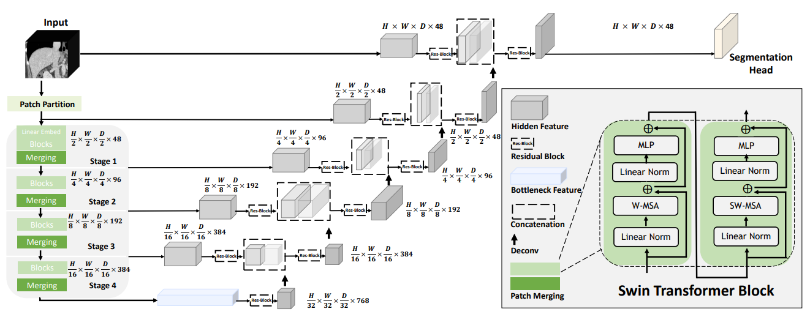

[](https://github.com/Azure/azureml-examples/actions/workflows/smoke.yml)
[](https://github.com/psf/black)
[](LICENSE)
# **Swin UNETR training**

This example will focus on training [Swin UNETR[1, 2] model for 3D segmentation on BTCV dataset](https://github.com/Project-MONAI/research-contributions/tree/c148c436cf675e568649aa07763002cc0ab09ee8/SwinUNETR/BTCV). Swin UNETR is the state-of-the-art on Medical Segmentation Decathlon (MSD) and Beyond the Cranial Vault (BTCV) Segmentation Challenge dataset. We provide the option for training Swin UNETR by fine-tuning from pre-trained self-supervised weights or from scratch.



## **Setup**
### **Hardware**
Depending on your objective you can choose from two options:
- V100 GPUs (Standard_NC24s_v3) are recommended for this job as default option for training on subvolumes of size 64^3 or less. In this case, by default, 4 subvolumes are randomly samples from each sample in batch size of 1.
- A100 GPUs (Standard_ND96amsr_A100_v4) are recommended for training with subvolumes larger than 64^3. The limitation of the dataset allow us to create subsamples of size at most 128^3, however, we extended implementation by upsampling the subvolumes before training using interpolation, which allows you to test scalability boundaries.

:warning: Please specify target compute name in `config.yaml` file.

#### **Linear Scaling with Infiniband Enabled SKUs**
To attain linear scaling for large model, one important step can be to use InfiniBand. InfiniBand enables low-latency, GPU-to-GPU communication across nodes in a cluster. InfiniBand requires specialized hardware to operate. Only some VM SKUs on Azure contain this required hardware. You can view the full list of InfiniBand-enabled machine SKUs [here](https://learn.microsoft.com/en-us/azure/virtual-machines/sizes-hpc#rdma-capable-instances). 

### **Job Configuration**
The job is organized into two pipeline components, where the first one, **download-data-component**, is responsible for downloading and storing the data and the second one, **training-component**, is responsible for training.

:warning: Make sure to create two secrets for synapse credentials in the default key vault for your AzureML workspace with **synapse-username** and **synapse-password** keys for username and password respectively. If you do not have an account yet, you can register [here](https://www.synapse.org/#!RegisterAccount:0).

#### **download-data-component**
Downloads data to `datastore` specified in `config.yaml`, by default it uses `workspaceblobstore` and stores data in `swin_transformer_multid_segmentation` folder.

#### **training-component**
Please refer to [training](#training) section in this document to view all the default option the script offers and their possible combinations. We have edited and added following options:
- **roi_x, roi_y, roi_z** - correspond to the resolution of individual samples that are processed by the network, the values has to be larger or equal to **randcrop_x, randcrop_y, randcrop_z**
- **randcrop_x, randcrop_y, randcrop_z** - corresponds to resolutions of subvolumes created for each sample
- **randcrop_samples** - defines number of subvolumes created per each sample

### **Custom dataset**
If you would like to train the model on your custom dataset, you need to:
- Upload your dataset to AzureML datastore
- Remove **download-data-component** from the pipeline in `submit.py` script and update `data_dir` variable to point to your folder for **training-component**
- provide custom `get_loader` function to the `main.py` script that return tuple of training and testing instance of PyTorch dataloader

# **Models**

Please download the self-supervised pre-trained weights for Swin UNETR backbone (CVPR paper [1]) from this <a href="https://github.com/Project-MONAI/MONAI-extra-test-data/releases/download/0.8.1/model_swinvit.pt"> link</a>.

We provide several pre-trained models on BTCV dataset in the following.

<table>
  <tr>
    <th>Name</th>
    <th>Dice (overlap=0.7)</th>
    <th>Dice (overlap=0.5)</th>
    <th>Feature Size</th>
    <th># params (M)</th>
    <th>Self-Supervised Pre-trained </th>
    <th>Download </th>
  </tr>
<tr>
    <td>Swin UNETR/Base</td>
    <td>82.25</td>
    <td>81.86</td>
    <td>48</td>
    <td>62.1</td>
    <td>Yes</td>
    <td><a href="https://github.com/Project-MONAI/MONAI-extra-test-data/releases/download/0.8.1/swin_unetr.base_5000ep_f48_lr2e-4_pretrained.pt">model</a></td>
</tr>

<tr>
    <td>Swin UNETR/Small</td>
    <td>79.79</td>
    <td>79.34</td>
    <td>24</td>
    <td>15.7</td>
    <td>No</td>
    <td><a href="https://github.com/Project-MONAI/MONAI-extra-test-data/releases/download/0.8.1/swin_unetr.small_5000ep_f24_lr2e-4_pretrained.pt">model</a></td>
</tr>

<tr>
    <td>Swin UNETR/Tiny</td>
    <td>72.05</td>
    <td>70.35</td>
    <td>12</td>
    <td>4.0</td>
    <td>No</td>
    <td><a href="https://github.com/Project-MONAI/MONAI-extra-test-data/releases/download/0.8.1/swin_unetr.tiny_5000ep_f12_lr2e-4_pretrained.pt">model</a></td>
</tr>

</table>

# **Data Preparation**


The training data is from the [BTCV challenge dataset](https://www.synapse.org/#!Synapse:syn3193805/wiki/217752).

- Target: 13 abdominal organs including 1. Spleen 2. Right Kidney 3. Left Kideny 4.Gallbladder 5.Esophagus 6. Liver 7. Stomach 8.Aorta 9. IVC 10. Portal and Splenic Veins 11. Pancreas 12.Right adrenal gland 13.Left adrenal gland.
- Task: Segmentation
- Modality: CT
- Size: 30 3D volumes (24 Training + 6 Testing)

Please download the json file from this link.

We provide the json file that is used to train our models in the following <a href="https://drive.google.com/file/d/1t4fIQQkONv7ArTSZe4Nucwkk1KfdUDvW/view?usp=sharing"> link</a>.

Once the json file is downloaded, please place it in the same folder as the dataset. Note that you need to provide the location of your dataset directory by using ```--data_dir```.

# **Training**

A Swin UNETR network with standard hyper-parameters for multi-organ semantic segmentation (BTCV dataset) is be defined as:

``` bash
model = SwinUNETR(img_size=(96,96,96),
                  in_channels=1,
                  out_channels=14,
                  feature_size=48,
                  use_checkpoint=True,
                  )
```


The above Swin UNETR model is used for CT images (1-channel input) with input image size ```(96, 96, 96)``` and for ```14``` class segmentation outputs and feature size of  ```48```.
More details can be found in [1]. In addition, ```use_checkpoint=True``` enables the use of gradient checkpointing for memory-efficient training.

Using the default values for hyper-parameters, the following command can be used to initiate training using PyTorch native AMP package:
``` bash
python main.py
--feature_size=32
--batch_size=1
--logdir=unetr_test
--fold=0
--optim_lr=1e-4
--lrschedule=warmup_cosine
--infer_overlap=0.5
--save_checkpoint
--data_dir=/dataset/dataset0/
```

## **Training from self-supervised weights on single GPU (base model with gradient check-pointing)**

To train a `Swin UNETR` with self-supervised encoder weights on a single GPU with gradient check-pointing:

```bash
python main.py --json_list=<json-path> --data_dir=<data-path> --feature_size=48 --use_ssl_pretrained\
--roi_x=96 --roi_y=96 --roi_z=96  --use_checkpoint --batch_size=<batch-size> --max_epochs=<total-num-epochs> --save_checkpoint
```

## **Training from self-supervised weights on multiple GPUs (base model without gradient check-pointing)**

To train a `Swin UNETR` with self-supervised encoder weights on a multiple GPUs without gradient check-pointing

```bash
python main.py --json_list=<json-path> --data_dir=<data-path> --feature_size=48 --use_ssl_pretrained\
--roi_x=96 --roi_y=96 --roi_z=96  --distributed --optim_lr=2e-4 --batch_size=<batch-size> --max_epochs=<total-num-epochs> --save_checkpoint
```

## **Training from scratch on single GPU (base model without AMP)**

To train a `Swin UNETR` from scratch on a single GPU without AMP:

```bash
python main.py --json_list=<json-path> --data_dir=<data-path> --feature_size=48 --noamp\
--roi_x=96 --roi_y=96 --roi_z=96  --use_checkpoint --batch_size=<batch-size> --max_epochs=<total-num-epochs> --save_checkpoint
```

## **Training from scratch on single GPU (small model without check-pointing)**

To train a `Swin UNETR` from scratch on a single GPU without AMP:

```bash
python main.py --json_list=<json-path> --data_dir=<data-path> --feature_size=24\
--roi_x=96 --roi_y=96 --roi_z=96 --batch_size=<batch-size> --max_epochs=<total-num-epochs> --save_checkpoint
```

## **Training from scratch on single GPU (tiny model without check-pointing)**

To train a `Swin UNETR` from scratch on a single GPU without AMP:

```bash
python main.py --json_list=<json-path> --data_dir=<data-path> --feature_size=12\
--roi_x=96 --roi_y=96 --roi_z=96 --batch_size=<batch-size> --max_epochs=<total-num-epochs> --save_checkpoint
```

# **Finetuning**

Please download the checkpoints for models presented in the above table and place the model checkpoints in `pretrained_models` folder.
Use the following commands for finetuning.

## **Finetuning base model on single GPU (gradient check-pointing)**

To finetune a  `Swin UNETR` base model on a single GPU with gradient check-pointing:

```bash
python main.py --json_list=<json-path> --data_dir=<data-path> --feature_size=48 \
--pretrained_model_name='swin_unetr.base_5000ep_f48_lr2e-4_pretrained.pt' --resume_ckpt --use_checkpoint \
--batch_size=<batch-size> --max_epochs=<total-num-epochs> --save_checkpoint
```

## **Finetuning small model on single GPU (gradient check-pointing)**

To finetune a  `Swin UNETR` small model on a single GPU with gradient check-pointing:

```bash
python main.py --json_list=<json-path> --data_dir=<data-path> --feature_size=24 \
--pretrained_model_name='swin_unetr.small_5000ep_f24_lr2e-4_pretrained.pt' --resume_ckpt --use_checkpoint \
--batch_size=<batch-size> --max_epochs=<total-num-epochs> --save_checkpoint
```

## **Finetuning tiny model on single GPU (gradient check-pointing)**

To finetune a  `Swin UNETR` tiny model on a single GPU with gradient check-pointing:

```bash
python main.py --json_list=<json-path> --data_dir=<data-path> --feature_size=12 \
--pretrained_model_name='swin_unetr.tiny_5000ep_f12_lr2e-4_pretrained.pt' --resume_ckpt --use_checkpoint \
--batch_size=<batch-size> --max_epochs=<total-num-epochs> --save_checkpoint
```

# **Citation**
If you find this repository useful, please consider citing the following papers:

```
@inproceedings{tang2022self,
  title={Self-supervised pre-training of swin transformers for 3d medical image analysis},
  author={Tang, Yucheng and Yang, Dong and Li, Wenqi and Roth, Holger R and Landman, Bennett and Xu, Daguang and Nath, Vishwesh and Hatamizadeh, Ali},
  booktitle={Proceedings of the IEEE/CVF Conference on Computer Vision and Pattern Recognition},
  pages={20730--20740},
  year={2022}
}

@article{hatamizadeh2022swin,
  title={Swin UNETR: Swin Transformers for Semantic Segmentation of Brain Tumors in MRI Images},
  author={Hatamizadeh, Ali and Nath, Vishwesh and Tang, Yucheng and Yang, Dong and Roth, Holger and Xu, Daguang},
  journal={arXiv preprint arXiv:2201.01266},
  year={2022}
}
```

# **References**
[1]: Tang, Y., Yang, D., Li, W., Roth, H.R., Landman, B., Xu, D., Nath, V. and Hatamizadeh, A., 2022. Self-supervised pre-training of swin transformers for 3d medical image analysis. In Proceedings of the IEEE/CVF Conference on Computer Vision and Pattern Recognition (pp. 20730-20740).

[2]: Hatamizadeh, A., Nath, V., Tang, Y., Yang, D., Roth, H. and Xu, D., 2022. Swin UNETR: Swin Transformers for Semantic Segmentation of Brain Tumors in MRI Images. arXiv preprint arXiv:2201.01266.
