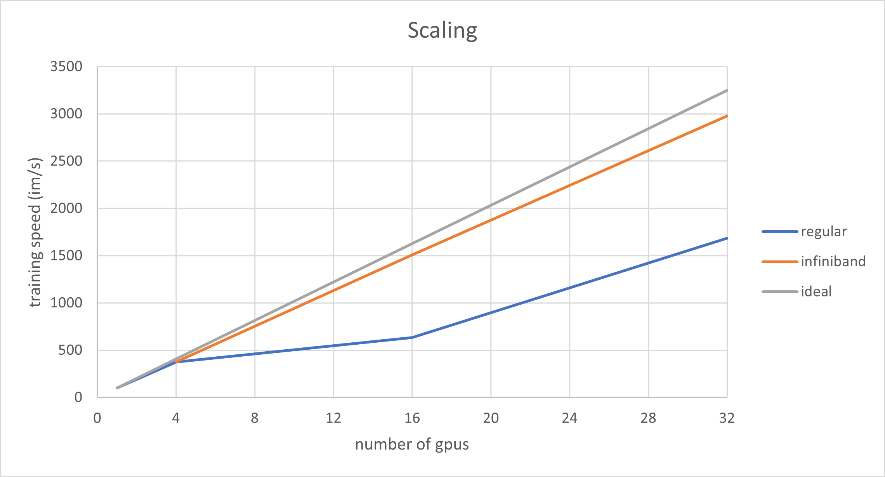
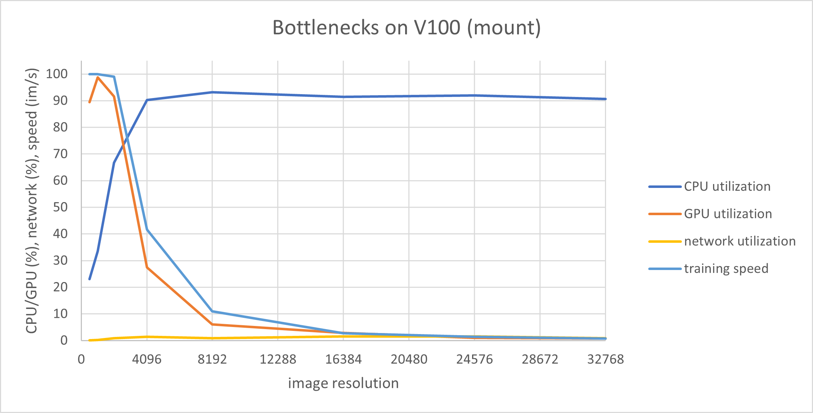
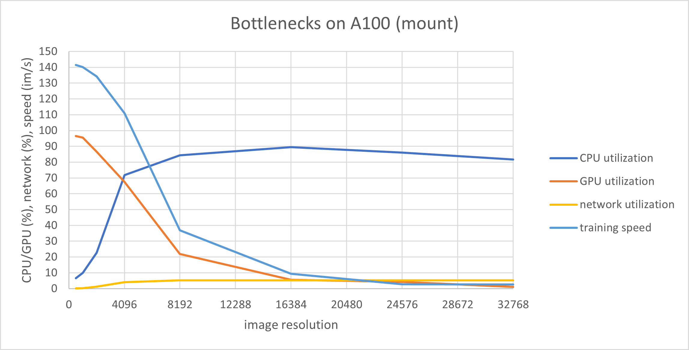
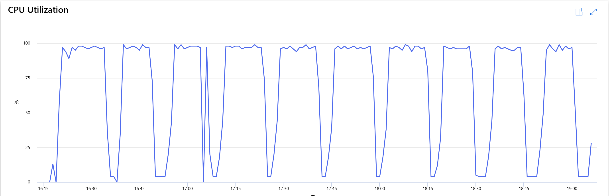

[](https://github.com/Azure/azureml-examples/actions/workflows/smoke.yml)
[](https://github.com/psf/black)
[](LICENSE)
# **ViT Pretraining**

The main task we consider in this example is pretraining the vision transformer base (ViTB) model on [ImageNet-1k](https://www.image-net.org/). Larger datasets like ImageNet-22k will likely lead to better model quality, but here we focus on making the training process as efficient as possible and we identify the techniques to achieve this goal. We also trained ViTB on [PANDA](https://www.kaggle.com/c/prostate-cancer-grade-assessment/data), a medical dataset with high resolution images, and synthetic datasets similar to it.

## **General Tips and Tricks**

Based on general best practices for Computer Vision model training and our experimentation on Azure, we synthesized the following guidelines:

1. Set the batch size so that GPU memory consumption is maximized.
2. Set the shared memory size to a large value, e.g. 50% of the total CPU memory available, to make sure dataloaders have enough memory. Please see the [launcher.py](src/launcher.py) file in this folder for a code snippet (look for "shm_size").
3. If network traffic does not exceed the network bandwidth available to the machine, mount the dataset's datastore path and disable caching. This has virtually the same performance as downloading the dataset on the machine when this option is available (disk large enough).
4. In general, the optimal number of workers for data loading can be found by starting with the number of CPU cores and increasing until there is no noticeable improvement. We have seen that for [NCv3 machines](https://learn.microsoft.com/en-us/azure/virtual-machines/ncv3-series) a good starting point is 6, but for [NCA100v4 machines](https://learn.microsoft.com/en-us/azure/virtual-machines/nc-a100-v4-series) a good starting point is 12.
5. Scale up before scaling out, e.g. use a Standard_NC24s_v3 with 4 GPUs instead of 4 Standard_NC6s_v3's with 1 GPU each [NCv3 machines](https://learn.microsoft.com/en-us/azure/virtual-machines/ncv3-series). Synchronizing weights on one machine with 4 GPUs (Standard_NC24s_v3) is faster than synchronizing weights across the network between 4 machines with one GPU each (Standard_NC6s_v3).
6. Use [InfiniBand](#hardware) whenever possible, as it enables near linear scaling.
7. If working with high resolution images, strongly consider resizing them or extracting tiles from them before training. If training a ViTB model, images larger than 2048 x 2048 will lead to severe bottlenecks in CPU processing, reading from disk and transferring data over the network.
8. Depending on your particular application, the [Nvidia DALI](https://developer.nvidia.com/dali) package might help reduce the load on the CPU by doing image preprocessing and augmentation on the GPU.

## **Experiment Setup**

We derived some of the ideas above via experimentation. Since our experiment setup can be a good starting point for implementing large scale training for Computer Vision, we describe it below.

### **Hardware**

We used machines with [V100](https://learn.microsoft.com/en-us/azure/virtual-machines/ncv3-series) and [A100](https://learn.microsoft.com/en-us/azure/virtual-machines/nc-a100-v4-series) GPUs. We also used InfiniBand, which is specialized hardware for linear scaling. InfiniBand enables low-latency, GPU-to-GPU communication across nodes in a cluster. You can view the full list of InfiniBand-enabled Azure machine SKUs [here](https://learn.microsoft.com/en-us/azure/virtual-machines/sizes-hpc#rdma-capable-instances).

### **Code**

All of the code in our experiments uses the PyTorch Lightning framework and can be found in the ``src`` subdirectory of this directory.

### **Job Submission**

The code assumes that the workspace where the job runs contains a datastore named `datasets` with a blob named `imagenet`. The folders under it must be readable by PyTorch's `ImageFolder` class. For more details, please see the [launcher.py](src/launcher.py) and [run_image_classification.py](src/run_image_classification.py) files.

To train a ViTB model on ImageNet-1k, submit the following command from within the ``src`` subdirectory of this directory:
```
python launcher.py
```

## **Experiment Results**

We show the results of our experiments below.

### **Multiple nodes / multiple GPUs**

We trained ViTB on ImageNet-1k in a few hardware configurations with varying numbers of nodes and GPUs. The GPU used was V100.

| Nodes | GPUs per Node | Total GPUs | InfiniBand | Training Speed (images/second) |
|-------|---------------|------------|------------|--------------------------------|
| 1 | 1 | 1 | no | 101.6 |
| 1 | 4 | 4 | no | 376.3 |
| 1 | 4 | 4 | yes | 377.3 |
| 4 | 4 | 16 | no | 634.2 |
| 4 | 4 | 16 | yes | 1507.3 |
| 8 | 4 | 32 | no | 1685.7 |
| 8 | 4 | 32 | yes | 2979.5 |

Plotting the training speed as a function of the number of GPUs, it becomes clear that InfiniBand provides almost linear scaling. Note that Infiniband is designed to speed up multi-node training only, but the table above includes a 1 node, 4 GPU, Infiniband enabled setting for completeness.

<center></center>

### **High resolution images**

We trained ViTB on datasets similar to PANDA but with progressively larger images. The images are randomly generated and saved with JPEG compression with a quality factor of 5, leading to file sizes similar to PANDA. We report resource consumption and training speed below, for two hardware configurations.

#### **Single node with a V100 GPU**

| Resolution | CPU utilization (%)\* | GPU utilization (%) | Network Bandwidth / Max Bandwidth (MBps) | Training Speed (images/second) |
|------------|---------------------|---------------------|----------------------------------------|--------------------------------|
| 512 | 23.1 | 89.4 | 2 / 3000 | 100.0 |
| 1024 | 33.6 | 98.8 | 7 / 3000  | 100.0 |
| 2048 | 66.7 | 91.6 | 25 / 3000  | 99.0 |
| 4096 | 90.2 | 27.4 | 43 / 3000  | 41.6 |
| 8192 | 93.2 | 6.1 | 25 / 3000  | 10.9 |
| 16384 | 91.4 | 2.9 | 44 / 3000  | 2.7 |
| 24576 | 92 | 1.0 | 47 / 3000  | 1.4 |
| 32768 | 90.7 | 0.7 | 27 / 3000  | 0.7 |
| PANDA | 92.7 | 0.9 | 74 / 3000  | 1.0 |

Displaying the resource utilization and the training speed as a function of the image resolution, it becomes clear that the CPU is the bottleneck beyond 2048 x 2048. At 4096 x 4096, the CPU utilization is above 95% for training steps and the GPU utilization drops drastically, while the network bandwidth is far below the limit of 3GBps for Standard_NC6s_v3 machines.

<center></center>

#### **Single node with an A100 GPU**

| Resolution | CPU utilization (%)\* | GPU utilization (%) | Network Bandwidth / Max Bandwidth (MBps) | Training Speed (images/second) |
|------------|-----------------------|---------------------|------------------------------------------|----------------|
| 512 | 6.6 | 96.6 | 3 / 3000 | 141.5 |
| 1024 | 9.9 | 95.6 | 10 / 3000 | 140.1 |
| 2048 | 22.7 | 86.6 | 39 / 3000 | 134.2 |
| 4096 | 71.8 | 67.4 | 121 / 3000 | 110.9 |
| 8192 | 84.3 | 22.0 | 156 / 3000 | 37.0 |
| 16384 | 89.6 | 5.7 | 155 / 3000 | 9.4 |
| 24576 | 86.1 | 4.2 | 156 / 3000 | 2.8 |
| 32768 | 81.7 | 1.0 | 155 / 3000 | 2.6 |
| PANDA | 23.7 | 2 | 150 / 3000 | 2.9 |

Displaying the resource utilization and the training speed as a function of the image resolution, it becomes clear that the CPU is the bottleneck beyond 2048 x 2048. At 4096 x 4096, the CPU utilization is above 95% for training steps and the GPU utilization drops drastically, while the network bandwidth is far below the limit of 3GBps for Standard_ND24asr_v4 machines.

<center></center>

\* Note that the CPU utilization reported in the two graphs above is an average over 10 training epochs (like GPU utilization, network bandwidth and training speed). Initial setup, validation steps and checkpointing operations all have a low CPU utilization and as a consequence, the average is lower than the value for training steps, eg 72% compared to 97%. See below for an illustration.

<center></center>
