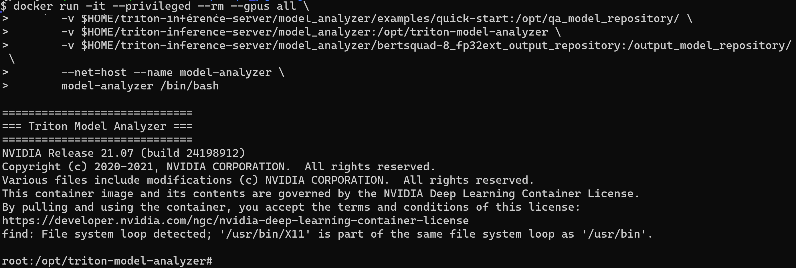
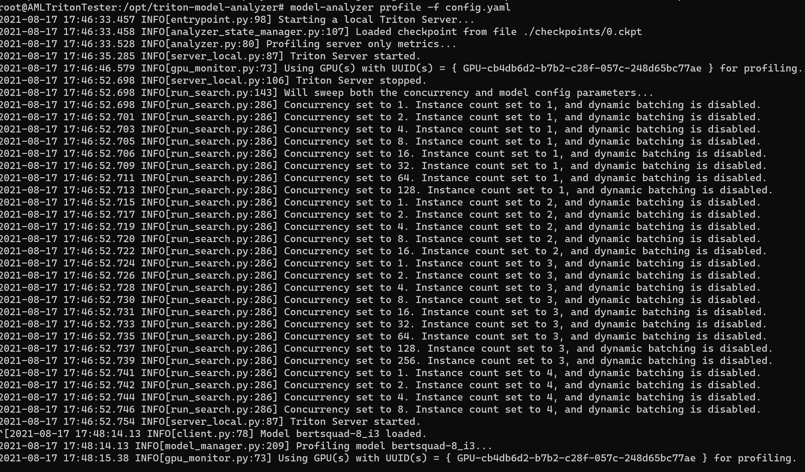
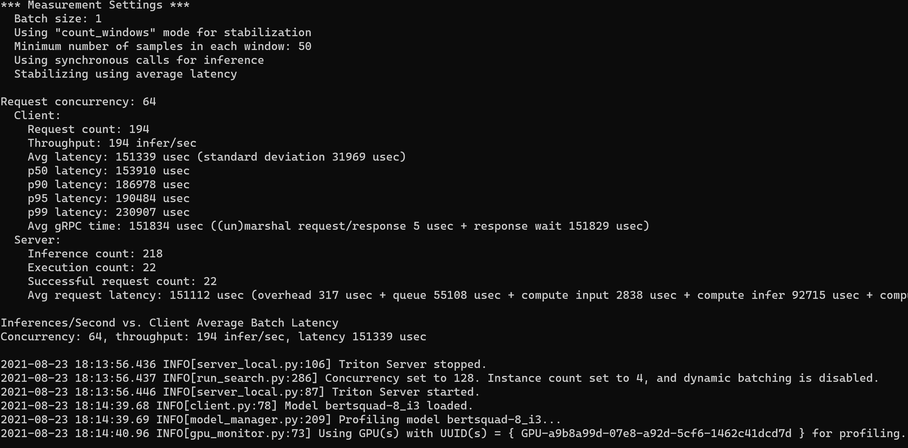
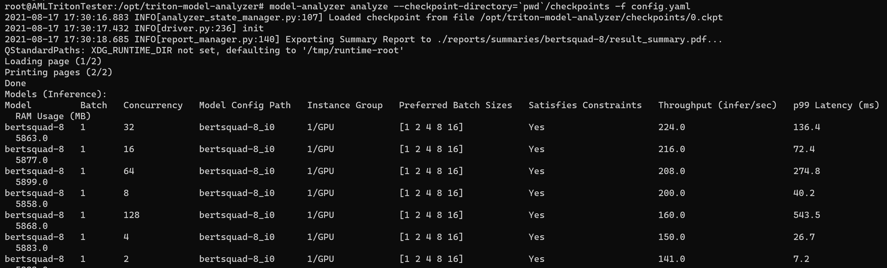
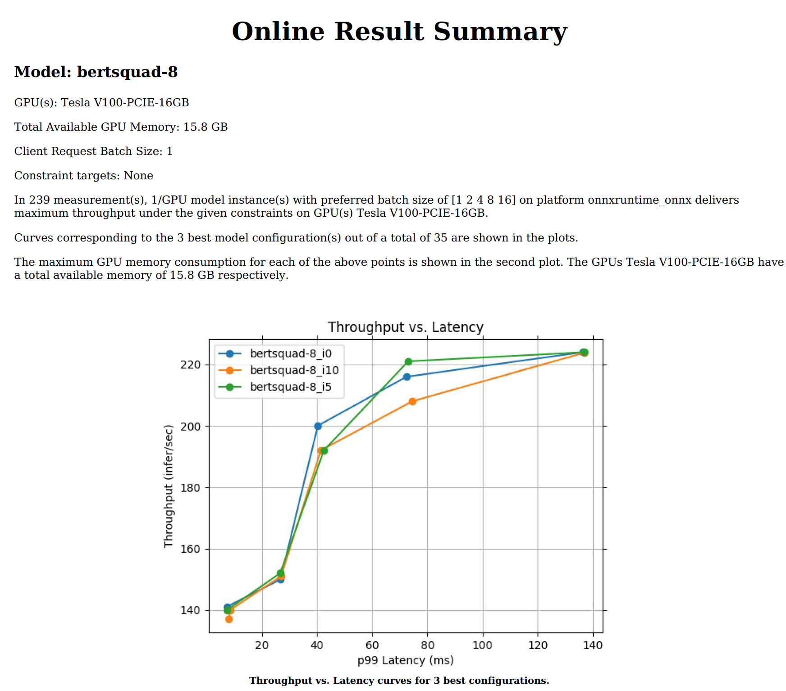
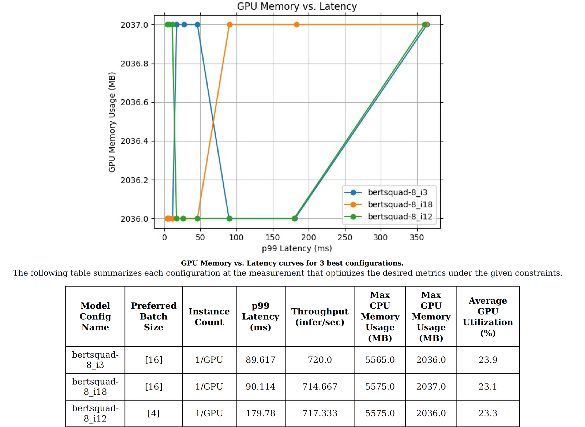
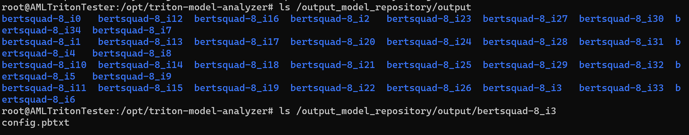

## Finding the optimal model configuration for inference deployment using the NVIDIA Triton Model Analyzer

### Objective: Use the Triton Model Analyzer to find the optimal configuration for a ONNX Bert Model

#### Triton Model Analyzer
The Model Analyzer is a suite of tools that helps users select the optimal model configuration that maximizes performance in Triton. The Model Analyzer benchmarks model performance by measuring throughput (inferences/second) and latency under varying client loads. It can then generate performance charts to help users make tradeoff decisions around throughput and latency, as well as identify the optimal batch size, through the use of dynamic batching, as well as optimal concurrency values to use for the best performance.

By measuring GPU memory utilization, the Model Analyzer also optimizes hardware usage by informing how many models can be loaded onto a GPU and the exact amount of hardware needed to run your models based on performance or memory requirements.

#### Compute Requirements	
* Machine with at least one Volta GPU or above
* OS: Linux 18.04 LTS or above
* Nvidia Driver (minimum version 450.57)
* Docker CE 19.03 or above
* Access to ports 8000, 8001 and 8002

The instructions and results discussed in this document were obtained using the following Azure specifications
* VM_Size: Standard_NC6s_v3 (one 16GiB V100 card)
* Base Image: Azure Market Place, NVIDIA Image for AI using GPUs - v21.04.1

The "NVIDIA Image for AI using GPUs" available for free in the Azure Market Place has all the prerequisites needed to run the Model Analyzer

#### Set up needed directories

<pre style="background-color:rgba(0, 0, 0, 0.0470588)"><b>mkdir $HOME/triton-inference-server

mkdir $HOME/triton-inference-server/model_analyzer

mkdir $HOME/triton-inference-server/model_analyzer/examples

mkdir $HOME/triton-inference-server/model_analyzer/examples/quick-start

mkdir $HOME/triton-inference-server/model_analyzer/examples/quick-start/bertsquad-8

mkdir $HOME/triton-inference-server/model_analyzer/examples/quick-start/bertsquad-8/1

mkdir $HOME/triton-inference-server/model_analyzer/bertsquad-8_fp32ext_output_repository</b></pre>

#### Download model from ONNX Zoo
<pre style="background-color:rgba(0, 0, 0, 0.0470588)"><b>wget -O $HOME/triton-inference-server/model_analyzer/examples/quick-start/bertsquad-8/bertsquad-8.onnx https://github.com/onnx/models/blob/master/text/machine_comprehension/bert-squad/model/bertsquad-8.onnx?raw=true</b></pre>

#### Enabling dynamic batching on model

To fully utilize the power of dynamic batching from model analyzer of Triton inference server, you need to make sure the onnx model is indeed in dynamic shape.

The downloaded BERT model from ONNX model zoo, has output nodes shapes that are not dynamic and then ORT-TRT cannot run. To convert output shape dynamic, we need to run a script as describe in [https://www.onnxruntime.ai/docs/reference/execution-providers/TensorRT-ExecutionProvider.html](https://www.onnxruntime.ai/docs/reference/execution-providers/TensorRT-ExecutionProvider.html)

The repo with the script and relevant code should be cloned, as well as, installing some dependencies:

<pre style="background-color:rgba(0, 0, 0, 0.0470588)"><b>git clone https://github.com/microsoft/onnxruntime.git $HOME/triton-inference-server/onnxrt

pip install onnx

pip install sympy
</b></pre>

Dynamic batching is enabled by running the following command

<pre style="background-color:rgba(0, 0, 0, 0.0470588)"><b>python $HOME/triton-inference-server/onnxrt/onnxruntime/python/tools/symbolic_shape_infer.py --input $HOME/triton-inference-server/model_analyzer/examples/quick-start/bertsquad-8/bertsquad-8.onnx --output $HOME/triton-inference-server/model_analyzer/examples/quick-start/bertsquad-8/1/bertsquad-8-si.onnx --auto_merge</b></pre>

The output shape-inferred onnx model is named: &quot;bertsquad-8-si.onnx&quot;

Now that we have a model ready to be optimized, we need to get and execute the model analyzer bits
 
#### Getting the Model Analyzer bits

We first clone the Model Analyzer GitHub [https://github.com/triton-inference-server/model\_analyzer](https://github.com/triton-inference-server/model_analyzer):

<pre style="background-color:rgba(0, 0, 0, 0.0470588)"><b>git clone https://github.com/triton-inference-server/model_analyzer.git
</b></pre>

Changing to r21.07 branch from main branch

<pre style="background-color:rgba(0, 0, 0, 0.0470588)"><b>cd model_analyzer/

git checkout r21.07
</b></pre>

#### Building the Model Analyzer container

Building docker container r21.06 since ORT-TRT is disabled on 21.07

<pre style="background-color:rgba(0, 0, 0, 0.0470588)"><b>docker build --pull --build-arg=TRITONSDK_BASE_IMAGE="nvcr.io/nvidia/tritonserver:21.06-py3-sdk" --build-arg=BASE_IMAGE="nvcr.io/nvidia/tritonserver:21.06-py3" . -t model-analyzer
</b></pre>

Setting onnx model and model analyzer config files

<pre style="background-color:rgba(0, 0, 0, 0.0470588)"><b>wget -O $HOME/triton-inference-server/model_analyzer/examples/quick-start/bertsquad-8/config.pbtxt https://github.com/Azure/azureml-examples/tree/triton-bert-perf/cli/endpoints/online/triton/batching/modelanalyzer/config.pbtxt?raw=true

wget -O $HOME/triton-inference-server/model_analyzer/config_model_analyzer.yaml https://github.com/Azure/azureml-examples/tree/triton-bert-perf/cli/endpoints/online/triton/batching/modelanalyzer/config.yaml?raw=true

cp nvidia_entrypoint.sh $HOME/triton-inference-server/model_analyzer
</b></pre>

#### Running the Model Analyzer container
 
Since bertsquad-8-si.onnx model is in directory $HOME/triton-inference-server/model_analyzer/examples/quick-start, it should mounted into the container model repository directory. The directory $HOME/triton-inference-server/model_analyzer containing the Model Analyzer config file should also be mounted into the container file tree, along with a directory where to find the outputs

<pre style="background-color:rgba(0, 0, 0, 0.0470588)"><b>docker run -it --privileged --rm --gpus all \
       -v $HOME/triton-inference-server/model_analyzer/examples/quick-start:/opt/qa_model_repository/ \
       -v $HOME/triton-inference-server/model_analyzer:/opt/triton-model-analyzer \
       -v $HOME/triton-inference-server/model_analyzer/bertsquad-8_fp32ext_output_repository:/output_model_repository/ \
       --net=host --name model-analyzer \
       model-analyzer /bin/bash
</b></pre>

Running the container on interactive mode (-it) would bring the terminal inside the container and one should see <b>/opt/triton-model-analyzer#</b> attached to the prompt

<b>Please click to display the screenshot the user should expect to see</b>

 

#### Setting desired precision 
The user can set-up the precision to be used. The seeting for FP16 is: 

<pre style="background-color:rgba(0, 0, 0, 0.0470588)"><b>root:/opt/triton-model-analyzer# export ORT_TENSORRT_FP16_ENABLE=1
</b></pre>

The FP32 default for ORT-TRT can be set with:

<pre style="background-color:rgba(0, 0, 0, 0.0470588)"><b>root:/opt/triton-model-analyzer# export ORT_TENSORRT_FP16_ENABLE=0
</b></pre>

#### Model Analyzer config file
We would be profiling the model using this Model Analyzer config file: https://github.com/Azure/azureml-examples/tree/triton-bert-perf/cli/config_model_analyzer.yaml, which we have downloaded and mounted in the /opt/triton-model-analyzer folder in the Model Analyzer container.

<b>Please click to display the config file used on this document</b>

<pre style="background-color:rgba(227, 147, 125, 0.36)"><b>model_repository: /opt/qa_model_repository
override_output_model_repository: False
output_model_repository_path: /output_model_repository/output
checkpoint_directory: ./checkpoints/

run_config_search_disable: False
run_config_search_max_concurrency: 256
run_config_search_max_instance_count: 5

perf_analyzer_cpu_util: 80000
perf_output: True

triton_launch_mode: local
triton_http_endpoint: localhost:8000
triton_grpc_endpoint: localhost:8001
triton_metrics_url: http://localhost:8002/metrics
triton_output_path: triton.log

batch_size: 1

profile_models:
   - bertsquad-8

#Config For Analyze
checkpoint_directory: ./checkpoints/
summarize: True
num_configs_per_model: 3

analysis_models: 
  bertsquad-8:
    objectives:
      perf_throughput: 10
</b></pre>

 
Please refer to the blog for more details about the config file

#### Profiling a model with the Model Analyzer

Run the following command to start the profiling process

<pre style="background-color:rgba(0, 0, 0, 0.0470588)"><b>root:/opt/triton-model-analyzer# model-analyzer profile -f config.yaml
</b></pre>

<b>Please click to display the screenshot the user should expect to see</b>

 
The profiling would take a few hours

#### Analyzing profiling results

To generate reports run:

<pre style="background-color:rgba(0, 0, 0, 0.0470588)"><b>root:/opt/triton-model-analyzer# model-analyzer analyze --checkpoint-directory=`pwd`/checkpoints -f config.yaml
</b></pre>
 

<b>Please click to display the screenshot the user should expect to see</b>

 

Reports can be found in /opt/triton-model-analyzer/reports

<b>Please click to display the the content on file: /opt/triton-model-analyzer/reports/summaries/bertsquad-8/result_summary.pdf </b>

 

Please refer to the blog for an explanation of the summary of results

Detailed results can be found in /opt/triton-model-analyzer/results

Automatically generated model repository can be found in /output_model_repository/output

<b>Please click to display the screenshot the user should expect to see</b>

 

Where the user can find the config files for each of the runs tried by the Model Analyzer, as explain in the blog, the user should take the one that corresponds to the optimal configuration and use it to deploy the model to production 
