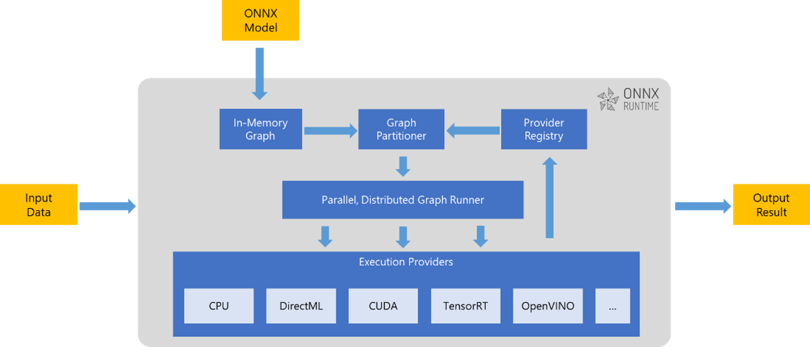
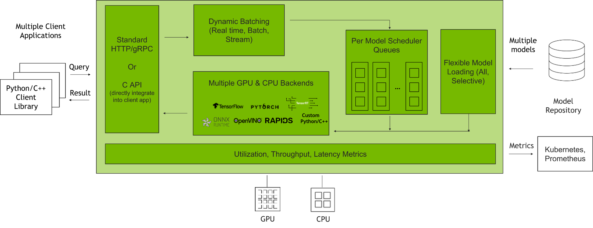
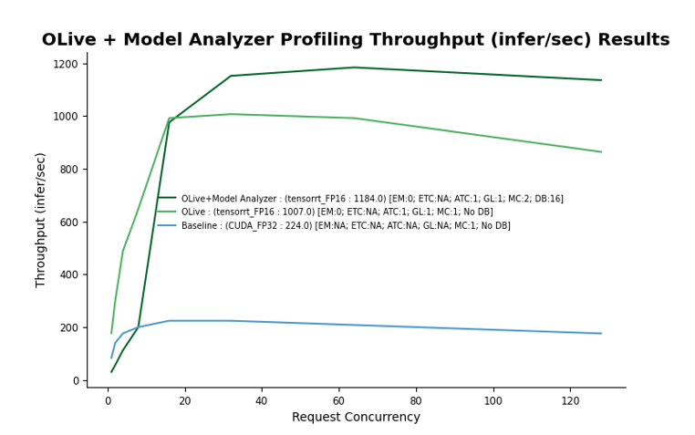
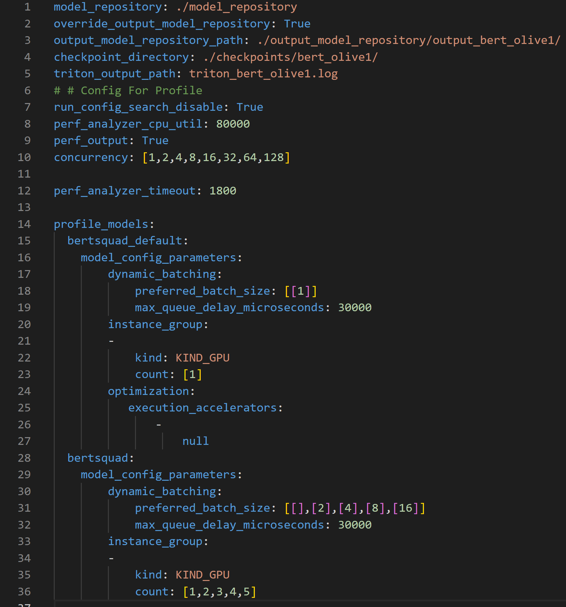
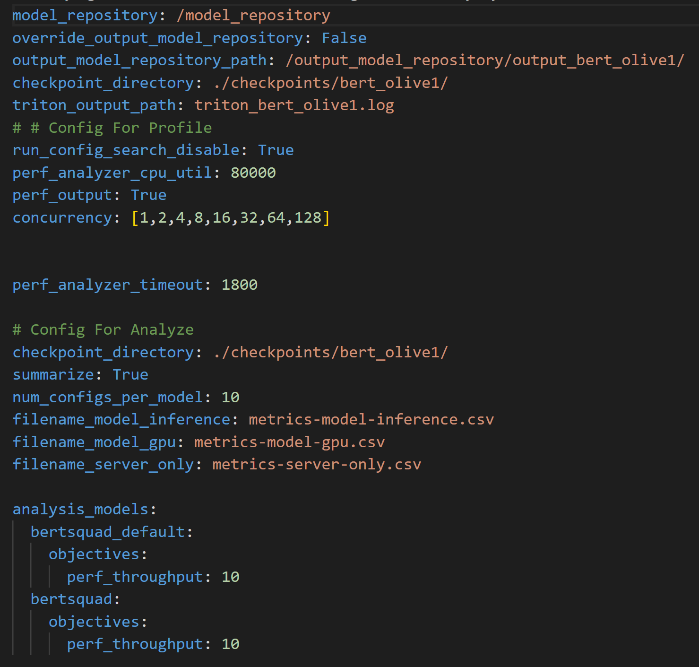
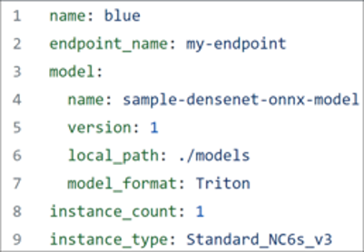
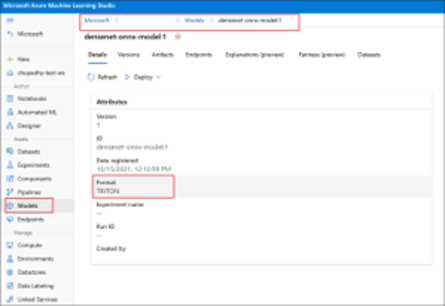
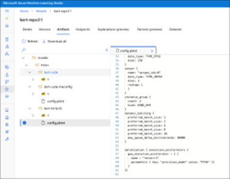

# Accelerate Model Inference for Azure ML Deployment with ONNX Runtime, OLive, NVIDIA Triton Inference Server, and Triton Model Analyzer

## AI Model Inference


Nowadays, AI applications are everywhere 

From Speech Recognition and Natural Language Understanding on Voice Assistants. To learning user preferences and intent on Search and Recommender Systems 

The process of querying an AI model to make a prediction is known as Model Inference 

For instance, when a user talks to a voice assistance, a speech recognition model is queried to transcribe the message 

Most modern applications require Model Inferences responses to be close to immediate 

The two main quantities used to measure Model Inference performance are: Latency and Throughput 

#### Latency
Latency is defined as the response time for a single query 

#### Throughput
Throughput is defined as the number of queries processed by time unit

## ONNX Runtime (ORT) and OLive – ORT Go Live



[ONNX Runtime] (https://onnxruntime.ai/) is a high-performance inference engine to run AI models across various hardware such as CPU, GPU and NPU with a support of multi-language APIs including C, C++, Java, JavaScript and more. users can easily plugin it into any existing inference stack to accelerate the performance. ONNX Runtime is compatible with multiple popular training frameworks such as TF and PyTorch and it runs models across server, desktop, mobile and Web. 

To accelerate your model with ONNX Runtime, there are two major steps. Converting your original model, such as TensorFlow model or PyTorch model to ONNX format, then inferencing the ONNX model with ONNX Runtime. By default, ONNX Runtime gives you out-of-box good performance. For advanced cases, there are a lot of tuning knobs in ONNX Runtime to further maximize performance. For example, we can choose different model optimization levels. And for GPU acceleration, which is our focus in this example, we could tune CUDA and TensorRT execution provider in ONNX Runtime with different data types like full precision and mix precision. TensorRT optimizes the use of GPU memory and bandwidth by fusing nodes in a Kernel. If we tune all combinations manually, it is very time consuming and requires a lot of domain expertise. That's where OLive comes in. 

OLive, meaning ORT Go Live, is a python package that automates the process of accelerating models with ONNX Runtime. It contains two parts including model conversion to ONNX and auto performance tuning with ONNX Runtime. Users can run these two together through a single pipeline or run them independently as needed. [more details] (https://github.com/microsoft/olive)

## Triton Inference Server and Triton Model Analyzer



Triton Inference Server is an inference serving software that streamlines AI inferencing. Triton enables teams to deploy any AI model from multiple deep learning and machine learning frameworks. Our demonstration today showed Triton using the officially supported ONNX Runtime Backend configured to use the TensorRT execution provider with multiple precisions. Support for the ONNX Runtime backend is provided collaboratively by both Microsoft and NVIDIA.

Triton supports inference across cloud, data center, edge, and embedded devices on NVIDIA GPUs, x86 and ARM CPUs, or AWS Inferential. Triton delivers optimized performance for many query types, including real time, batched, ensembles and audio/video streaming.

The optimizations discussed in the demonstration utilize two major features of Triton: dynamic batching and model concurrency. Dynamic batching allows inference requests to be combined by the server, so that a batch is created dynamically and results in increased throughput. Model concurrency additionally improves throughput by allowing multiple models and/or multiple instances of the same model to execute in parallel on the same system. The system may have zero, one, or many GPUs.

Triton Model Analyzer is a separate CLI tool that generates optimal model configuration files for Triton Inference Server. Model Analyzer profiles models on the actual hardware configuration used in production and provides a list of possible configurations based on user supplied priorities and constraints.

## Triton-ONNX Runtime Config Model Optimization

ONNX Runtime has been integrated in Triton as one backend. To deploy an AI model using Triton-ONNX Runtime, the user needs two things: The model itself and a configuration file that defines the parameter values to be used for the deployment. Parameters consist of the ONNX Runtime parameters such as execution provider and data precision and Triton parameters such as dynamic batching and model concurrency

In this section we discuss the model inference performance obtained after optimizing the Triton-ONNX Runtime config file 

### Optimization Pipeline
<br>

<br>
<br>
As can be observed in the figure, it was done in a sequential manner, first OLive was used to convert a Bert Squad PyTorch model into the ONNX format without any perf tuning in ONNX Runtime and Triton. The config file there would have the default parameters, a CUDA backend with full precision, default ONNX parameters and no use of dynamic batching or model concurrency in Triton. 

### Performance Results

<br>
<br>
The plot in blue in the picture shows the inference performance for such configuration. 

In the plot we used the Triton Perf Analyzer, a tool that mimics user traffic by generating inference requests to the model at different levels and then measures the throughput and latency at those request levels.

The X axis shows the request levels, and the Y-axis shows the throughput, all while keeping the latency under a specified budget.

Then OLive is used to optimize ONNX Runtime performance over the execution providers, precision and other parameters while still not using Triton dynamic batching nor model concurrency.

The performance results can be observed on the light green line, the chosen execution provider after tuning is TensorRT with mix precision, in addition to other ONNX Runtime parameters.

The config file obtained from OLive is then fed into the triton Model Analyzer that optimizes the dynamic batching and Model concurrency parameters. The resulting performance, that further boost performance by 20% can be observed in dark green, where optimal values of Model concurrency of 2 and Dynamic batching of 16 were chosen.

Overall, the gain on inference performance over the default parameters is over 10-fold. 

Now, with the model and the optimal Triton config file, the user would be ready to do the deployment over AzureML.

## Repo Contents

This repo contains material that the user could use to replicate the results shown here and where they could substitute their own model on the script

### Compute Requirements

The results discussed above were obtained with a machine with the following specifications

* Machine with at least one Volta GPU or above
* OS: Linux 18.04 LTS or above
* Nvidia Driver (minimum version 450.57)
* Docker CE 19.03 or above
* +64 GB of disk space

The instructions and results discussed in this document were obtained using the following Azure specifications
* VM_Size: Standard_NC6s_v3 (one 16GiB V100 card)
* Resized 64 GB Disk (default is 32 GB)
* Base Image: Azure Market Place, NVIDIA Image for AI using GPUs - v21.04.1


The "NVIDIA Image for AI using GPUs" available for free in the Azure Market Place has all the prerequisites needed to run the Model Analyzer


### Load the Triton Server Container

Once the user has downloaded the repo

Before running the material, from the content root directory (azureml-examples/cli/endpoints/online/triton/single-model/olive_model_analyzer), the user should load the Triton Server container and within it, navegate to the /models folder where the material was mounted by doing:

```bash
# Load the Triton Server Container
docker run --gpus=1 --rm -it -v "$(pwd)":/models nvcr.io/nvidia/tritonserver:21.08-py3 /bin/bash

cd /models
```

### download.sh script
Then first step is to download the OLive and ONNX runtime packages and the model to be optimized by running the download.sh script
```bash
# Run the download.sh script
bash download.sh
```

The script would download three files:

* onnxruntime_olive-0.3.0-py3-none-any.whl 
* onnxruntime_gpu_tensorrt-1.9.0-cp38-cp38-linux_x86_64.whl
* bert-base-cased-squad.pth

The latter file is the original Py Torch to be optimized

### demo.sh script

It runs the end-to-end pipeline, among other things, it produces two files:

* Optimal_Results.png: A figure like the one above showing the performance results at different points of the pipeline
* Optimal_ConfigFile_Location.txt: The location of the optimal config file to be deployed

To run the script:

```bash
# Run the demo.sh script
bash demo.sh
```

Here the different parts of the script are discussed

#### OLive Model Conversion
After installing all the libraries, it needs, the script starts by converting the original PyTorch model into the ONNX format

```bash
# Run OLive conversion
olive convert --model_path bert-base-cased-squad.pth --model_framework pytorch --framework_version 1.11 --input_names input_names,input_mask,segment_ids --output_names start,end --onnx_opset 11 --input_shapes [[-1,256],[-1,256],[-1,256]]  --input_types int64,int64,int64 --onnx_model_path bertsquad/1/model.onnx 
```

The resulting model and the default config files are then copied to the Model Repository location that the Model Analyzer would later use to run the performance metrics

#### OLive Optimization
Then the OLive optimization is applied by running:

```bash
# Run OLive optimization
olive optimize --model_path bertsquad/1/model.onnx --model_analyzer_config bertsquad/config.pbtxt --providers_list tensorrt --trt_fp16_enabled --result_path bertsquad_model_analyzer
```

The resulting config file is copied to the Model Repository to be used by the Model Analyzer

#### Model Analyzer Optimization
The script then runs the Model Analyzer profile command by running:

```bash
# Run Model Analyzer Optimization
model-analyzer -v profile -f config_bert-olive.yml
```

The profile command requires the specification of config file for the Model Analyzer to specify the location of the Model Repository and the parameters and their ranges to create the optimization search space

The config file for the profile command used in this work is the following:

<br>

<br>
<br>

Parameter concurrency: [1,2,4,8,16,32,64,128], specifies the concurrent inference requests levels to be used by the Perf Analyzer to mimic user traffic

Two models are specified, the bert_default one that corresponds to the default model obtained from the simple model conversion from PyTorch to ONNX format, the Triton parameters to be used for optimization are set to its default values, Dynamic Batching equal to 1 and Model Concurrency (count) equal to 1, which means there is no optimization done for that model. It’s used to set up the performance metric baseline

The second model called bertsquad is the one coming from OLive, for this model the Dynamic Batching search space is set to: [[1],[2],[4],[8],[16]] and the search space for the Model Concurrency parameters is set to: [1,2,3,4,5]

The profile command would run the Perf Analyzer at the different specified concurrent inference requests levels for the default configurations for both models, as specified by the config files on the Model Repository, as well as for the configurations obtained by doing the cross-product of the triton parameters ranges specified on the config file (5x5=25, in this case)

The script then runs the Model Analyzer analyze command to process the results of the profile command by running:

```bash
# Run Model Analyzer Optimization
model-analyzer analyze -f config_bert_olive_analyze.yml
```

The profile command requires the specification of config file for the Model Analyzer to specify the location of the Output Model Repository where the optimized models were place by the profile command as well as the name of the CSV files where to write the performance results obtained by the analysis

The config file for the profile command used in this work is the following:

<br>

<br>
<br>

#### Tracking best inference performance and visualizing results

The script finally tracks the inference performance and finds the config file with the best performance and visuals the results by running the following simple Python script

```bash
python3 Plot_Performance_Results.py --output_repository ./output_model_repository/output_bert_olive1 --inference_results_file results/metrics-model-inference.csv --output_figure_file Optimal_Results.png --optimal_location_file Optimal_ConfigFile_Location.txt
```

This python script would produce the resulting files mentioned earlier.

## AzureML Deployment

The last part of the process consists of deploying the model and its optimal config file using Azure Machine Learning. 

Azure machine learning helps you deploy the model with managed endpoints. One of the ways you can achieve this is using Azure machine learning CLI. You need to provide the YAML file as shown in the figure

<br>

<br>
<br>

It contains the name, environment and target machines which can be CPU/GPU based. As in this example we see it's using Nc6s v3 which is v100 GPUs on Azure.

Azure machine learning recognizes Triton model format, which means if the directory structure of your model repository follows the correct syntax in terms of model and its' config file, it should be running with triton by default.

There's also a UI based option where you can upload the model from your local workstation and can then see if it's in Triton format. 

<br>

<br>
<br>

<br>

<br>
<br>

So, once it’s uploaded you can see on the "artifacts" section the optimized config as well as the models and their different versions.

You can now create managed endpoints for doing real time inferencing using the generated URLs


