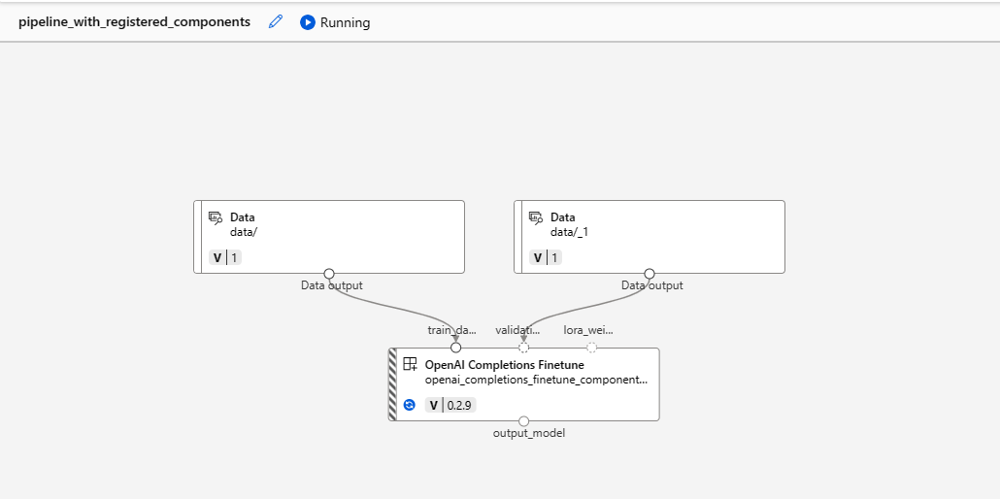
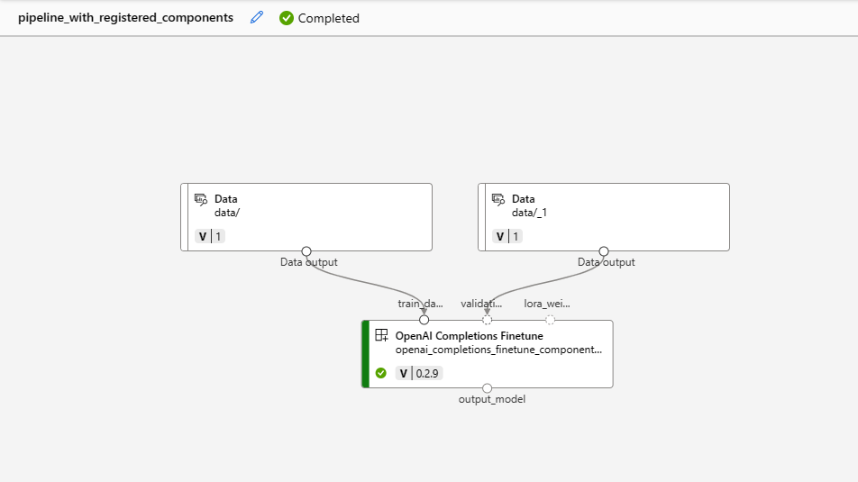
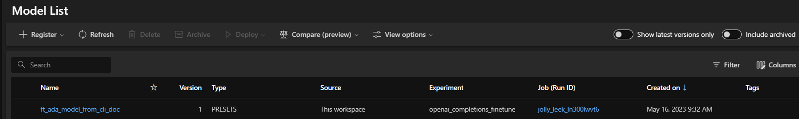

## How to finetune openai models via CLI mode using command component ?

1. Login to az cli using `az login`

2. Navigate to `cli\foundation-models\azure_openai\oai-v1\openai_completions_finetune`

3. Run `az ml job create --subscription <SUBSCRIPTION_ID> --resource-group <RESOURCE_GROUP_NAME> --workspace-name <WORKSPACE_NAME> --file "openai_completions_finetune_spec.yaml"`

4. The url to the run will be logged in the command line after step 3 is completed.

5. After completion of the run, the status will be `Completed` of each component.

6. Now you can view the fine-tuned model in `Models` section.

