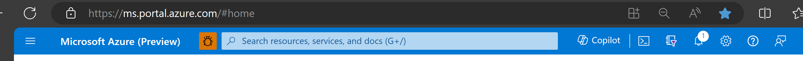
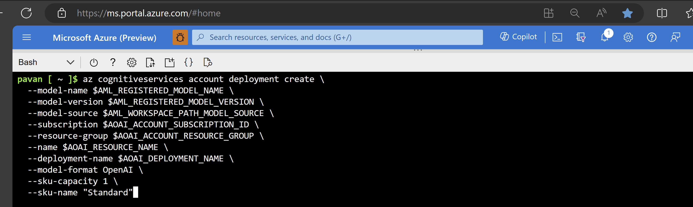
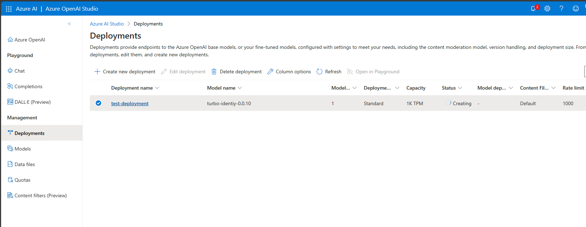
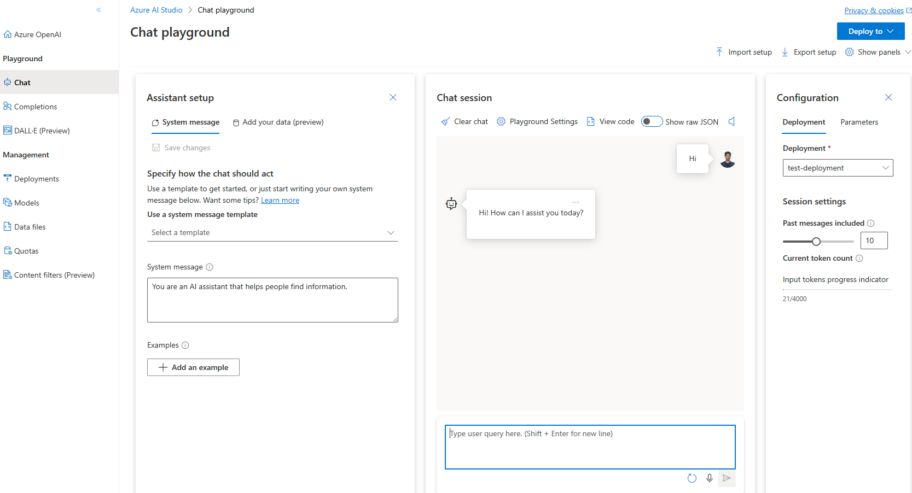

# How to Deploy OpenAI Fine-tuned Models using Azure Cognitive Services CLI

This document provides a guide to deploy OpenAI models fine-tuned via Azure Machine Learning workspace. For deploying OpenAI models fine-tuned via Azure OpenAI services, please refer to the documentation [here](#).

### 1. Use the Azure Cloud Shell on the Microsoft Azure Portal
Visit [https://ms.portal.azure.com/#home](https://ms.portal.azure.com/#home)



### 2. Define Your Azure OpenAI Account Resource
Add your Azure OpenAI studio account's name, subscription ID, and resource group in cloud shell.
```bash
export AOAI_RESOURCE_NAME="<YOUR-AOAI-ACCOUNT-NAME>"
export AOAI_ACCOUNT_SUBSCRIPTION_ID="<YOUR-AOAI-ACCOUNT-SUBSCRIPTION>"
export AOAI_ACCOUNT_RESOURCE_GROUP="<YOUR-AOAI-ACCOUNT-RESOURCE-GROUP>"
```

### 3. Add AzureML Registered Fine-Tuned Model Information
In Azure Cloud Shell, add the AzureML registered model name, registered model version, and the AzureML (AML) workspace path for your fine-tuned model. 
Your registered models data can be found in the `Models` tab of your AzureML workspace.

```bash
export AML_REGISTERED_MODEL_NAME="<YOUR-AML-REGISTERED-MODEL-NAME>"
export AML_REGISTERED_MODEL_VERSION="<YOUR-AML-REGISTERD-MODEL-VERSION>"
export AML_WORKSPACE_PATH_MODEL_SOURCE="<YOUR-AML-WORKSPACE-PATH>"
```

Note: Azure ML workspace path format is `/subscriptions/<AML-WORKSPACE-SUBSCRIPTION-ID>/resourceGroups/<AML-WORKSPACE-RESOURCE-GROUP>/providers/Microsoft.MachineLearningServices/workspaces/<AML-WORKSPACE-NAME>`

### 4. Set the Deployment Name and Run the Azure Cognitive Service CLI Command
Set the deployment name and run the Azure Cognitive serivce CLI command to deploy your fientuned model on Azure OpenAI studio.
```
export AOAI_DEPLOYMENT_NAME="DEPLOYMENT-NAME"
az login
az cognitiveservices account deployment create \
  --model-name $AML_REGISTERED_MODEL_NAME \
  --model-version $AML_REGISTERED_MODEL_VERSION \
  --model-source $AML_WORKSPACE_PATH_MODEL_SOURCE \
  --subscription $AOAI_ACCOUNT_SUBSCRIPTION_ID \
  --resource-group $AOAI_ACCOUNT_RESOURCE_GROUP \
  --name $AOAI_RESOURCE_NAME \
  --deployment-name $AOAI_DEPLOYMENT_NAME \
  --model-format OpenAI \
  --sku-capacity 1 \
  --sku-name "Standard"
```


### 5. View Your Azure OpenAI Model Deployment status in Azure OpenAI Studio portal
Visit [https://oai.azure.com/portal/](https://oai.azure.com/portal/) to view your model deployments.



### 6. After your deployment succeeds, use Azure OpenAI chat playground to test your Deployment
View your deployments on Azure OpenAI studio as shown below.


Use Chat Playground features to make calls to your fine-tuned model:



### 7. Refer to the documentation on Azure OpenAI Studio here - [https://learn.microsoft.com/en-us/azure/ai-services/openai/](https://learn.microsoft.com/en-us/azure/ai-services/openai/) to learn more on how to use your model deployments.