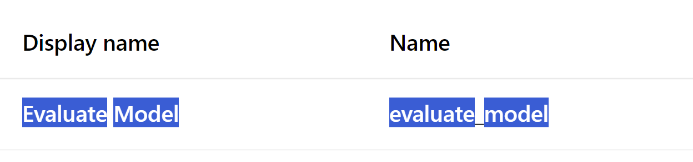

# LLM Evaluate Model Component
This component enables user to evaluate a model by providing the supported model, run inference to generate predictions first followed by computing metrics against a dataset. You can find the component in your workspace components page. 

# Inputs
1. _task_ (string, required):

    Task type for which model is trained
2. _test_data_ (URI_FILE, required):

    Path to file containing test data in `jsonl` format
3. _evaluation_config_ (URI_FILE, optional):

    Path to file containing test data in `jsonl` format
4. _test_data_input_column_names_ (string, required):

    Name of the columns in the test dataset that should be used for prediction. More than one columns should be separated by the comma(,) delimiter without any whitespaces in between
4. _test_data_label_column_name_ (string, required):

    Name of the key containing target values in test data.
5. _mlflow_model_ (mlflow_model, optional):

    MLFlow model (either registered or output of another job)
6. _model_uri_ (string, optional):

    MLFlow model uri of the form -  
    fetched from azureml run as `runs:/<azureml_run_id>/run-relative/path/to/model`  
    fetched from azureml model registry as `models:/<model_name>/<model_version>`
7. _device_ (string, optional):
    
    Option to run the experiment on CPU or GPU provided that the compute that they are choosing has Cuda support.
8. _batch_size_ (integer, optional):

    Option to provide batch size for a task.

    
# Outputs
1. _evaluation_result_ (URI_FOLDER):

    Path to output directory which contains the generated predictions.csv file containing predictions for the provided test set to the component and other metadata in the evaluationResult folder

# Additional Parameters
- Classification Inputs
    1. _metrics_ (list[str], optional): 

        List of metric names to be computed. If not provided we choose the default set. 
    2. _class_labels_ (list[any], optional): 

        List of labels for entire data (all the data train/test/validation) 
    3. _train_labels_ (list[any], optional): 

        List of labels used during training. 
    4. _sample_weight_ (list[float], optional):  
        Weights for the samples (Does not need to match sample weights on the fitted model) 
    6. _use_binary_ (bool, optional): 

        Boolean argument on whether to use binary classification metrics or not 
    7. _positive_label_ (any, optional):

        Class designed as positive class in binary classification metrics. 
    8. _multilabel_ (bool, optional): 
    
        Whether the classification type is multilabel or single label.

- Regression Inputs
    1. _metrics_ (list[str], optional): 

        List of metric names to be computed. If not provided we choose the default set. 
    2. _y_max_ (float, optional): 

        The max target value. 
    3. _y_min_ (float, optional): 

        The min target value. 
    4. _y_std_ (float, optional): 

        The standard deviation of targets value. 
    5. _sample_weight_ (list[float], optional):

        Weights for the samples (Does not need to match sample weights on the fitted model) 
    6. _bin_info_ (dict[str, float], optional):  

        The binning information for true values. This should be calculated from make_dataset_bins. Required for 
        calculating non-scalar metrics. 

- Token Classification Inputs
    1. _train_label_list_ (list[str], optional)

        List of labels for training data.
    2. _metrics_ (list[str], optional)

        List of metric names to be computed. If not provided we choose the default set. 

- Summarization Inputs
    1. _metrics_ (list[str], optional)

        List of metric names to be computed. If not provided we choose the default set. 
    2. _aggregator_ (bool, optional)

        Boolean to indicate whether to aggregate scores.
    3. _stemmer_ (bool, optional)

         Boolean to indicate whether to use Porter stemmer for word suffixes.

- Translation Inputs
    1. _metrics_ (list[str], optional)

        List of metric names to be computed. If not provided we choose the default set. 
    2. _smoothing_ (bool, optional)

        Boolean to indicate whether to smooth out the bleu score

- Question Answering Inputs
    1. _metrics_ (list[str], optional)

        List of metric names to be computed. If not provided we choose the default set. 
    2. _regexes_to_ignore_ (list[str], optional)

        List of string regular expressions to ignore.
    3. _ignore_case_ (bool, optional)

         Boolean to indicate whether to ignore case.
    4. _ignore_punctuation_ (bool, optional)

         Boolean to indicate whether to ignore punctuation.
    5. _ignore_numbers_ (bool, optional)

         Boolean to indicate whether to ignore numbers.

# Caveats, Recommendations and Known Issues
Some AutoML Models are not generating correct Mlflow-models so they might not work on with Evaluate Model Component. 
