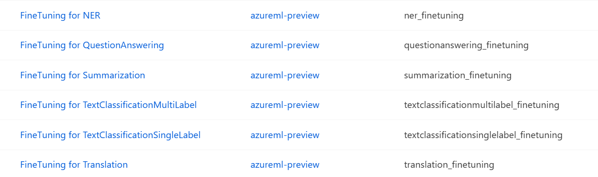
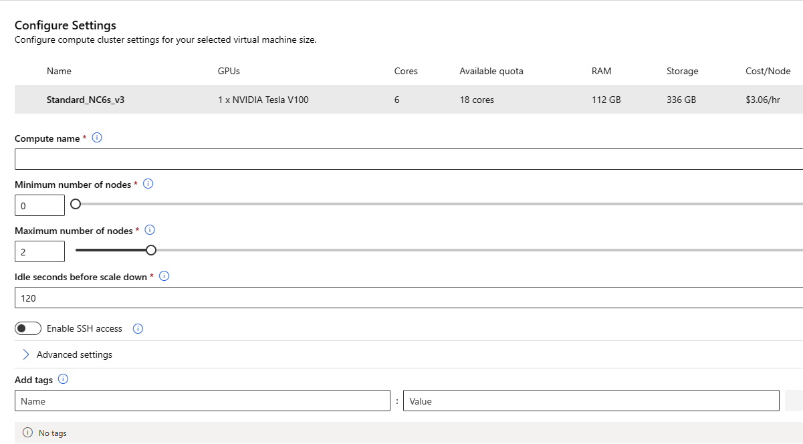
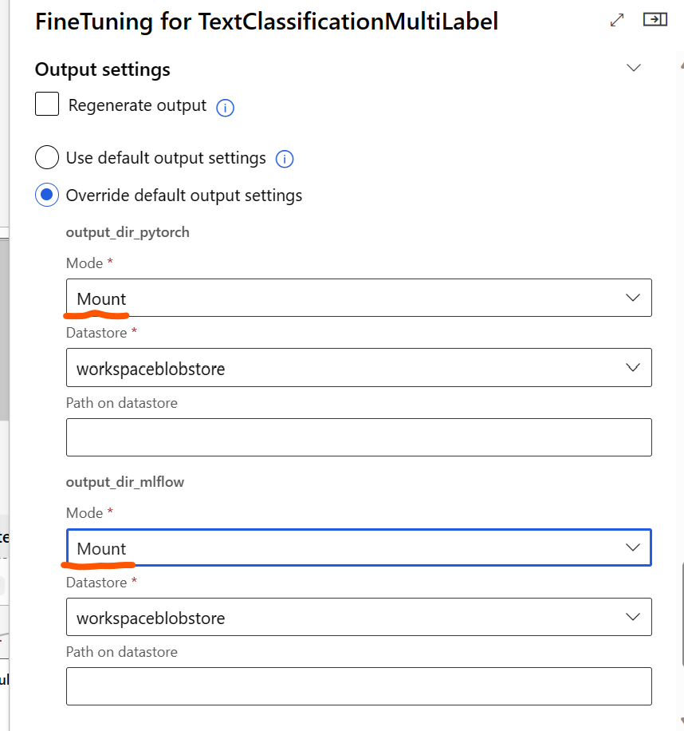

# Finetune Component
This component enables finetuning of pretrained models on custom or pre-available datasets. The component supports LoRA, Deepspeed and ONNXRuntime configurations for performance enhancement. 
The components can be seen here 

# 1. Inputs
1. _deepspeed_config_ (URI_FILE, optional)

    Path to the deepspeed config file

2. _dataset_path_ (URI_FOLDER, required)

    Path to the output folder of [preprocess component](preprocess_component.md/#2-outputs)

3. _model_path_ (URI_FOLDER, required)

    Path to the output directory of [model_selector component](model_selector_component.md/#2-outputs)

# 2. Outputs
1. _output_dir_ (URI_FOLDER)

    The folder containing finetuned model output with checkpoints, model configs, tokenizers, optimzer and scheduler states and random number states in case of distributed training.

# 3. Parameters
    
## 3.1. Lora Parameters
1. _apply_lora_ (string, optional)

    If "true" enables lora. The default is "false". The lora is `ONLY` supported for models present in `model_id` dropdown of `model_selector` component. When *finetune component* is connected to *model_evaluation* component, _merge_lora_weights_ **MUST** be set to "true" when _apply_lora_ is "true"

2. _merge_lora_weights_ (string, optional)

    If "true", the lora weights are merged with the base Hugging Face model. The default value is "false"

2. _lora_alpha_ (integer, optional)

    alpha attention parameter for lora

3. _lora_r_ (integer, optional)

    The rank to be used with lora.

4. _lora_dropout_ (float, optional)

    lora dropout value

## 3.2. Training Parameters

1. _epochs_ (int, optional)

    Number of epochs to run for finetune. The default value is 5

2. _max_steps_ (int, optional)

    If set to a positive number, the total number of training steps to perform. Overrides `epochs`. In case of using a finite iterable dataset the training may stop before reaching the set number of steps when all data is exhausted. default value is -1

3. _learning_rate_ (float, optional)

    Start learning rate used for training. default value is 2e-5

4. _train_batch_size_ (int, optional)

    Batch size used for training. default value is 4.

5. _valid_batch_size_ (int, optional)

    Batch size used for validation. default value is 4.

6. _auto_find_batch_size_ (string, optional)

    If set to "true", the train batch size will be automatically downscaled recursively till if finds a valid batch size that fits into memory. The default value is "false".

## 3.3. Deepspeed and ORT Parameters
1. _apply_ort_ (string, optional)

    If "true" apply ORT optimization. The default is "false".

2. _apply_deepspeed_ (string, optional)

    If "true" enables deepspeed. If no `deepspeed_config` is provided, the default config in the component will be used else the user passed config will be used. The default is "false".

    Please note that to enable deepspeed, `apply_deepspeed` must be set to true

## 3.4. Optimizer and Scheduler Parameters

1. _optimizer_ (string, optional)

    Optimizer to be used while training. default value is "adamw_hf"

2. _warmup_steps_ (int, optional)
    
    The number of steps for the learning rate scheduler warmup phase. The default value is 20

3. _weight_decay_ (float, optional)

    The weight decay to apply (if not zero) to all layers except all bias and LayerNorm weights in AdamW optimizer. The default value is 0

4. _adam_beta1_ (float, optional)

    The beta1 hyperparameter for the AdamW optimizer. The default value is 0.9

5. _adam_beta2_ (float, optional)

    The beta2 hyperparameter for the AdamW optimizer. The default value is 0.999

6. _adam_epsilon_ (float, optional)

    The epsilon hyperparameter for the AdamW optimizer. The default value is 1e-8

7. _gradient_accumulation_steps_ (int, optional)

    Number of updates steps to accumulate the gradients for, before performing a backward/update pass. The default value is 1

8. _lr_scheduler_type_ (string, optional)

    The learning rate scheduler to use. The default value is `linear`

## 3.5. Misc Parameters

1. _precision_ (int, optional)

    Apply mixed precision training. This can reduce memory footprint by performing operations in half-precision. The default value is 32

2. _seed_ (int, optional)

    Random seed that will be set at the beginning of training. The default value is 42

3. _evaluation_strategy_ (string, optional)

    The evaluation strategy to adopt during training. If set to "steps", either the `evaluation_steps_interval` or `evaluation_steps` needs to be specified, which helps to determine the step at which the model evaluation needs to be computed else evaluation happens at end of each epoch. The default value is "epoch"

4. _evaluation_steps_interval_ (float, optional)

    The evaluation steps in fraction of an epoch steps to adopt during training. Overwrites evaluation_steps if not 0. The default value is 0

5. _evaluation_steps_ (int, optional)

    Number of update steps between two model evaluations if evaluation_strategy='steps'. The default value is 500

6. _logging_strategy_ (string, optional)

    The logging strategy to adopt during training. If set to "steps", the `logging_steps` will decide the frequency of logging else logging happens at the end of epoch. The default value is "epoch".

7. _logging_steps_ (int, optional)

    Number of update steps between two logs if logging_strategy='steps'. The default value is 100

8. _save_total_limit_ (int, optional)

    If a value is passed, will limit the total amount of checkpoints. Deletes the older checkpoints in output_dir. If the value is -1 saves all checkpoints". The default value is -1

9. _apply_early_stopping_ (string, optional)

    If set to "true", early stopping is enabled. The default value is "false"

10. _early_stopping_patience_ (int, optional)

    Stop training when the specified metric worsens for early_stopping_patience evaluation calls.

11. _early_stopping_threshold_ (float, optional)

    Denotes how much the specified metric must improve to satisfy early stopping conditions.

## 3.6. Continual Finetuning

1. _resume_from_checkpoint_ (string, optional)

    If set to "true", resumes the training from last saved checkpoint. Along with loading the saved weights, saved optimizer, scheduler and random states will be loaded if exists. The default value is "false"

# 4. Run Settings

This setting helps to choose the compute for running the component code. **For the purpose of finetune, gpu compute should be used**. We recommend using ND24 compute.

> Select *Use other compute target*

- Under this option, you can select either `compute_cluster` or `compute_instance` as the compute type and the corresponding instance / cluster created in your workspace.
- If you have not created the compute, you can create the compute by clicking the `Create Azure ML compute cluster` link that's available while selecting the compute. See the figure below

## 4.1. Settings for Distributed Training

> When creating the compute, set the `Maximum number of nodes` to the desired value for multi-node training as shown in the figure below

> In case of distributed training, a.k.a multi-node training, the mode must be set to `Mount` and not `Upload` as shown in the figure below

> Set the number of processes under Distribution subsection to use all the gpus in a node

To use all the gpus within a node, set the `Process count per instance` to number of gpus in that node as shown below

> Set the number of nodes under the Resources subsection

In case of distributed training, you can configure `instance count` under this subsection to increase the number of nodes as shown below

