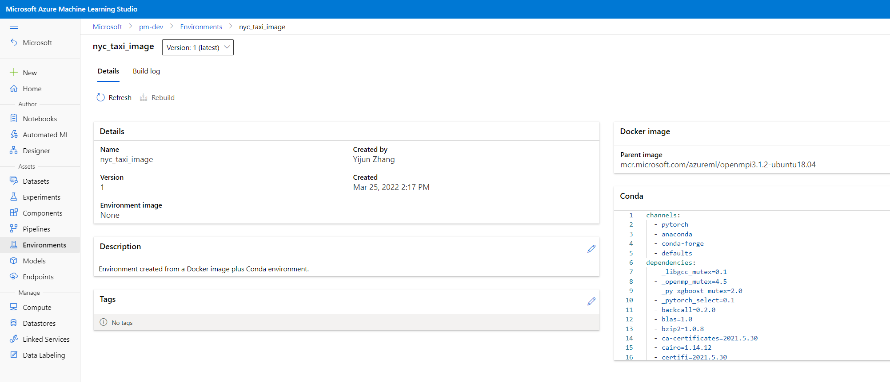
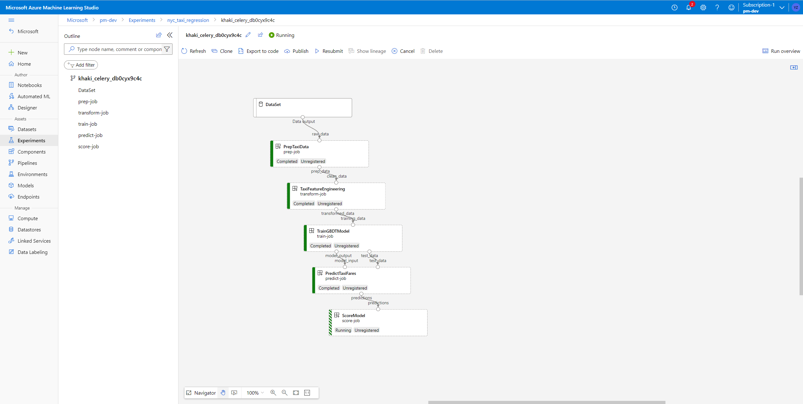

# How to transition a model experiment to a pipeline?

Machine learning is a work that needs collaboration of many different roles, among which data scientist and machine learning engineer are the two major roles who will work together to train and productionize models. This article's purpuse is to show machine learning engineers how to productionize models built by data scientists.

If you are not sure which role you are, please check the table below.

|Role |Responsiblities |Tools |
| --- | --- | --- |
|data scientist|model development, model debug, data understanding, model experimentation, continuous training |VSCode/PyCharm/Jupyter Notebook, Python, PyTorch/TensorFlow, ML Platform|
|machine learning engineer|engineering best practices, scaling, production training, model management, model deployment, application integration, MLOps|ML platform, Python, Docker, Kubernetes, ML pipeline|

When a model is developped and goes to production, work will be handed over from data scientist (hereinafter referred to as DS) to machine learning engineer (hereinafter referred to as MLE).

Data Scientist should provide:
* a training script, it could be a Jupyter Notebook file or a python script depending on editor used by DS. This script includes what piece of sample data used, how data is processd, how model is trained, how metrics are defined to evaluate the model, and metrics baseline on sample data.
* the environment to run this script, it could be a conda environment yaml or a requirements.txt.


After these inputs are handed over from DS, a MLE usually will take following steps to productionize the model.

1. Git it work: test the code in local 
1. Get it reproducable
    - submit a standalone job to cloud with sample data
    - validate the model performacne with full data
1. Get it modulized - turn into a pipeline

The sample code for each step is stored under *cli\jobs\pipelines-with-components\local-model-experiment-to-pipeline* folder in [azureml-example repo](https://github.com/Azure/azureml-examples). We will use a simple NYC Taxi fee prediction example to demo this process. 

## 1. Get it work

### Get it work on local 

In order to make a script run on local, MLE needs to first go through code, understand logic in code, and refine code if necessary, rebuild environment, then run it locally. 

#### Refine code

When refining code, a MLE should take into consideration security, compliance, cost, company internal engineering practices, etc.

For example, to imporve productivity, MLE can delete or comment parts of code for data visulization and expolartion, which will save compute time when runing on production environment. For example, code cells to check statistics or to view data distribution through histogram can be comment out.

Besides, if a .ipynb file is provided by data scientist, you also need to convert notebook to python file using command below because Azure ML accepts .py file as job input when moving to cloud.

```
jupyter nbconvert --to script --output script inputs_from_data_scientist/notebook.ipynb 
```

#### Rebuild environement to run script

To run DS's script on local, MLE needs to reproduce the same environment.

These are some popular approaches to do this, for example:

* build a docker image and run container
* create conda environment from yaml file 
* pip install requirements.txt

Building a docker image and running script in container is recommended, it's OS independent and thus the best way to simulate running script in remote. We will take this method as an example below.

First, list all the dependencies imported in script, and get denpendencies versions according to full list of requirements provided by DS.

```python
from pathlib import Path
import os
import pandas as pd
from sklearn.ensemble import GradientBoostingRegressor
from sklearn.model_selection import train_test_split
import pickle
import numpy as np
from sklearn.metrics import mean_squared_error, r2_score
import matplotlib.pyplot as plt 
```


Now you can obtain a relatively short list of requirements.txt. In this example, `pathlib/os/pickle` are removed, because they are included in python. And `plt` is not necessary, since we already remove histogramm plotting code.

```python
pathlib2==2.3.6
pandas==1.3.3
sklearn==0.0
numpy==1.18.5
```

Now you can write your dockerfile in which you set base image as python with a proper version, then install requirements, copy sample data and script, set command.
```docker
#FROM mcr.microsoft.com/azureml/openmpi3.1.2-ubuntu18.04
FROM python:3.8.5

# python installs
COPY env/local/requirements.txt .
RUN pip install -r requirements.txt && rm requirements.txt

COPY data/sample_data /usr/python/data/sample_data
COPY /1_script_run_on_local/src/script.py /usr/python/1_script_run_on_local/src/
WORKDIR /usr/python

# set command
CMD ["bash", "-c", "cd 1_script_run_on_local/src && python script.py && exit"]
```

You can then run these commands to build image and run python script in container to test it. 

```
docker build -t nyc_taxi_image -f env/local/Dockerfile .
docker run -it nyc_taxi_image:latest
```

### Get it work on cloud

After making sure your code can work on local, you can then move to cloud by submitting an Azure ML job. 

#### Prerequisites

To submit a job to Azure ML, you should install cli and set up environment on your local machine.

Install latest version of azure cli, please refer to [How to install the Azure CLI](https://docs.microsoft.com/en-us/cli/azure/install-azure-cli).

Install latest version of azure ml cli and then set up default subscription, resource group and workspace (commands shown below). For more informations, please refer to [Install and set up the Maching learning CLI ](https://docs.microsoft.com/en-us/azure/machine-learning/how-to-configure-cli?tabs=public).

Here is a cheatsheet for environment set-up.

```
az login --use-device-code
az account set -s "sub_id"
az configure --defaults group=rg_name workspace=ws_name location=location
```

#### Define inputs and outputs

In preperation for moving to cloud, you need to define script interfaces (inputs and outputs), because you will use AZure ML datastore instead of local disk as data source.

In this example, I define raw_data as input, model_output as output.

Code modifications are:

1. Import argparse package, add these two arguments

    ``` python
    import argparse

    parser = argparse.ArgumentParser()
    parser.add_argument("--raw_data", type=str, help="Path to raw data")
    parser.add_argument("--model_output", type=str, help="Path of output model")


    args = parser.parse_args()

    lines = [
        f"Raw data path: {args.raw_data}",
        f"model output path: {args.model_output}",

    ]

    for line in lines:
        print(line)
    ```

2. Replace raw_data with args.raw_data
    
    ```python
    # Read raw data from csv to dataframe
    # raw_data = './../data/sample_data/'
    print("raw data files: ")
    arr = os.listdir(args.raw_data)
    print(arr)

    green_data = pd.read_csv((Path(args.raw_data) / 'greenTaxiData.csv'))
    yellow_data = pd.read_csv((Path(args.raw_data) / 'yellowTaxiData.csv'))
    ```

3. Replace model_output with args.model_output
    ```python
    # Output the model 
    # model_output = './model/'
    if not os.path.exists(args.model_output):
        os.mkdir(args.model_output)
    pickle.dump(model, open((Path(args.model_output) / "model.sav"), "wb"))
    ```

4. Add metrics and parameters logging code. Azure ML leverages MLflow to do experiment tracking. You need to import mlflow, then use mlflow.log_param() and mlflow.log_metric() instead of standard ouput print(). See more in [this article](https://docs.microsoft.com/en-us/azure/machine-learning/how-to-use-mlflow-cli-runs?tabs=mlflow).

    ```python
    # Compare predictions to actuals (testy)
    # The mean squared error
    # print("Scored with the following model:\n{}".format(model))
    # print("Mean squared error: %.2f" % mean_squared_error(testy, predictions))
    # The coefficient of determination: 1 is perfect prediction
    # print("Coefficient of determination: %.2f" % r2_score(testy, predictions))

    # Log params and metrics to AML

    mlflow.log_param("learning_rate", learning_rate)
    mlflow.log_param("n_estimators", n_estimators)

    mlflow.log_metric("mean_squared_error", mean_squared_error(testy, predictions))
    mlflow.log_metric("r2_score", r2_score(testy, predictions))
    ```

#### Create an Azure ML environment

In the first place, modify dockerfile by deleting commands for copying data and script.

In the second place, write your environment yaml file following [this schema instruction](https://docs.microsoft.com/en-us/azure/machine-learning/reference-yaml-environment). Remember to add argparse and azureml-mlflow in your requirements.txt.

```python
azureml-mlflow==1.39.0
argparse==1.4.0
```

In the end, run this command to register environment on AML. Learn more about Azure ML environments management commands [here](https://docs.microsoft.com/en-us/cli/azure/ml/environment?view=azure-cli-latest#az-ml-environment-create).

```
az ml environment create --file env/cloud/env.yml
```
Now you can run the command below to list all environments created in workspace.

```
az ml environment list
```

Apart from that you can login Azure ML portal to check whether environment is registered correctly.




#### Prepare Azure ML job yaml file and submit a job

What you should do is to wrap your python script into a standalone job through a yaml file. To begin with, you need to follow [this article](https://docs.microsoft.com/en-us/azure/machine-learning/how-to-train-cli) to write your job yaml file, in which you define job name, description, environment used, code path and command to submit job, and interfaces, etc.

Here is an example.

```yaml
$schema: https://azuremlschemas.azureedge.net/latest/commandJob.schema.json
code: ./src
command: >-
  python script.py 
  --raw_data ${{inputs.raw_data}}
  --model_output ${{outputs.model_output}}
inputs:
  raw_data: 
    type: uri_folder
    path: ../sample_data 
outputs:
  model_output: 
    type: uri_folder
environment: azureml:nyc_taxi_image@latest
compute: azureml:cpu-cluster
display_name: nyc_taxi_regression
experiment_name: nyc_taxi_regression
description: Train a GBDT regression model on the NYC taxi dataset.
```
The input can be a local path, Azure ML will upload your sample data to workspace default datastore.

After job yaml file prepared, you can run this command on your local environment to submit a job to Azure ML.

```
az ml job create --f 2_standalone_job_run_on_cloud/2a_job_sample_data.yml --web
```

With this --web option, you are automatically directed to Azure ML job detail page where you can view job informations like run status, duration, logs, etc.

## Get it reproducible

In the first stage, you get your script work in remote with a sample data. To be reproducible, it is recommended to resubmit an Azure ML job with full size big data.

#### Prepare full data

Azure ML datastores record connection information to your Azure storage where your full production data is located. For more details please refer to [Secure data access in Azure Machine Learning](https://review.docs.microsoft.com/en-us/azure/machine-learning/concept-data?branch=release-preview-aml-cli-v2-refresh#connect-to-storage-with-datastores).


Assume your data is now in cloud. Here we will take Azure Blob as an example. Your full size data is stored in the worksapce default blob. Path looks like below: 

```
azureml://datastores/workspaceblobstore/paths/nyc_taxi_data/full_data
```
#### Prepare Azure ML job yaml file and submit a job

What you need to do is to take job.yml of last step, modify input from local path to remote datastore path. 

From:

```yaml
inputs:
  raw_data: 
    type: uri_folder
    path: ./sample_data 
```

To:

```yaml
inputs:
  raw_data: 
    type: uri_folder
    path: azureml://datastores/myfileshare/paths/nyc_taxi/full_data 
```
In this yaml file, myfileshare is datastore name.

Attention, as you use full size data to reproduce your model, you might need to swich to a compute cluster with optimized memory. 

Then rerun this command to submit a job:

```
az ml job create --f 2_standalone_job_run_on_cloud/2b_job_full_data.yml --web
```

## Get it modulized

We suggest MLE to use Azure Machine Learning pipelines to productionize their machine learning project.The core of a machine learning pipeline is to split a complete machine learning task into a multistep workflow. Each step is a manageable component that can be developed, optimized, configured, and automated individually. For more information about pipeline value add, please refer to [what is pipeline](https://docs.microsoft.com/en-us/azure/machine-learning/concept-ml-pipelines).

### Decompose code into independent components

First of all, you need to go through code, understand AI workflow.Then decompose it into several steps. 

In this example, we will decompose the task into data processing, feature engineering, training, prediction, scoring steps. Each step will be a component, with well defined interface and can be developped and test indenpendently. For more details about component, please refer to [this component concept article](https://docs.microsoft.com/en-us/azure/machine-learning/concept-component).

Each component can be considered as a stanalone job, then a pipeline is responsible to schedule them together. Similar with migrating a single script from local to remote, what you need to do is to import necessary dependencies, define interfaces, modify code for each step, create yaml file for each componet. You can learn more about [how to create component using YAML and CLI v2 here](https://docs.microsoft.com/en-us/azure/machine-learning/how-to-create-component-pipelines-cli).

The component YAML defination and source code is under *local-model-experiment-to-pipeline\3_pipeline_job_run_on_cloud\components*

#### Step 1:

Input: NYC taxi dataset folder, including 2 .csv files

Code: Take multiple taxi datasets (yellow and green), remove and rename columns, combine greed and yellow data.

Output: Single combined data

#### Step 2:

Input: Output of step 1, combined data

Code: Eliminate filers, filter out locations outside NYC, split the pickup and dropoff date into the day of the week, day of the month, and month values, etc.

Output: Dataset filtered and created with 20+ features

#### Step 3:

Input: Output of step 2, processed data

Code: Split data into X and Y, split the data into train/test set, train a GBDT model, log parameters

Output: Trained model (pickle format) and data subset for test (.csv)

#### Step 4:

Input: Output of step3, GBDT model and test data

Code: Predict test dataset with trained model

Output: Test data with predictions added as a column

#### Step 5:

Input: Output of step4, test data with predictions

Code: Calculate and log metrics

Output: None

After all these, you have 5 python source codes and yaml file.

### Define and submit a pipeline

After defining components, you could create a pipeline which connects a serie of components and submit whole complete workflow.

What you need to do is first to write a pipeline yaml file which describes how pipeline is built, what compute resource used, inputs and outputs, etc. and then to submit a pipeline job using command line.

You can refer to this article to learn more [pipeline job yaml specification](https://docs.microsoft.com/en-us/azure/machine-learning/reference-yaml-job-pipeline).

You can first test with sample file and then run it with full size data by switching pipeline input path from local to Azure ML datastore.

```
az ml job create --f 3_pipeline_job_run_on_cloud/3a_pipeline_sample_data.yml --web
az ml job create --f 3_pipeline_job_run_on_cloud/3b_pipeline_full_data.yml --web
```
The command is the same as standalone job, except this time you are directed to pipeline job detail page where you can see your pipeline graph.




