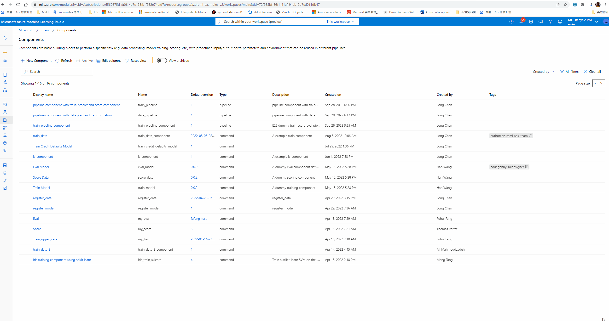
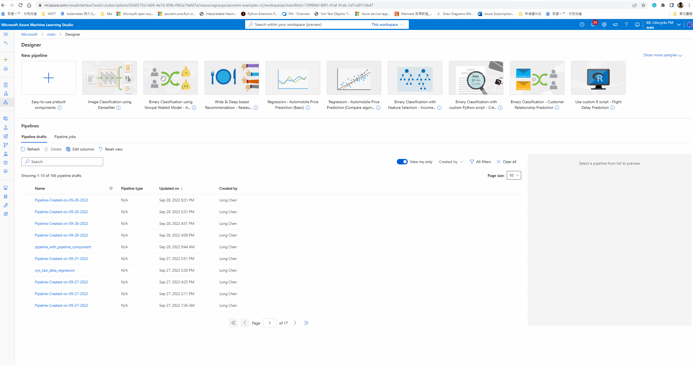
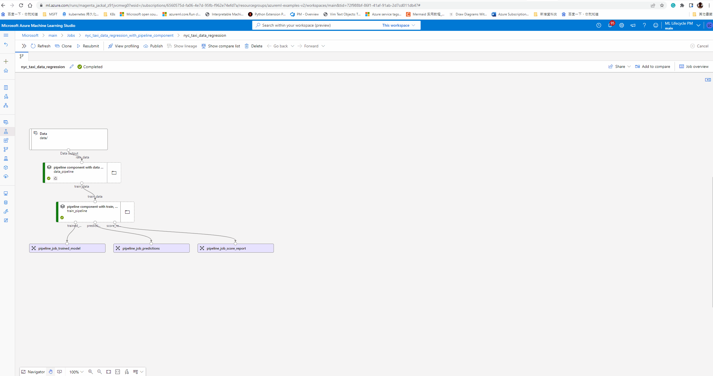
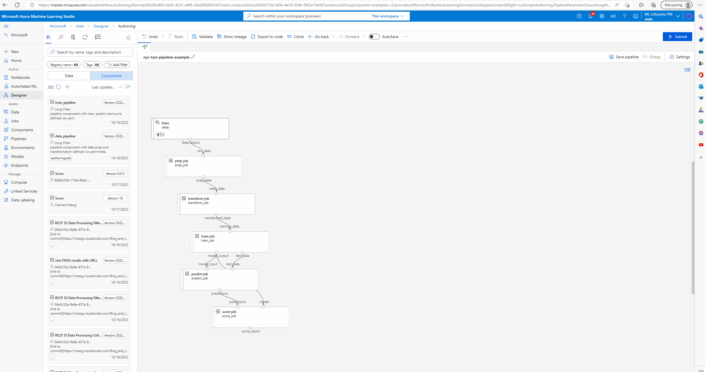

# Pipeline component
Please note that this Private Preview release is subject to the [Supplemental Terms of Use for Microsoft Azure Previews](https://azure.microsoft.com/en-us/support/legal/preview-supplemental-terms/).
## Overview
When developing complex machine learning  pipeline, there will be sub-pipeline which will use multi-step to doing some task such as data preprocessing, model training. And they can develop and test standalone. We introduce pipeline component, which can group multi-step as component, then you can use them to as single step built complex pipeline, this will help your share your work and better collaborate with team members.

Pipeline component author can focus on the sub-task, and easy to integrate pipeline component with whole pipeline job. Meanwhile, as pipeline component have well defined interface (inputs/outputs), pipeline component user didn't need to know detail implementation of pipeline component.

## Prerequisites
- Please update your CLI and SDK to new version: CLI>=2.10.0, SDK>=0.1.0
- As this private preview feature, please fill [this form to join](https://forms.office.com/r/pEguDEiqZL).
- To use this new featur you need use [CLI and SDK v2](https://learn.microsoft.com/en-us/azure/machine-learning/concept-v2).
    - [Install and set up CLI (v2)](https://learn.microsoft.com/en-us/azure/machine-learning/how-to-configure-cli)
    - [Install and set up SDK (v2)](https://aka.ms/sdk-v2-install)

## The difference of pipeline job and pipeline component
In general, pipeline component is much similar to pipeline job. They are both consist of group of jobs/component. Here are some main difference you need aware when defining pipeline component:
- Pipeline component only define the interface of inputs/outputs, which means when define pipeline component your need explicitly define type of inputs/outputs instead of directly assign values to them.
- Pipeline component can not have runtime settings, your can not hard-code compute, data node in pipeline component, you need promote them as pipeline level inputs, and assign values during runtime.
- Pipeline level settings such as default_datastore, default_compute are also runtime setting, they are also not part of pipeline component definition.

## Get started
Please make sure to set the environment variable `AZURE_ML_CLI_PRIVATE_FEATURES_ENABLED` equals `true` , as this feature is under private preview.
- `set AZURE_ML_CLI_PRIVATE_FEATURES_ENABLED=true` in Windows. 
- `export AZURE_ML_CLI_PRIVATE_FEATURES_ENABLED=true` in macOS/Linux
### CLI experience
You can find more detail example [here](./samples/cli/nyc_taxi_data_regression_with_pipeline_component/).

#### Define pipeline component
You can use multi-components to built a pipeline component. Much similar like how you built pipeline job with component.

This is two step pipeline component.

```yaml
$schema: https://azuremlschemas.azureedge.net/latest/pipelineComponent.schema.json
type: pipeline
name: data_pipeline
display_name: pipeline component with data prep and transformation
description: pipeline component with data prep and transformation

# <inputs_and_outputs>
inputs:
  raw_data: 
    type: uri_folder
outputs: 
  train_data:
    type: uri_folder
# </inputs_and_outputs>

# <jobs>
jobs:
  prep_job:
    type: command
    component: ./prep_src/prep.yml
    inputs:
      raw_data: ${{parent.inputs.raw_data}}
    outputs:
      prep_data: 

  transform_job:
    type: command
    component: ./transform_src/transform.yml
    inputs:
      clean_data: ${{parent.jobs.prep_job.outputs.prep_data}}
    outputs:
      transformed_data: ${{parent.outputs.train_data}}
# </jobs>
```

##### Using pipeline component to built pipeline job
When reference pipeline component to define child job in pipeline job, just like reference other type of component.
You can provide runtime settings such as default_datastore, default_compute in pipeline job level, any parameter you want to change during run time need promote as pipeline job inputs, otherwise, they will be hard-code in next pipeline component.
We are support to promote compute as pipeline component input to support heterogenous pipeline which may need different compute target in different steps.
```yaml
$schema: https://azuremlschemas.azureedge.net/latest/pipelineJob.schema.json
type: pipeline
display_name: nyc_taxi_data_regression
description: Train regression model based on nyc taxi dataset

settings:
  default_datastore: azureml:workspaceblobstore
  default_compute: azureml:cpu-cluster
  continue_on_step_failure: false

# <inputs_and_outputs>
inputs:
  pipeline_raw_data:
    type: uri_folder
    path: ./data
  compute_train_node: cpu-cluster # example to show how to promote compute as inputs

outputs: 
  pipeline_job_trained_model:
    type: mlflow_model
  pipeline_job_predictions:
    mode: rw_mount 
  pipeline_job_score_report:
    mode: rw_mount
# </inputs_and_outputs>

# <jobs>
jobs:
  data_pipeline:
    type: pipeline
    component: ./data_pipeline/data_pipeline.yml
    inputs:
      raw_data: ${{parent.inputs.pipeline_raw_data}}
    outputs:
      train_data:  
  train_pipeline:
    type: pipeline
    component: ./train_pipeline/train_pipeline.yml
    inputs: 
      train_data: ${{parent.jobs.data_pipeline.outputs.train_data}}
      compute_train_node: ${{parent.inputs.compute_train_node}}
    outputs:
      trained_model: ${{parent.outputs.pipeline_job_trained_model}}
      predictions: ${{parent.outputs.pipeline_job_predictions}}
      score_report: ${{parent.outputs.pipeline_job_score_report}}
# </jobs>
```
### SDK experience
You can find more detail example [here](./samples/sdk/1f_pipeline_with_pipeline_component/pipeline_with_pipeline_component.ipynb).

#### Define pipeline component
You can use python function to define pipeline component, much similar like using function to define pipeline job. You can also promote compute of some step as pipeline component inputs.

```python
# Load components from YAML
components_dir = "./components/"
train_model = load_component(path=f"{components_dir}/train/train.yml")
score_data = load_component(path=f"{components_dir}/score/score.yml")
eval_model = load_component(path=f"{components_dir}/eval/eval.yml")
compare2 = load_component(path=f"{components_dir}/compare2/compare2.yml")

# Define pipeline component with components
@pipeline()
def train_pipeline_component(
    training_input: Input,
    test_input: Input,
    training_learning_rate: float,
    train_compute: str,
    training_max_epochs: int = 20,
    learning_rate_schedule: str = "time-based",
):
    """E2E dummy train-score-eval pipeline with components defined via yaml."""
    # Call component obj as function: apply given inputs & parameters to create a node in pipeline
    train_with_sample_data = train_model(
        training_data=training_input,
        max_epochs=training_max_epochs,
        learning_rate=training_learning_rate,
        learning_rate_schedule=learning_rate_schedule,
    )
    train_with_sample_data.compute = train_compute

    score_with_sample_data = score_data(
        model_input=train_with_sample_data.outputs.model_output, test_data=test_input
    )
    score_with_sample_data.outputs.score_output.mode = "upload"

    eval_with_sample_data = eval_model(
        scoring_result=score_with_sample_data.outputs.score_output
    )

    # Return: pipeline outputs
    return {
        "trained_model": train_with_sample_data.outputs.model_output,
        "evaluation_report": eval_with_sample_data.outputs.eval_output,
    }
```

#### Using pipeline component to built pipeline job
Pipeline component can use as step like other component in pipeline job. 

```python
# Construct pipeline
@pipeline()
def pipeline_with_pipeline_component(
    training_input,
    test_input,
    compute_train_node,
    training_learning_rate1=0.1,
    training_learning_rate2=0.01,
):
    # Create two training pipeline component with different learning rate
    # Use anonymous pipeline function for step1
    train_and_evaludate_model1 = train_pipeline_component(
        training_input=training_input, 
        test_input=test_input, 
        training_learning_rate=training_learning_rate1,
        train_compute=compute_train_node
    )
    # Use registered pipeline function for step2
    train_and_evaludate_model2 = registered_pipeline_component(
        training_input=training_input, 
        test_input=test_input, 
        training_learning_rate=training_learning_rate2,
        train_compute=compute_train_node
    )

    compare2_models = compare2(
        model1=train_and_evaludate_model1.outputs.trained_model,
        eval_result1=train_and_evaludate_model1.outputs.evaluation_report,
        model2=train_and_evaludate_model2.outputs.trained_model,
        eval_result2=train_and_evaludate_model2.outputs.evaluation_report,
    )
    # Return: pipeline outputs
    return {
        "best_model": compare2_models.outputs.best_model,
        "best_result": compare2_models.outputs.best_result,
    }


pipeline_job = pipeline_with_pipeline_component(
    training_input=Input(type="uri_folder", path="./data/"),
    test_input=Input(type="uri_folder", path="./data/"),
    compute_compare_node="cpu-cluster"
)

# set pipeline level compute
pipeline_job.settings.default_compute="cpu-cluster"
```

### UI experience
You can use `az ml component create` or `ml_client.components.create_or_update` to register pipeline component as registered component. After that you can view component in asset library and component list page.

#### view pipeline component detail
In component list page, you can find the pipeline component detail page to view component interface/definition and manage component versions.


#### Using pipeline component to build pipeline job
After register pipeline component, you can drag and drop pipeline component in designer canvas and use UI to build pipeline job.



#### View pipeline job using pipeline component
After submitted pipeline job, you can go to pipeline job detail page to change pipelline component status, you can also drill down to child component in pipeline component to debug specific component.



#### group components as pipeline component and ungroup pipeline component


## Contact us

Reach out to us: lochen@microsoft.com if you have any questions or feedback.