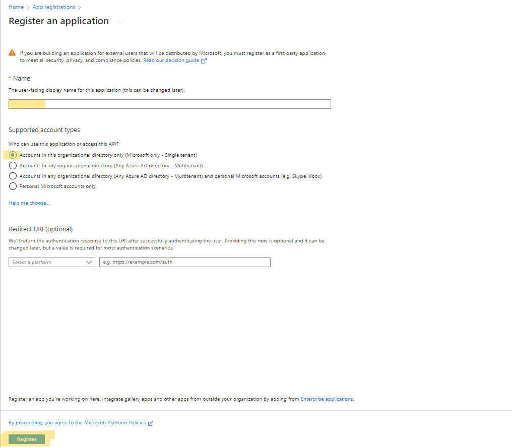
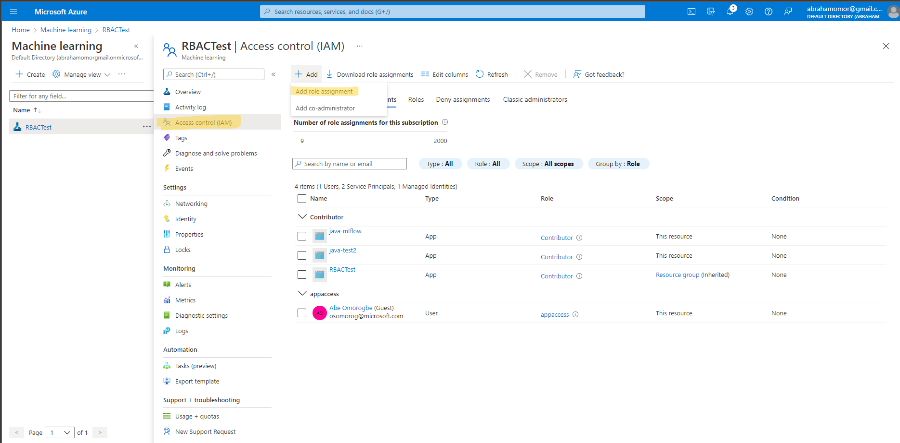
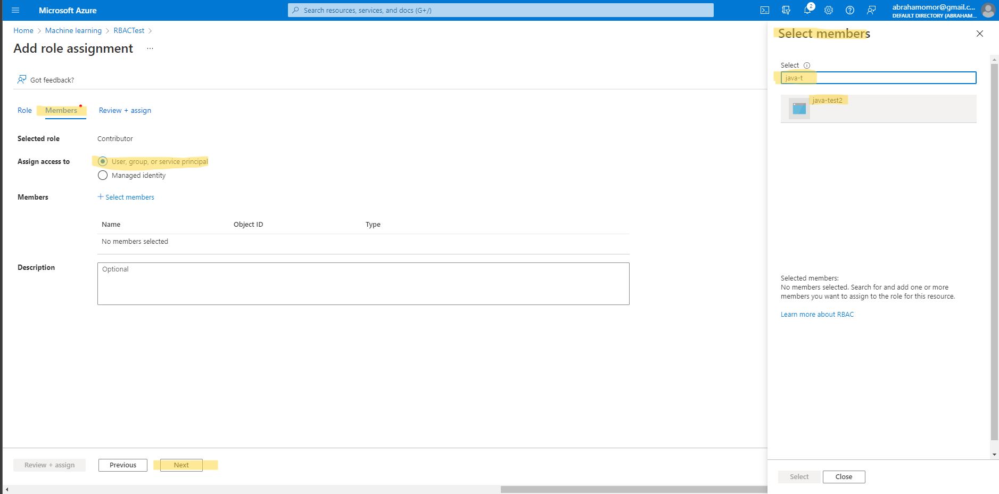
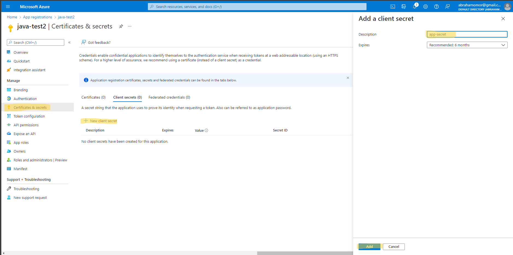

# azuremlflow-java
A simple Java example using the MLflow tracking client with the Azure ML tracking server.  

It uses the IRIS dataset, and popular DeepLearning4J [https://deeplearning4j.konduit.ai/]  to run a mult-class classification experiment in Azure ML.  The model registry and telemetry are tracked in AML using MLflow.  This example has beed develoed and tested using JAVA 11. 

!NOTE Before you run your Java Application, make sure you have Admin permission for the AzureML workspace. 

## Create an App Registration in Azure
1) Enter a name
2) Select Supported account types. (Recommended choice: Accounts in this organizational directory only (Microsoft only - Single tenant))
3) Click Register

## Give the App Permission to your Azure ML workspace
1) Find your AzureML workspace in Azure Portal
2) Select the Access Control and add a new role for the service principal created in the App Registration above.

3) Add the Service Principal as a "Contributor" to the AzureML workspace

## Obtain Secrets for Application 

1) Find your App Registration in Azure Portal (We create this in the first step)
2) Select the Certificates & secrets and add a new client secret for the app.

3) Enter the client secret (AZUREMLFLOW_SP_CLIENT_SECRET) in the [Job YAML File](/job.yml) in the environment variable section. 
4) Enter the rest of the information from the workspace you want to use.
