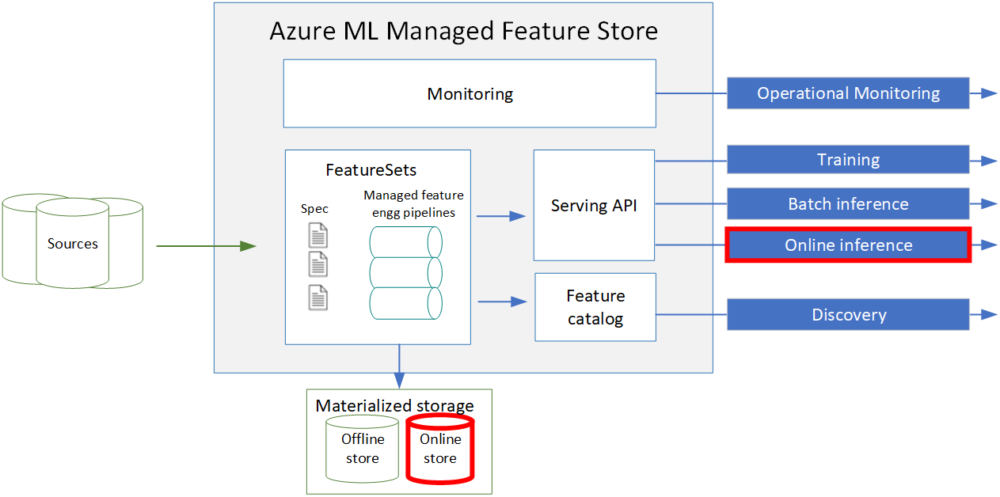

# Private preview of online inference support in feature store

Welcome to the private preview! You can improve your model performance by using features in your online inference flows. Online inference usecases require low latency access to features. To cater to this need, we support Azure cache for redis as the online materialization store.

## Get started with the online inference: 
1. Prerequisite: Please complete the [tutorial series](https://learn.microsoft.com/en-us/azure/machine-learning/tutorial-get-started-with-feature-store?view=azureml-api-2). This will build on top of that.
1. Follow instructions in this [notebook](https://github.com/Azure/azureml-examples/blob/featurestore/online/sdk/python/featurestore_sample/notebooks/sdk_only/5.%20Enable%20online%20store%20and%20run%20online%20inference.ipynb).

Points to note:

1. Enabling online materialization is as simple as enabling the `online` flag in the `materialization_settings` in the feature set.
1. Backfill operation and recurrent materialization jobs will materialize data to both offline and online store (if enabled)
