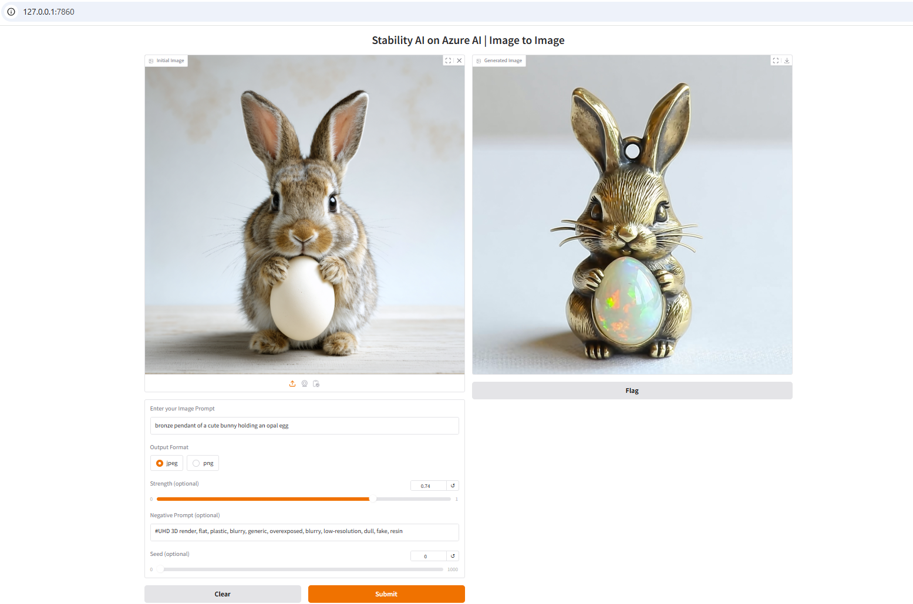

## Prerequisites

Before we start, there are certain steps we need to take to deploy the models:

* Register for a valid Azure account with subscription

* Make sure you have access to Azure AI Studio

* Create a project and resource group

* Select Stability AI models from Model catalog and deloy any of the Stability models

* Deploy with "Pay-as-you-go"

## Quick Start
1. Install python packages  using
   ```
   pip install -r requirements.txt
   ```

2. Run Text_to_Image.py for Text-to-Image usecase or run Image_to_Image.py for Image_to_Image usecases.

3. Replace AZURE_AI_MAAS_ENDPOINT & AZURE_AI_MAAS_ENDPOINT_KEY in the above scripts with your serverless endpoint & key on AI foundry

4. Start the app
   ```
   python Text_to_Image.py
   or
   python Image_to_Image.py
   ```

5. Open UI in a web browser: [http://127.0.0.1:7861](http://127.0.0.1:7861)


### Snapshot
