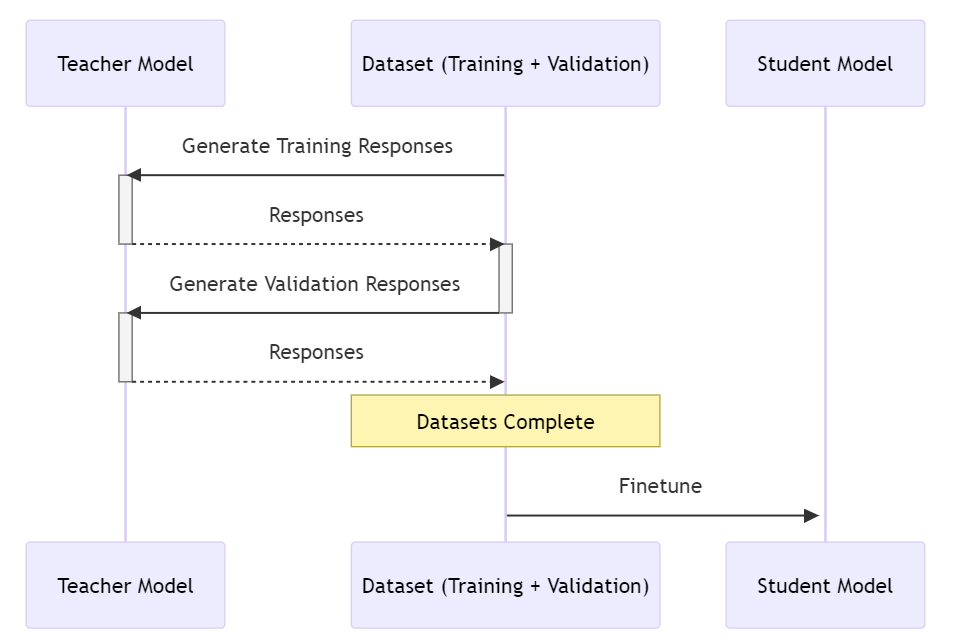

# AzureML Model Distillation

## Table of Contents
- [AzureML Model Distillation](#azureml-model-distillation)
- [Welcome](#welcome)
- [Getting Started](#getting-started)
- [Model Distillation](#model-distillation)
- [Model Offerings](#model-offerings)
- [Examples](#examples)

## Welcome
This document is for anyone interested in exploring and performing model distillation in AzureML. We assume basic knowledge of python.

## Getting Started
Please follow this [tutorial](https://learn.microsoft.com/en-us/azure/machine-learning/quickstart-create-resources?view=azureml-api-2) in order to create all the necessary resources to get started. You'll then have everything you need to get started with Azure Machine Learning. The AzureML Workspace is the top-level resource for your machine learning activities, providing a centralized place to view and manage the artifacts you create when you use Azure Machine Learning. The compute resources provide a pre-configured cloud-based environment you can use to train, deploy, automate, manage, and track machine learning models.

## Model Distillation
Large Language Models (LLMs) are gradually increasing in size. As their size increases, so does the compute resources needed to host these models. Consuming larger language models has the benefit of more accurate responses than smaller language models. With model distillation, we can improve the accuracy of smaller language models by leveraging larger language models.

During distillation, a smaller LLM "student" learns from a larger LLM "teacher". The teacher teaches the student on specific tasks in order to transfer its knowledge onto the student. Through this distillation process, the student's accuracy improves and less computational resources are needed to host this smaller LLM. 

The process of model distillation is a two stage process as seen below.

1. The first stage is the synthetic data generation step. In this step, using a training dataset, the teacher model is asked to generate responses for the training data. If there is a validation dataset, the teacher model also generates responses for that dataset as well.
2. The second stage is finetuning. Once the synthetic data is collected, the student model is then finetuned off of the training and validation data created from the teacher model. This transfers the knowledge from the teacher model to the student model.

## Model Offerings
### Teacher Models
We currently support Meta Llama 3.1 405B Instruct as the teacher model for all distillation scenarios.

### Student Models
- Meta Llama 3.1 8B Instruct
- Phi 3 Mini 4k Instruct
- Phi 3 Mini 128k Instruct
- Phi 3.5 Mini Instruct
- Phi 3.5 MoE Instruct
- Phi 3 Medium 4k Instruct
- Phi 3 Medium 128k Instruct

We currently support Meta Llama 3.1 8B Instruct and Microsoft Phi3-Mini, Phi3-Medium, and Phi3.5 Instruct series models as student models. Fine-tuning of Meta Llama 3.1 Instruct series of models is only available in West US 3 region whereas Fine-tuning of Phi 3 and Phi 3.5 Instruct series of models is only available in East US 2 region. To use the distillation offering your workspace must be setup in the appropriate region for your selected student model.

## Examples
We currently support numerous task types for model distillation. To view examples on how to distill and consume a model with the SDK, click on the following task type of interest

### SDK Examples
- [NLI (Natural Language Interpretation)](./nli/distillation_chat_completion.ipynb)
- [Conversation](./conversation/distillation_conversational_task.ipynb)
- [NLU QA (Natural Language Understanding Question and Answer)](./nlu_qa/distillation_nlu_qa_task.ipynb)
- [Math](./math/distillation_math.ipynb)
- [Summarization](./summarization/distillation_summarization.ipynb)

### CLI Examples
- [NLI (Natural Language Interpretation)](/cli/foundation-models/system/distillation/nli/README.md)
- [Conversation](/cli/foundation-models/system/distillation/conversation/README.md)
- [NLU QA (Natural Language Understanding Question and Answer)](/cli/foundation-models/system/distillation/nlu_qa/README.md)
- [Math](/cli/foundation-models/system/distillation/math/README.md)
- [Summarization](/cli/foundation-models/system/distillation/summarization/README.md)
