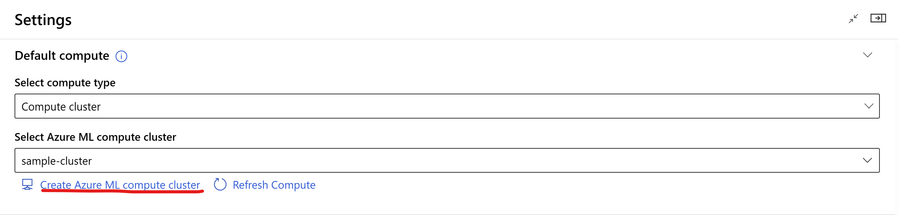
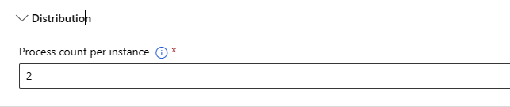
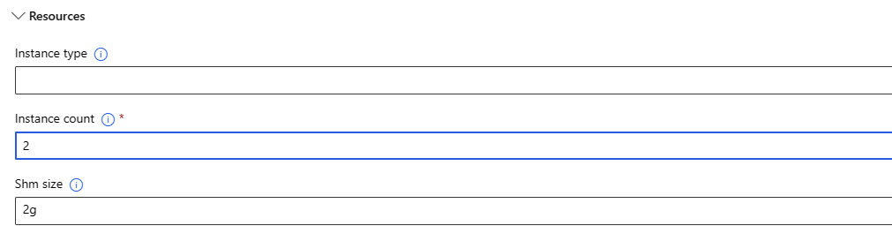

# MMDetection Model Finetune Component
This component enables finetuning of pretrained models on custom or pre-available datasets. The component supports Deepspeed and ONNXRuntime configurations for performance enhancement. 
The components can be seen in your workspace component page as below:
- [mmdetection_image_objectdetection_instancesegmentation_model_import](https://ml.azure.com/registries/azureml/components/mmdetection_image_objectdetection_instancesegmentation_model_import)
- [mmdetection_image_objectdetection_instancesegmentation_finetune](https://ml.azure.com/registries/azureml/components/mmdetection_image_objectdetection_instancesegmentation_finetune)
- [mmdetection_image_objectdetection_instancesegmentation_pipeline](https://ml.azure.com/registries/azureml/components/mmdetection_image_objectdetection_instancesegmentation_pipeline)

# 1. Inputs
1. _model_path_ (URI_FOLDER, required)

    Path to the output directory of [model import component](mmd_model_import_component.md/#2-outputs).

2. _training_data_ (MLTABLE, required)

    Path to the mltable folder of training dataset.

3. _validation_data_ (MLTABLE, optional)

    Path to the mltable folder of validation dataset.

4. _image_min_size_ (int, optional)

    Minimum image size after augmentation that is input to the network. If left empty, it would either be overwritten by image_scale in model config or would be chosen based on the task type and model selected. The image will be rescaled as large as possible within the range [image_min_size, image_max_size]. The image size will be constraint so that the max edge is no longer than image_max_size and short edge is no longer than image_min_size.

5. _image_max_size_ (int, optional)

    Maximum image size after augmentation that is input to the network. If left empty, it would either be overwritten by image_scale in model config or would be chosen based on the task type and model selected. The image will be rescaled as large as possible within the range [image_min_size, image_max_size]. The image size will be constraint so that the max edge is no longer than image_max_size and short edge is no longer than image_min_size.

6. _task_name_ (string, required)

    Which task the model is solving.
    It could be one of [`image-object-detection`, `image-instance-segmentation`].

7. _metric_for_best_model_ (string, optional)

    Specify the metric to use to compare two different models. It could be one of [`mean_average_precision`, `precision`, `recall`].

    If left empty, will be chosen automatically based on the task type and model selected.
    Generally, `mean_average_precision` is chosen for object detection and instance segmentation tasks.

8. _apply_augmentations_ (bool, optional)

    If set to true, will enable data augmentations for training and validation. Please note, if it is set to false, normalization and resize augmentation would still be applied to pre-process the image.

    The default value is true.

9. _number_of_workers_ (int, optional)

    Number of subprocesses to use for data loading (PyTorch only). 0 means that the data will be loaded in the main process. The default value is 8.

10. _apply_deepspeed_ (bool, optional)

    If true enables deepspeed. If no `deepspeed_config` is provided, the default config in the component will be used else the user passed config will be used. The default value is false.

    Please note that to enable deepspeed, `apply_deepspeed` must be set to true.

    Please note deepspeed is not yet supported for MMDetection, will be enabled in future.

11. _deepspeed_config_ (URI_FILE, optional)

    Path to the deepspeed config file.

    Please note deepspeed is not yet supported for MMDetection models, will be enabled in future.

12. _apply_ort_ (bool, optional)

    If true, apply ORT optimization. The default value is false.

    Please note ORT is not yet supported for MMDetection models, will be enabled in future.

13. _number_of_epochs_ (int, optional)

    Number of training epochs.

    If left empty, will be chosen automatically based on the task type and model selected.

14. _max_steps_ (int, optional)

    If set to a positive number, the total number of training steps to perform. Overrides 'number_of_epochs'. In case of using a finite iterable dataset the training may stop before reaching the set number of steps when all data is exhausted.

    If left empty, will be chosen automatically based on the task type and model selected.

15. _training_batch_size_ (int, optional)

    Batch size used for training.

    If left empty, will be chosen automatically based on the task type and model selected.

16. _validation_batch_size_ (int, optional)

    Batch size used for validation.

    If left empty, will be chosen automatically based on the task type and model selected.

17. _auto_find_batch_size_ (bool, optional)

    If set to true, the train batch size will be automatically downscaled recursively till if finds a valid batch size that fits into memory. If the provided 'per_device_train_batch_size' goes into Out Of Memory (OOM) enabling auto_find_batch_size will find the correct batch size by iteratively reducing 'per_device_train_batch_size' by a factor of 2 till the OOM is fixed. The default value is false.

18. _learning_rate_ (float, optional)

    Start learning rate used for training.

    If left empty, will be chosen automatically based on the task type and model selected.

19. _learning_rate_scheduler_ (string, optional)

    The learning rate scheduler to use. The default value is warmup_linear.
    It could be one of [`warmup_linear`, `warmup_cosine`, `warmup_cosine_with_restarts`, `warmup_polynomial`, `constant`, `warmup_constant`].

    If left empty, will be chosen automatically based on the task type and model selected.

20. _warmup_steps_ (int, optional)
    
    The number of steps used for the learning rate scheduler warmup phase. It is the number of steps used for a linear warmup from 0 to learning_rate.

    If left empty, will be chosen automatically based on the task type and model selected.

21. _optimizer_ (string, optional)

    Optimizer to be used while training. The default value is adamw_hf.
    It could be one of [`adamw_hf`, `adamw`, `sgd`, `adafactor`, `adagrad`].

    If left empty, will be chosen automatically based on the task type and model selected.

22. _weight_decay_ (float, optional)

    The weight decay to apply (if not zero) to all layers except all bias and LayerNorm weights in AdamW optimizer.

    If left empty, will be chosen automatically based on the task type and model selected.

23. _extra_optim_args_: (string, optional)

    Optional additional arguments that are supplied to SGD Optimizer. The arguments should be semi-colon separated key value pairs and should be enclosed in double quotes. For example, "momentum=0.5; nesterov=True" for sgd. Please make sure to use a valid parameter names for the chosen optimizer. For exact parameter names, please refer to https://pytorch.org/docs/1.13/generated/torch.optim.SGD.html#torch.optim.SGD for SGD. Parameters supplied in extra_optim_args will take precedence over the parameter supplied via other arguments such as weight_decay. If weight_decay is provided via "weight_decay" parameter and via extra_optim_args both, values specified in extra_optim_args will be used.

24. _gradient_accumulation_step_ (int, optional)

    Number of updates steps to accumulate the gradients for, before performing a backward/update pass.

    If left empty, will be chosen automatically based on the task type and model selected.

25. _precision_ (int, optional)

    Apply mixed precision training. This can reduce memory footprint by performing operations in half-precision. It could one of [`16`, `32`].

    The default value is "32".

26. _iou_threshold_ (float, optional)

    This is the IOU threshold used during inference for non-maximum suppression while post processing the predictions.

    If left empty, will be chosen automatically based on the task type and model selected.

27. _box_score_threshold_ (float, optional)

    During inference, only return proposals with a score greater than `box_score_threshold`.
    The score is the multiplication of the objectness score and classification probability.

    If left empty, will be chosen automatically based on the task type and model selected.

28. _random_seed_ (int, optional)

    Random seed that will be set at the beginning of training. The default value is 42.

29. _evaluation_strategy_ (string, optional)

    The evaluation strategy to adopt during training. If set to "steps", either the `evaluation_steps_interval` or `evaluation_steps` needs to be specified, which helps to determine the step at which the model evaluation needs to be computed else evaluation happens at end of each epoch. The default value is "epoch".
    It could be one of [`epoch`, `steps`].

30. _evaluation_steps_ (int, optional)

    Number of update steps between two evals if evaluation_strategy='steps'. The default value is 500.

31. _logging_strategy_ (string, optional)

    The logging strategy to adopt during training. If set to "steps", the `logging_steps` will decide the frequency of logging else logging happens at the end of epoch. The default value is "epoch". It could be one of [`epoch`, `steps`].

32. _logging_steps_ (int, optional)

    Number of update steps between two logs if logging_strategy='steps'. The default value is 500.

33. _save_strategy_ (string, optional)

    The checkpoint save strategy to adopt during training.
    The default value is "epoch".
    It could be one of [`epoch`, `steps`].
    Please note that the save_strategy and evaluation_strategy should match.

34. _save_steps_ (int, optional)

    Number of updates steps before two checkpoint saves if save_strategy="steps".
    The default value is 500.
    Please note that the saving steps should be a multiple of the evaluation steps.

35. _save_total_limit_ (int, optional)

    If a value is passed, will limit the total number of checkpoints. Deletes the older checkpoints in output_dir. If the value is -1 saves all checkpoints". The default value is -1.

36. _early_stopping_ (bool, optional)

    If set to true, early stopping is enabled. The default value is false.

37. _early_stopping_patience_ (int, optional)

    Stop training when the specified metric doesn't improve for early_stopping_patience evaluation calls. The default value is 1.

38. _max_grad_norm_ (float, optional)

    Maximum gradient norm (for gradient clipping).

    If left empty, will be chosen automatically based on the task type and model selected.

39. _resume_from_checkpoint_ (bool, optional)

    If set to true, resumes the training from last saved checkpoint. Along with loading the saved weights, saved optimizer, scheduler and random states will be loaded if exists. The default value is false.

40. _save_as_mlflow_model_ (bool, optional)

    Save as mlflow model with pyfunc as flavour. The default value is true.

# 2. Outputs
1. _output_dir_pytorch_ (custom_model, required)

    The folder containing finetuned model output with checkpoints, model config, optimizer and scheduler states and random number states in case of distributed training.

2. _output_dir_mlflow_ (URI_FOLDER, optional)

    Output directory to save the finetuned model as mlflow model.

# 4. Run Settings

This setting helps to choose the compute for running the component code. **For the purpose of finetune, gpu compute should be used**. We recommend using Standard_NC6s_v3 compute.

> Select *Use other compute target*

- Under this option, you can select either `compute_cluster` or `compute_instance` as the compute type and the corresponding instance / cluster created in your workspace.
- If you have not created the compute, you can create the compute by clicking the `Create Azure ML compute cluster` link that's available while selecting the compute. See the figure below

## 4.1. Settings for Distributed Training

> When creating the compute, set the `Maximum number of nodes` to the desired value for multi-node training as shown in the figure below

> In case of distributed training, also known as multi-node training, the mode must be set to `Mount` ( not `Upload`) as shown in the figure below

> Set the number of processes under Distribution subsection to use all the gpus in a node

To use all the gpus within a node, set the `Process count per instance` to number of gpus in that node as shown below

> Set the number of nodes under the Resources subsection

In case of distributed training, you can configure `instance count` under this subsection to increase the number of nodes as shown below

