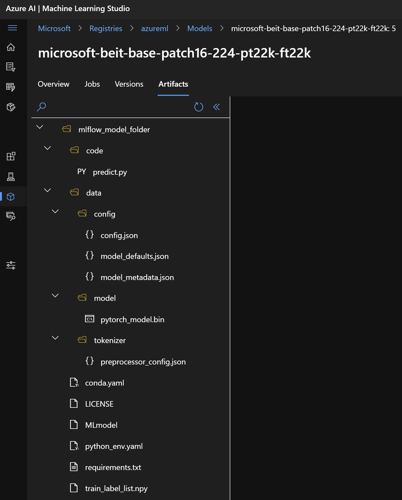

# Transformers Model Import Component
The component copies the input model folder to the component output directory when the model is passed as an input to the `pytorch_model` or `mlflow_model` nodes. If `model_name `is selected, the component is just a pass through. The component can be seen in your workspace component page - [transformers_image_classification_model_import](https://ml.azure.com/registries/azureml/components/transformers_image_classification_model_import).

# 1. Inputs

1. _pytorch_model_ (custom_model, optional)

    Pytorch Model registered in AzureML Asset.

    The continual finetune flag will be set to true in this case. If you want to resume from previous training state, set *resume_from_checkpoint* flag to True in [finetune component](transformers_finetune_component.md/#38-resume-from-checkpoint).

2. _mlflow_model_ (mlflow_model, optional)

    MlFlow Model registered in AzureML Asset. Some HuggingFace models are registered in azureml registry and can be used directly. The user can also register HuggingFace models into their workspace or organisation's registry, and use them.

    Following models are registered in azureml registry, and can be used directly.
    | Model Name | Source |
    | ------ | ---------- |
    | [microsoft-beit-base-patch16-224-pt22k-ft22k](https://ml.azure.com/registries/azureml/models/microsoft-beit-base-patch16-224-pt22k-ft22k/version/11) | azureml registry |
    | [microsoft-swinv2-base-patch4-window12-192-22k](https://ml.azure.com/registries/azureml/models/microsoft-swinv2-base-patch4-window12-192-22k/version/11) | azureml registry |
    | [facebook-deit-base-patch16-224](https://ml.azure.com/registries/azureml/models/facebook-deit-base-patch16-224/version/10) | azureml registry |
    | [google-vit-base-patch16-224](https://ml.azure.com/registries/azureml/models/google-vit-base-patch16-224/version/10) | azureml registry |

    Here is the folder structure of a registered MLFlow model.
    

    - All the configuration files should be stored in _data/config_
    - All the model files should be stored in _data/model_
    - All the tokenizer files should be kept in _data/tokenizer_
    - **`MLmodel`** is a yaml file and this should contain relavant information. See the sample MLmodel file [here](../../sample_files/HFMLmodel)

    > Currently _resume_from_checkpoint_ is **NOT** fully enabled with _mlflow_model_. Only the saved model weights can be reloaded but not the optimizer, scheduler and random states

**NOTE** The _pytorch_model_ take priority over _mlflow_model_, in case both inputs are passed

# 2. Outputs
1. _output_dir_ (URI_FOLDER):

    Path to output directory which contains the component metadata and the copied model data.

# 3. Parameters
1. _model_family_ (string, required)

    Which framework the model belongs to.
    It could be one of [`HuggingFaceImage`]

2. _model_name_ (string, optional)

    Please select models from AzureML Model Assets for all supported models.
    For HuggingFace models, which are not supported in AzureML model registry, input HuggingFace model name here. You can see supported image-classification models [here](https://huggingface.co/models?pipeline_tag=image-classification&library=transformers).
    The model will be downloaded from HuggingFace hub using this model_name and
    is subject to third party license terms available on the HuggingFace model details page.
    It is the user's responsibility to comply with the model's license terms.

3. __download_from_source__ (boolean, optional)
    Set to True for downloading model directly from HuggingFace instead of system registry.
    Defaults to `False`.

# 4. Run Settings

This setting helps to choose the compute for running the component code. For the purpose of model selector, cpu compute should work. We recommend using D12 compute.

1. Option1: *Use default compute target*

    If this option is selected, it will identify the compute from setting tab on top right as shown in the below figure
    

2. Option2: *Use other compute target*

    - Under this option, you can select either `compute_cluster` or `compute_instance` as the compute type and select any of the already created compute in your workspace.
    - If you have not created the compute, you can create the compute by clicking the `Create Azure ML compute cluster` link that's available while selecting the compute. See the figure below.
    
