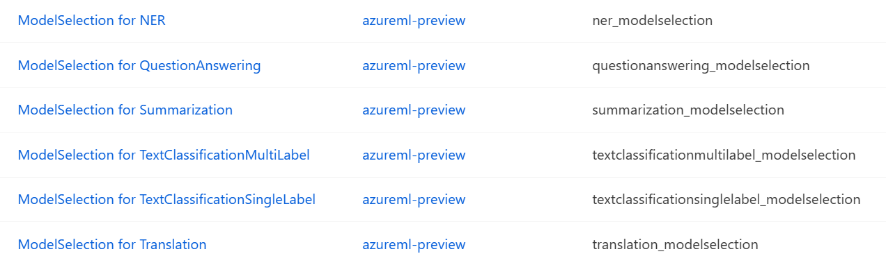
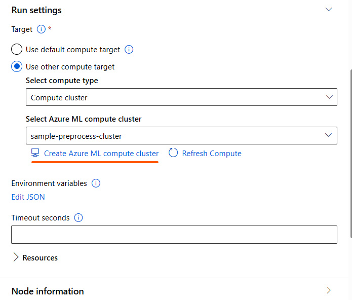

# Model selector component
The component copies the input model folder to the component output directory when the model is passed as an input to the `pytorch_continual_finetuning_model_path` or `mlflow_continual_finetuning_model_path` nodes. If `model_id `is selected, the model is downloaded from the registry, else the component is just a pass through. The component can be seen in your workspace component page

# 1. Inputs
1. _pytorch_continual_finetuning_model_path_ (custom_model, optional)

    Pytorch model as an input. This input model folder is expected to contain model, config and tokenizer files and optionally optimizer, scheduler and the random states. The files are expected to be in the [Hugging Face format](https://huggingface.co/bert-base-uncased/tree/main) and only **PyTorch** models are supported. Additionally, the input folder **MUST** contain the file `finetune_args.json` with *model_name_or_path* as one of the keys of the dictionary ([sample file](../sample_files/finetune_args.json)). This file is already present if you are using an already trained model from Azureml

    The continual finetune flag will be set to true in this case.If you want to resume from previous training state, set *resume_from_checkpoint* flag to True in [finetune component](finetune_component.md/#36-continual-finetuning)

2. _mlflow_continual_finetuning_model_path_ (mlflow_model, optional)

    MLflow model as an input. This input folder is expected to contain model, config and tokenizer files in a specific format as shown below. The MLflow output of an already trained model will confirm to the below shown format.

    

    - All the configuration files should be stored in _data/config_
    - All the model files should be stored in _data/model_
    - All the tokenizer files should be kept in _data/tokenizer_
    - **`MLmodel`** is a yaml file and this should contain _model_name_or_path_ information. See the sample MLmodel file [here](../sample_files/MLmodel)

    > Currently _resume_from_checkpoint_ is **NOT** fully enabled with _mlflow_continual_finetuning_model_path_. Only the saved model weights can be reloaded but not the optimizer, scheduler and random states

**NOTE** The _pytorch_continual_finetuning_model_path_ take priority over _mlflow_continual_finetuning_model_path_, in case both inputs are passed

# 2. Outputs
1. _output_dir_ (URI_FOLDER):

    Path to output directory which contains the component metadata and the copied model data, saved under either _model_id_ or _huggingface_id_, when model is passed through input nodes or _model_id_. In cases, where _huggingface_id_ is passed, only the component metadata is present in the output folder.

# 3. Parameters
1. _model_id_ (string, required)

    The Hugging Face(HF) model id used for finetuning the model. The models in the dropdown are most frequently downloaded models from HF website and are thoroughly tested and benchmarked under different configurations.

2. _huggingface_id_ (string, optional)

    The string can be any Hugging Face id from the [Hugging Face models webpage](https://huggingface.co/models)
    
    > Models from Hugging Face are subject to third party license terms available on the Hugging Face model details page. It is your responsibility to comply with the model's license terms.

**NOTE** The _huggingface_id_ takes priority, in case, both _model_id_ and _huggingface_id_ are specified.

# 4. Run Settings

This setting helps to choose the compute for running the component code. For the purpose of model selector, cpu compute should work. We recommend using D12 compute.

1. Option1: *Use default compute target*

    If this option is selected, it will identify the compute from setting tab on top right as shown in the below figure
    

2. Option2: *Use other compute target*

    - Under this option, you can select either `compute_cluster` or `compute_instance` as the compute type and select any of the already created compute in your workspace.
    - If you have not created the compute, you can create the compute by clicking the `Create Azure ML compute cluster` link that's available while selecting the compute. See the figure below
    
