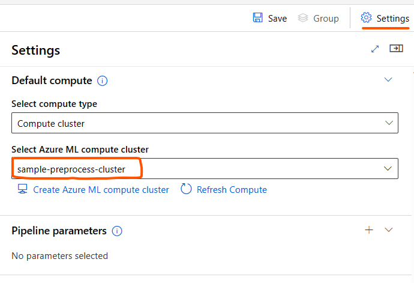

# Data Preprocessing Component
The goal of data preprocessing component is to validate and tokenize the user data and save the tokenized data and other relevant metadata to be consumed by downstream components. There is a separate component for each of the supported task. You can find the components in your workspace components page.

# 1. Inputs
1. _train_file_path_ (URI_FILE, optional)

    Registered training data asset in `jsonl` format

2. _valid_file_path_ (URI_FILE, optional)

    Registered validation data asset in `jsonl` format

3. _train_mltable_path_ (MLTABEL, optional)

    Registered training data asset in `mltabel` format

4. _valid_mltable_path_ (MLTABEL, optional)

    Registered training data asset in `mltabel` format

5. _model_path_ (URI_FOLDER, required)

    Output of [ModelSelector](model_selector_component.md) component

You can explore more about MLTable at [Working with tables in Azure Machine Learning](https://learn.microsoft.com/en-us/azure/machine-learning/how-to-mltable?tabs=cli%2Cpandas%2Cadls) and about its schema at [CLI (v2) mltable YAML schema](https://learn.microsoft.com/en-us/azure/machine-learning/reference-yaml-mltable).

# 2. Outputs
1. _output_dir_ (URI_FOLDER, required)

    The folder contains the tokenized output of the train and validation data along with the tokenizer files used to tokenize the data

# 3. Parameters

Since each task has a different preprocessing component, the parameters will be different for each task. The below sub-sections lists the parameters required for all the tasks.

## 3.1. Single Label Classification

1. _sentence1_key_ (string, required)

    Key for `sentence1_key` in each example line

2. _sentence2_key_ (string, optional)

    Key for `sentence2_key` in each example line

3. _label_key_ (string, required)

    label key in each example line

Example1: Below is an example from CoLA train dataset

{"sentence":"Our friends won't buy this analysis, let alone the next one we propose.","label":true,"idx":0}

For this setting, `sentence1_key` is sentence, and `label_key` is label. The optional parameter `sentence2_key` can be ignored

Example2: Below is an example from MRPC train dataset

{"sentence1":"Amrozi accused his brother , whom he called \" the witness \" , of deliberately distorting his evidence .","sentence2":"Referring to him as only \" the witness \" , Amrozi accused his brother of deliberately distorting his evidence .","label":1,"idx":0}

If your dataset follows above pattern, `sentence1_key` should be set as sentence1 and `sentece2_key` as sentence2 `label_key` as label.

Check this [link](../../../task_readme/single_label_classification.md/#2-data-preparation) to know more about single label data preparation.

## 3.2. Multi Label Classification

1. _sentence1_key_ (string, required)

    Key for `sentence1_key` in each example line

2. _sentence2_key_ (string, optional)

    Key for `sentence2_key` in each example line

3. _label_key_ (string, required)

    label key in each example line

Example1: Below is an example from GoEmotions dataset

{"text":"I\u2019m really sorry about your situation :( Although I love the names Sapphira, Cirilla, and Scarlett!","labels":"['25']","id":"eecwqtt"}

For this setting, `sentence1_key` is text, and `label_key` is labels

Check this [link](../../../task_readme/multi_label_classification.md/#2-data-preparation) to know more about multi label data preparation.

## 3.3. Named Entity Recognition (NER)

1. _token_key_ (string, required)

    Key for input text in each example line

2. _tag_key_ (string, required)

    Key for tokens in each example line

Example1: Below is an example from conll2003 dataset

{`tokens_column`: [ "EU", "rejects", "German", "call", "to", "boycott", "British", "lamb", "." ], `ner_tags_column`: '["B-ORG", "O", "B-MISC", "O", "O", "O", "B-MISC", "O", "O"]'}

For the above dataset pattern, `token_key` should be set as tokens_column and `tag_key` as ner_tags_column

Check this [link](../../../task_readme/named_entity_recognition.md/#2-data-preparation) to know more about NER data preparation.

## 3.4. Summarization

1. _document_key_ (string, required)

    Key for input document in each example line

2. _summary_key_ (string, required)

    Key for document summary in each example line

3. _summarization_lang_ (string, optional)

    Since, the current set of models `ONLY` support single language summarization, both the `document_key` and `summary_key` should be in same language.

    The parameter should be an abbreviated/coded form of the language as understood by tokenizer. Below table shows the list of supported languages for different model families

    | __Model Family__ | __Supported Language (code)__ |
    | --- | --- |
    |t5| `["French (fr)", "German (de)", "Romanian (ro)", "English (en)"]`|
    |mbart| `["Arabic (ar_AR)", "Czech (cs_CZ)", "German (de_DE)", "English (en_XX)", "Spanish (es_XX)", "Estonian (et_EE)", "Finnish (fi_FI)", "French (fr_XX)", "Gujarati (gu_IN)", "Hindi (hi_IN)", "Italian (it_IT)", "Japanese (ja_XX)", "Kazakh (kk_KZ)", "Korean (ko_KR)", "Lithuanian (lt_LT)", "Latvian (lv_LV)", "Burmese (my_MM)", "Nepali (ne_NP)", "Dutch (nl_XX)", "Romanian (ro_RO)", "Russian (ru_RU)", "Sinhala (si_LK)", "Turkish (tr_TR)", "Vietnamese (vi_VN)", "Chinese, Sim (zh_CN)"]`|
    |bart| `["English (en)"]`|

    Please note that the 2-letter code or 4-letter code needs to be used (mentioned in the brackets).

Example1: Below example is from xsum dataset

{`document_column`: "Cheryl Boone Isaacs said that the relationship with the accountancy firm PriceWaterhouseCoopers (PWC) was also under review.\nBrian Cullinan and Martha Ruiz were responsible for Sunday's mishap.\nLa La Land was mistakenly announced as the winner of the best picture award.\nThe team behind the film were in the middle of their speeches before it was revealed the accolade should have gone to Moonlight.\nIt has been described as the biggest mistake in 89 years of Academy Awards history.\nHow did the Oscars mistake happen?\nNine epic awards fails\nMr Cullinan mistakenly handed the wrong envelope to the two presenters.\nHe gave Warren Beatty and Faye Dunaway the back-up envelope for best actress in a leading role - rather than the envelope which contained the name of the winner for the best film.\nPriceWaterhouseCoopers, which counts the votes and organises the envelopes, has apologised for the mix-up.\nMr Cullinan tweeted a picture of best actress winner Emma Stone minutes before handing the presenters the wrong envelope, and Ms Boone Isaacs blamed "distraction" for the error.", `summary_column`: "The two accountants responsible for muddling up the main award envelopes at Sunday's Oscars ceremony will not be employed to do the job again, the academy president has announced."]}

For the above dataset pattern, `document_key` is document_column; `summary_key` is summary_column and `summarization_lang`: `en` for __t5__ family and `en_XX` for __mbart family__

Check this [link](../../../task_readme/summarization.md/#2-data-preparation) to know more about summarization data preparation.

## 3.5. Translation

1. _source_lang_ (string, required)

    Key for source language in each example line. The key should be an abbreviated/coded form of the language as understood by tokenizer. For example, in case of __t5__ models, the `source_lang` should be set to "en" for English, "de" for German and "ro" for Romanian

    See the below table for list of supported source languages

    | __Model Family__ | Source Language (code)__ |
    | --- | --- |
    |t5| `["English (en)"]`|
    |mbart| `["Arabic (ar_AR)", "Czech (cs_CZ)", "German (de_DE)", "English (en_XX)", "Spanish (es_XX)", "Estonian (et_EE)", "Finnish (fi_FI)", "French (fr_XX)", "Gujarati (gu_IN)", "Hindi (hi_IN)", "Italian (it_IT)", "Japanese (ja_XX)", "Kazakh (kk_KZ)", "Korean (ko_KR)", "Lithuanian (lt_LT)", "Latvian (lv_LV)", "Burmese (my_MM)", "Nepali (ne_NP)", "Dutch (nl_XX)", "Romanian (ro_RO)", "Russian (ru_RU)", "Sinhala (si_LK)", "Turkish (tr_TR)", "Vietnamese (vi_VN)", "Chinese, Sim (zh_CN)"]`|

2. _target_lang_ (string, required)

    Key for translated language in each example line. The key should be an abbreviated/coded form of the language as understood by tokenizer. For example, in case of __t5__ models, the `source_lang` should be set to "en" for English, "de" for German and "ro" for Romanian

    See the below table for the list of supported target languages

    | __Model Family__ | __Target Language (code)__ |
    | --- | --- |
    |t5| `["French (fr)", "German (de)", "Romanian (ro)"]`|
    |mbart| `["Arabic (ar_AR)", "Czech (cs_CZ)", "German (de_DE)", "English (en_XX)", "Spanish (es_XX)", "Estonian (et_EE)", "Finnish (fi_FI)", "French (fr_XX)", "Gujarati (gu_IN)", "Hindi (hi_IN)", "Italian (it_IT)", "Japanese (ja_XX)", "Kazakh (kk_KZ)", "Korean (ko_KR)", "Lithuanian (lt_LT)", "Latvian (lv_LV)", "Burmese (my_MM)", "Nepali (ne_NP)", "Dutch (nl_XX)", "Romanian (ro_RO)", "Russian (ru_RU)", "Sinhala (si_LK)", "Turkish (tr_TR)", "Vietnamese (vi_VN)", "Chinese, Sim (zh_CN)"]`|

Example1: Below is one sample example from `wmt16 dataset` line that translates from English to Romanian,

{`en`:"Others have dismissed him as a joke.",`ro`:"Al\u021bii l-au numit o glum\u0103."}

If the dataset follows above pattern, `source_lang` is en and
`target_lang` is ro

Check this [link](../../../task_readme/translation.md/#2-data-preparation) to know more about translation data preparation.

## 3.6. Question Answering

1. _question_key_ (string, required)

    Key for question in each example line

2. _context_key_ (string, required)

    Key for context in each example line

3. _answers_key_ (string, required)

    Key for answers in each example line

4. _answer_start_key_ (int, required)

    Key for answer start in each example line

5. _answer_text_key_ (string, required)

    Key for answer text in each example line

6. _doc_stride_ (int, optional)

    The amount of context overlap to keep in case the number of tokens per example exceed __max_seq_length__. The default value for the paramter is 128.

7. _n_best_size_ (int, optional)

    The `top_n` max probable start tokens and end tokens to be consider while generating possible answers. The default value for the parameter is 20.

8. _max_answer_length_in_tokens_ (int, optional)

    The maximum answer to be allowed specified in token length. The default value for this parameter is 30. All the answers with above 30 tokens will not be considered as a possible answer.

Example1: Below is the sample example from squad dataset,

{`question_column`: "In what year did Paul VI formally appoint Mary as mother of the Catholic church?", `context_column`: "Paul VI opened the third period on 14 September 1964, telling the Council Fathers that he viewed the text about the Church as the most important document to come out from the Council. As the Council discussed the role of bishops in the papacy, Paul VI issued an explanatory note confirming the primacy of the papacy, a step which was viewed by some as meddling in the affairs of the Council American bishops pushed for a speedy resolution on religious freedom, but Paul VI insisted this to be approved together with related texts such as ecumenism. The Pope concluded the session on 21 November 1964, with the formal pronouncement of Mary as Mother of the Church.", `answers_column`: {`answer_start_column`: [595], `text_column`: ['1964']}}

If the dataset follows above pattern, `question_key`: "question_column"; `context_key`: "context_column"; `answers_key`: answers_column; `answer_start_key`: answer_start_column; `answer_text_key`: text_column

Check this [link](../../../task_readme/question_answering.md/#2-data-preparation) to know more about question answering data preparation.

# 4. Run Settings

This setting helps to choose the compute for running the component code. For the purpose of preprocessing, cpu compute should work. We recommend using D12 compute.

1. Option1: *Use default compute target*

    If this option is selected, it will identify the compute from setting tab on top right as shown in the below figure
    

2. Option2: *Use other compute target*

    - Under this option, you can select either `compute_cluster` or `compute_instance` as the compute type and select any of the already created compute in your workspace.
    - If you have not created the compute, you can create the compute by clicking the `Create Azure ML compute cluster` link that's available while selecting the compute. See the figure below
    
