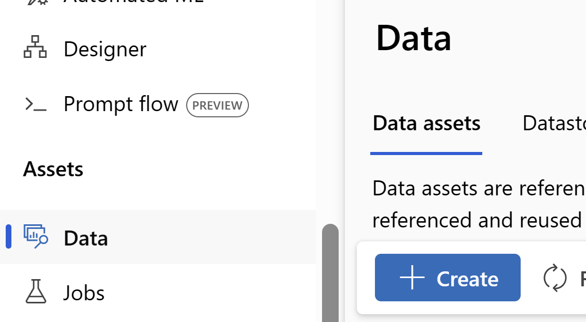
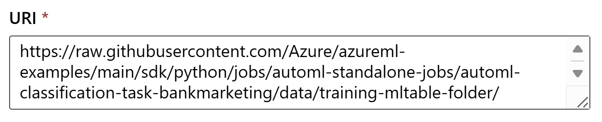
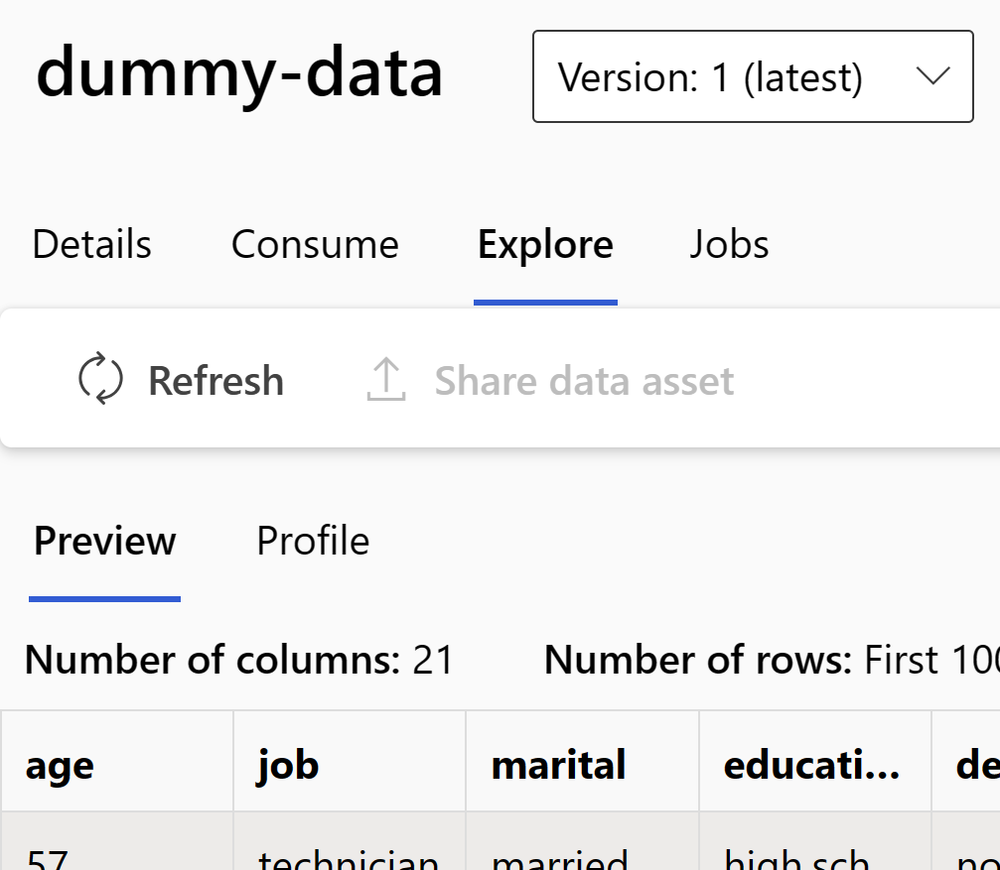

# Troubleshoot

- [Troubleshoot](#troubleshoot)
  - [AOAI deployment does not exist](#aoai-deployment-does-not-exist)
  - [Unable to retrieve OBO tokens for resource](#unable-to-retrieve-obo-tokens-for-resource)
  - [No Files Found](#no-files-found)
  - [Rate Limit Error from Azure OpenAI](#rate-limit-error-from-azure-openai)

## AOAI deployment does not exist

If a pipeline fails in llm_rag_validate_deployments component, then it indicates that the RAG pipeline is unable to access model deployments from Azure Open AI connection. Some of the common scenarios include

- Incorrect API Base or Key for the Azure Open AI workspace connection.
- Deployment for selected model name (ex. text-embedding-ada-002, gpt-35-turbo, gpt-4 etc.) does not exist on the AOAI resource.
- Incorrect deployment name for the selected AOAI model.

## Unable to retrieve OBO tokens for resource

If a Component (ex. `LLM - Generate QnA Test Data`) fails with the following error in `Outputs + logs > user_logs/std_log.txt`:

> azure.core.exceptions.ClientAuthenticationError: Unexpected content type "text/plain; charset=utf-8"
Content: Unable to retrieve OBO tokens for resource [management.azure.com](https://management.azure.com).

It's probably because OBO token caching does not occur if the user is new to a region. A temporary solution to overcome this issue is to create a dataset from UI and Explore it. Follow these steps:

1. Open Data tab and click on Create:
   
1. Set `Name` as `dummy-data` and `Type` as `Table (mltable)`. Hit Next.
1. Select `From a URI`. Hit Next.
1. Copy this [link](https://raw.githubusercontent.com/Azure/azureml-examples/main/sdk/python/jobs/automl-standalone-jobs/automl-classification-task-bankmarketing/data/training-mltable-folder/) and paste into `URI`:
   
1. Hit Next and then Create. The details page should open up.
1. Click on the `Explore` tab and wait for `Preview` to load:
   
1. Once `Preview` table is loaded, OBO token should've been cached. You may retry whatever action you were trying before.

## No Files Found

If llm_rag_crack_and_chunk component fails with ```No Files Found`` error, then it indicates that the component was not able to find any of the supported file types in the provided source data files. Supported file types include .txt, .pdf, .html, .md, .ppt(x), doc(x), .xls(x). Any additional file types will be ignored.

## Rate Limit Error from Azure OpenAI

Components for embedding generation (llm_rag_generate_embeddings_parallel), test data generation (llm_rag_qa_data_generation) and auto prompt (llm_autoprompt_qna) may occasionally fail due to throttling or rate limit errors from Azure Open AI. These component implement retries with backoff but will error out if rate limit error continues to occur. Please retry the job again after sometime or ensure there are no other job using the same Azure Open AI instance simultaneously.
