# Getting Started with Retrieval Augmented Geneartion in AzureML

## Prerequisites

Retrieval Augmented Generation in AzureML Studio is supported within the prompt flow experience. To enable prompt flow, please complete the [pre-requisites](../prompt-flow/quick-start.md#step-1---prerequisites-enable-prompt-flow-in-your-azure-machine-learning-workspace) and [setup](../prompt-flow/quick-start.md#step-2---set-up) steps from prompt flow onboarding guide and continue with steps mentioned below.

For instructions on creating vector index using Azure ML components, refer to the [samples notebooks](./examples/notebooks/README.md)

## Create a RAG prompt flow using the samples gallery

1.  Click prompt flow on the left menu

    

2.  Click Create

    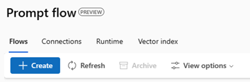

3.  Under *Create from gallery* select *View Detail* on the *Bring your
    own data Q&A* sample

    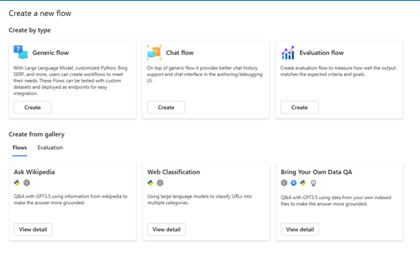

4.  Read the instructions and click *Clone* to create a Prompt flow in
    your workspace.

    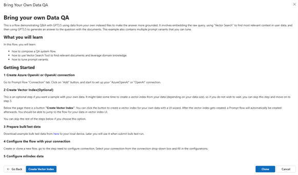

5.  This will open a prompt flow which you can run in your workspace and
    explore.

    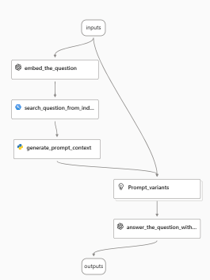

## Create a new Vector Index using a UI Wizard

1.  Click prompt flow on the left menu

    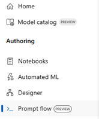

2.  Choose Vector Index on the top menu

    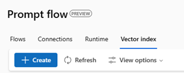

3.  Click Create

4.  In the wizard which opens up, provide a name for your vector index.
    Choose Create new index

    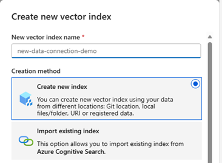

5.  Next choose your data source type

    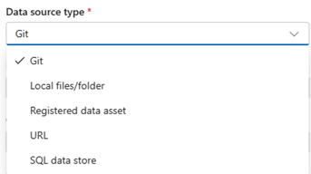

6.  Based on the chosen type, provide the location details of your
    source.

7.  Choose the Azure OpenAI connection which is required to access the
    embedding and generation models.

    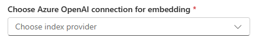

8.  Enter details of the model for embedding and for chat completion.

9.  Click Create.

    

10. This will now take you to an overview page from where you can track
    / view the status of your Vector Index creation. Note that Vector
    Index creation may take a while depending on the size of data.

    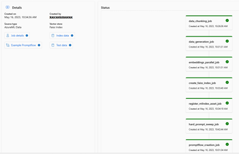

## Add a Vector Index to a prompt flow

1.  Open an existing prompt flow

2.  On the top menu click on *More Tools* and select *Vector Index
    Lookup*

    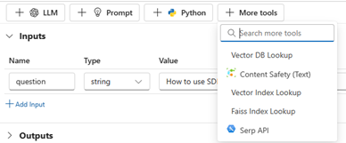

3.  The Vector Index lookup tool gets added to the canvas

4.  Enter the path to your Vector Index and enter the question

    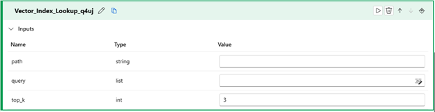

## Feedback and support

We'd love to hear your feedback which will help us improve the product.

You can reach out to azuremlpreviews@microsoft.com for any questions or share using [feedback form](https://forms.office.com/r/sGTkJ53e72).

