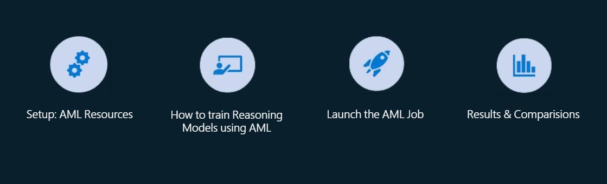

### This directory hosts an example to train an Instruct model into a Reasoning model on AML using Group Relative Policy Optimization (GRPO) - a RFT technique

#### Introduction:
In this repo, one will find a notebook (launch_grpo_command_job-med-mcqa-commented.ipynb) that details an end-to-end process of fine-tuning the **Qwen2.5-7B-Instruct** model into a **reasoning model** using medical data on **Azure ML**. Qwen2.5-7B-Instruct is an instruction-tuned large language model developed by Alibaba Cloud, based on their Qwen2.5-7B foundation model. \
It is optimized for following human instructions across a wide range of tasks, such as question answering, code generation, and language understanding. \
In this walkthrough, one will learn how to enhance the model's reasoning capabilities using **Reinforced Fine-Tuning (RFT)** techniques, with a focus on **GRPO (**G**roup **R**elative **P**olicy **O**ptimization)**.

#### About the GRPO Trainer

  

    
The reasoning model training process typically includes three key components:

    <ul>
      <li><strong>Sampler</strong> – Generates multiple candidate responses from the model</li>
      <li><strong>Reward Function</strong> – Evaluates and scores each response based on criteria like accuracy or structure</li>
      <li><strong>Trainer</strong> – Updates the model to reinforce high-quality outputs</li>
    </ul>
    

      In this example, the <strong>GRPO Trainer</strong> (an implementation from TRL library) is used for training Qwen2.5-7B-Instruct model into a reasoning model.
    

     
    

      <strong>GRPO</strong> (<strong>G</strong>roup <strong>R</strong>elative <strong>P</strong>olicy <strong>O</strong>ptimization) is a reinforcement learning technique that:
    

    <ul>
      <li><em>Compares</em> multiple answers within a group</li>
      <li><em>Rewards</em> the best-performing outputs</li>
      <li><em>Penalizes</em> poor ones</li>
      <li>Applies careful updates to <em>avoid sudden changes</em></li>
    </ul>
  

  

    
  

 

#### Repo structure:
- aml_setup.py: AzureML specific code relating to creation of dataset, model and environment. The workspace config is located here, make changes to this file before running the notebook.
- launch_grpo_command_job-med-mcqa-commented.ipynb: Entrypoint for the directory. In most cases, developers will just run this notebook; after adjusting the AzureML configuration.
- datasets/medmcqa: It has 3 jsonl files for train, test and validation. Each record in the jsonl has 2 important fields, **problem** (column) which is the prompt encouraging the model to do reasoning and the golden **solution**
- environment: This is the definition of the [AzureML environment](https://learn.microsoft.com/en-us/azure/machine-learning/concept-environments?view=azureml-api-2) in which the training job will run.
- src/
    - BldDemo_Reasoning_Train.py: Code relating to creating an instance of the GRPOTrainer class from trl with correct configurations.
    - grpo_trainer_callbacks.py: Code which converts the output models to MLflow model format. This conversation simplifies deployment as AzureML automatically generated inferencing environment and server for models in this format.
    - grpo_trainer_rewards.py: Rewards for the training, these are python functions which take an LLM response and grade it for accuracy and format.

Additionally, [this video](https://youtu.be/YOm_IQt3YWw?si=5nZzyy-PZyP9XFSU&t=1344) offers an overview based on the contents of this repository.
