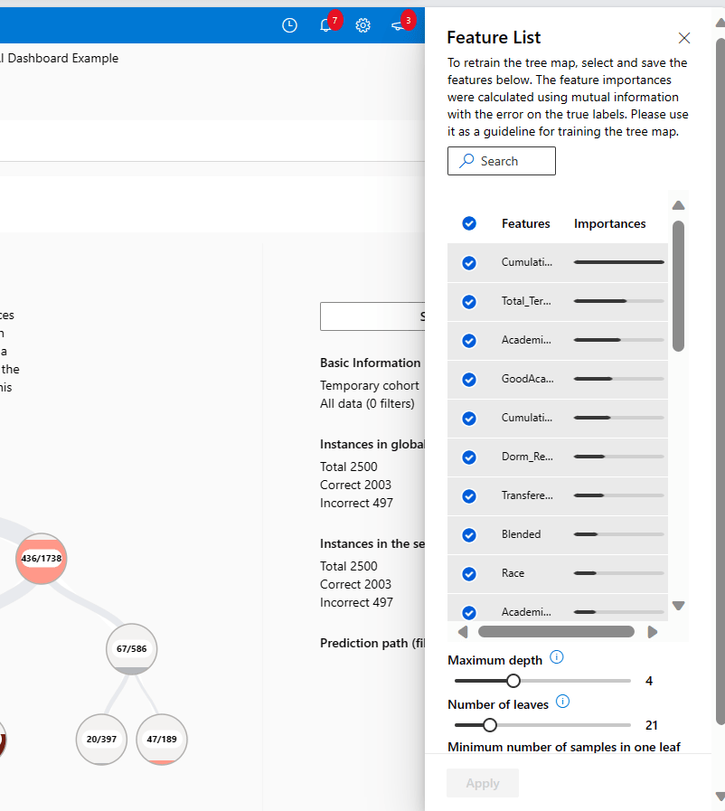
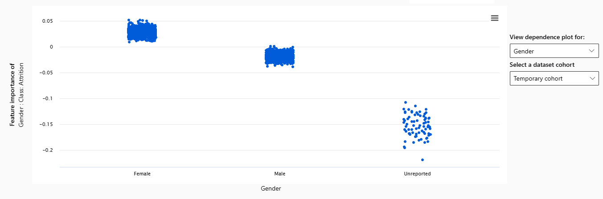

# Higher Education: Student Attrition
This scenario demonstrates how the Azure Machine Learning Responsible AI dashboard (RAI dashboard) 
can be used to understand student attrition at a higher education institution. Student attrition refers to students 
leaving or dropping out of an educational institution before completing their program.
Student attrition rates are a key performance indicator for any higher education provider and have a significant
impact on students. Understanding what causes student attrition (ie financial status, academic performance, or student wellbeing)
is a complex challenge which is often specific to individual student circumstances. 

The RAI dashboard can help higher education decision makers better understand student attrition while informing
the creation of intervents to improve student support services and foster student engagment and belonging.
The RAI dashboard also provides tools that can be used to debug the machine learning model in detail to 
understanding the model's predictions and errors to ensure decisions are made in a fair and equitable manner. 

Tutorial outline:

- [Deploy and run the notebook](#deploy-and-run-the-notebook)
- [Synthetic dataset and model descriptions](#synthetic-dataset-and-model)
- [Debugging the classification model via RAI dashboard components](#debugging-the-classification-model)
	- [Error analysis](#error-analysis)
	- [Model overview and performance analysis](#model-overview-and-performance-analysis)
	- [Fairness](#fairness)
	- [Data analysis](#data-analysis)
	- [Explainability and feature importance](#explainability)
	- [Counterfactual analysis](#counterfactual-analysis)
	- [Causal analysis](#causal-analysis)
- [Communicate your model stats with stakeholders](#communicate-your-model-stats-with-stakeholders)
	- [Scorecard](#scorecard)
- [Conclusion](#conclusion)

## Deploy and run the notebook
This demo relies on a single, included Jupyter notebook. 
This notebook does the following: 
- Loads and transforms data
- Trains and tests a model
- Creates a Responsible AI dashboard

Once you load this notebook to your Azure ML studio workspace, follow the steps described in the notebook to create your RAI dashboard. 
Once the RAI dashboard pipeline is complete, return to this page to explore the dashboard.

For help finding the RAI dashboard, please review this [information](https://learn.microsoft.com/en-us/azure/machine-learning/how-to-responsible-ai-dashboard)

## Synthetic dataset and model 

**Machine learning model** -- The notebook trains Logistic Regression model to predict if 
a student will leave a higher education program prior to completion or not (hence student attrition vs. retention). 

**WARNING: Use of synthetic data**  
This accelerator was developed using synthetic data to emphasize the importance of data 
privacy when analyzing student data. 
For this reason, you may find some anomalies in certain metrics or dashboard components. 
These should not distract from the demonstration. 
The tools and techniques described here remain valid, despite any data shortcomings that may be present. 

**Data dictionary for synthetic dataset:**

| Type   | Feature Name                        | Feature Description                                         |
|--------|-------------------------------------|-------------------------------------------------------------|
| Feature | FirstGenerationinCollegeFlag        | Institution classification of student as a first-generation college student                                            |
| Feature | Gender                              | Gender of the student                                       |
| Feature | Race                                | Student race/ethnicity, per IPEDS definition                 |
| Feature | HSGraduateorGED                     | Indicator if student received a HS diploma, GED, or other    |
| Feature | Age_Term_Min                        | Student age at start of the first enrollment term            |
| Feature | Age_Term_Max                        | Student age at start of the most recent enrollment term      |
| Feature | Total_Terms                         | Total number of terms enrolled                              |
| Feature | Entry_Type_DualEnrollment           | Student entry into university classification                 |
| Feature | Entry_Type_EarlyAdmission           | Student entry into university classification                 |
| Feature | Entry_Type_FirstTimeinCollege       | Student entry into university classification                 |
| Feature | Entry_Type_Re-Entry                 | Student entry into university classification                 |
| Feature | Entry_Type_Transfer                 | Student entry into university classification                 |
| Feature | AcademicProbation                   | Normalized level of academic status                         |
| Feature | AcademicSuspension                  | Normalized level of academic status                         |
| Feature | AcademicWarning                     | Normalized level of academic status                         |
| Feature | GoodAcademicStanding                | Normalized level of academic status                         |
| Feature | ProbationAfterSuspen/Dismiss        | Normalized level of academic status                         |
| Feature | TransferedToNonBusiness             | Student changed program to a non-business program            |
| Feature | CumulativeGPA                       | Cumulative university GPA                                   |
| Feature | CumulativeCreditHoursEarnedPerTerm  | Cumulative university credit hours earned                    |
| Feature | Blended                             | Percent of credit hours with specified delivery mode         |
| Feature | FullyOnline                         | Percent of credit hours with specified delivery mode         |
| Feature | RemoteLearning                      | Percent of credit hours with specified delivery mode         |
| Feature | RemoteLearningBlended               | Percent of credit hours with specified delivery mode         |
| Feature | Traditional                         | Percent of credit hours with specified delivery mode         |
| Feature | Adjunct                             | Percent of credit hours with specified instructor type       |
| Feature | Faculty                             | Percent of credit hours with specified instructor type       |
| Feature | Unknown_IntructorType               | Percent of credit hours with specified instructor type       |
| Feature | PELL_Eligible                       | Indicates if a student is PELL grant eligible (1=yes, 0=no) |
| Feature | Dorm_Resident                       | Indicates if a student lives in the campus dormitory (1=yes, 0=no) |
| Target Variable | Attrition                           | Model target variable. Indicates student attrition (1=yes, 0=no) |

Follow this link to find are more detailed [data dictionary](./data_dictionary/Data_dictionary_Education.xlsx) for this scenario.

## Debugging the classification model 
In data science and software development, the word debugging usually refers to finding and removing errors in a piece of code. 
With the Responsible AI (RAI) dashboard, we can debug a machine learning model and improve its overall performance and responsible AI aspects of its predictions. 

The RAI dashboard can be configured to include the following components, each of which are illustrated below for this scenario.

- [Error analysis](https://learn.microsoft.com/en-us/azure/machine-learning/concept-error-analysis?view=azureml-api-2), to view and understand how errors are distributed in your dataset.
- [Model overview and fairness assessment](https://learn.microsoft.com/en-us/azure/machine-learning/concept-fairness-ml?view=azureml-api-2), to evaluate the performance of your model and evaluate your model's group fairness issues (how your model's predictions affect diverse groups of people).
- [Data analysis](https://learn.microsoft.com/en-us/azure/machine-learning/concept-data-analysis?view=azureml-api-2), to understand and explore your dataset distributions and statistics.
- [Model interpretability](https://learn.microsoft.com/en-us/azure/machine-learning/how-to-machine-learning-interpretability?view=azureml-api-2) (importance values for aggregate and individual features), to understand your model's predictions and how those overall and individual predictions are made.
- [Counterfactual what-if](https://learn.microsoft.com/en-us/azure/machine-learning/concept-counterfactual-analysis?view=azureml-api-2), to observe how feature perturbations would affect your model predictions while providing the closest data points with opposing or different model predictions.
- [Causal analysis](https://learn.microsoft.com/en-us/azure/machine-learning/concept-causal-inference?view=azureml-api-2), to use historical data to view the causal effects of treatment features on real-world outcomes.

For more information, see the [Microsoft Learn Documentation](https://learn.microsoft.com/en-us/azure/machine-learning/concept-responsible-ai-dashboard).

### Error analysis
At the top of the RAI dashboard you will find the error analysis tree map. 
This chart simplifies the process of discovering and highlighting common failure patterns. 
Look for the nodes with the darkest red color (i.e. high error rate) and a high fill line (i.e. high error coverage). 
Error rate means what percentage of the selected node’s datapoints are receiving erroneous predictions. 
Error coverage defines what percentage of overall errors are concentrated in the given node.  

The Error Tree visualization helps you uncover your model’s “blind spots”. 
In this context, a blind spot is a group of datapoints, or a cohort, for which the model is less accurate and performant. 
This could be any group of observations, that when grouped by a common characteristic, show significantly worse model performance.

Looking at the root node of the tree (representing errors on all data) we see the error rate for all predictions is 
497 out of 2500, or about 19.88%. The root node has 100% error coverage because all 2500 respondants are contained within the root node.

**Explore nodes** – Looking at the right branch shown below with CumulativeCreditHoursEarnedPerTerm > 23.93 
and CumulativeCreditHoursEarnedPerTerm <= 60.63, we see an error rate of over 32%, higher than the base error rate. 
This branch accounts for 74.25% of the total error coverage. 

This contrasts sharply with students who are a Dorm_Resident, but with CumulativeCreditHoursEarnedPerTerm <= 23.93, a group with an error rate of 5.24%. 

These two cohorts are two good options to save in order to explore further. Click on the erroneous node again and choose the “Save as new cohort” button, at the upper-right corner of the tree map.

Then pick a useful name for the cohort. 
It can be helpful to copy the node filters directly into the cohort name. 
We called this cohort "23 < CreditHourse < 61".

Similarly, click on the previously selected left node and save that as a new cohort too! 
We named it "Dorm Resident and Credit Hours < 24"  .

 **Top features leading to errors** – Click on the feature list icon at the top of the error analysis section. 
 This will surface a list of features, ranked by their correlations to the model’s errors.

The Heat map component can also be quite useful. 
Start by selecting heat map. 

The heat map is useful for taking a closer look at certain groups, to explore different “slices” of the data. 
Select up to two features to see how errors are distributed across these groups. 
Find the heat map by selecting the “Heat map” tab, next to the “Feature list” tab shown above. 
Each cell of the heatmap represents a slice of the dataset, 
and the percentage of errors out of the total number of data points in that slice. 
Like the error tree nodes, you can “save a new cohort” based on your selected cells on the heatmap.

As an example, select “CumulativeCreditHoursEarnedPerTerm” as Feature 1 and Dorm_Resident as Feature 2. 
Use the default binning threshold.

Next, hover over each of the squares. 
You will see Error Rate and Error Coverage. 
Overall, the model has the lowest predictive error for students with high credit hours and are not dorm residents. 
The error is higher  when credit hours are lower and students are dorm residents.

**Custom cohorts** -- Outside the error analysis experience, you can also create custom cohorts. 
Simply click on the “+ New cohort” button near the top of the chart. 
You will be presented with a menu to identify the features and filters that can be used to form a cohort. 

### Model overview and performance analysis
Here we can look at all the data and compare individual cohorts. 
Each of the custom cohorts defined above is included in this view. 
You will see the difference in accuracy metrics in our cohorts. 

   

Similar investigations can be performed using the visualization options presented below the metrics table.

These will present a variety of options, including several bar chart views and a confusion matrix. These can be customized by different dimensions, such as cohort or metric.

### Fairness 
Does this model consistently predict student attrition when considering specific student population segments? 
The RAI dashboard can help identify if different groups within your overall population are being impacted differently by model results. 
These can be cohorts you previously defined or newly defined groups.  

**Configure the Feature Analysis tool** -- At the top of the Model overview section, select the Feature cohort option. 
This component also allows you look more closely at how the  model performs with respect to certain features. 
Use the Feature(s) drop-down to select gender. 

Here you will see that there are significant differences in model performance across high school graduate and GED. 
Overall, the model accuracy is higher for high school graduates than GED recipeints. 
Further, the false positive rate is much higher for GED recipients indicating that this subgroup is more likely to be incorrectly flagged by the model as predicted to attrition.

Let's create new cohorts, using the HSGraduateorGED feature for only GED recipients. 
Click on "+ New cohort" button and apply the filters. 
After defining the cohort criteria, click "Add filter" and then "Save." 

Do this for both GED and High School graduates.
These will be very useful when applying the next dashboard component. 

### Data analysis
Next, we come to the data analysis section. 
This tool allows you to look at the data behind the cohorts 
and can often give you clues as to why some groups are more error-prone than others. 
This information allows you to not just identify where are the blind spots, 
but also understand why. 
For example, your training data may have only a handful of observations for the error-prone cohort.

Start by selecting "Chart view," then:
- Select your cohort
- Select the y-axis and change it to "Count"
- Select the x-axis and change it to "True Y" data  

This will allow us to explore the "ground truth" data from the cohort.

Let's now look at the two cohorts from the error tree. 
Keep the axis labels the same and toggle to the error prone cohort (23 < CreditHourse < 61). 
Here we see the data is fairly balanced for student retention and attrition. 

When you switch the cohort to the group without any errors (Dorm Resident and Credit Hours < 24), 
we see that this population is even more heavily weighted towards attrition. 

To improve performance, a next step might be to gather more data for each group and each class
 and retrain the model. 

### Explainability
What factors are causing the model to mark certain students as "Attrition"? 
The explainability component shows feature importance values on the global and individual level. 
It consists of two views: Aggregate Feature Importance and Individual Feature Importance.  

1.) **Global explainability (Aggregate feature importance)** -- This dashboard component allows you to see which model features are most influential in determining model outcomes across all datapoints.  

Select the “Aggregate feature importance” option, at the top of the section, 
to analyze the top overall feature importance values. 
Use the slider directly above the chart to select the number of features that are displayed. 
You can activate or deactivate your created cohorts by toggling them on or off, 
using the legend below the chart.  

Click on the legend to remove certain cohorts from the chart. 
For this analysis, use the slider to see the top four most important features, 
and remove all cohorts except the "All Data" cohort. 
Observing the overall feature importance values on the entire test set, we see that "CumulativeCreditHoursEarnedPerTerm", "Dorm_Resident", "PELL_Eligible", and "CumulativeGPA" are the dominant features across all datapoints. 
The model uses them as strong indicators for predicting student attrition or retention.  

Let's take a closer look at the importance of the feature of Gender. 
Using the "Class importance weights" dropdown on the right of the chart,
select "Class: Attrition" to see how the model is using feature values of Gender for predicting student attrition.  

We see a very different model prediction pattern between Females, Males, and Unreported. 
The Gender value of "Male" was positively impacting the prediction of attrition while "Female" is a negative indicator. 
This indicates a significant imbalance in how the model is predicting student attrition for Females and Males. 
One action item is to explore and better balance the number of Females in training set with “predicted” vs “rejected” values and retrain the model, 
or use any of the unfairness mitigation algorithms covered in [Fairlearn](https://fairlearn.org/) 
to mitigate the observed fairness issues.

### Counterfactual analysis 
Now let's look at a male student that was predicted to be retained model and see what changes to the underlying features of a datapoint that would yield a different predicted outcome. 

Begin by updating the y-axis value to "Predicted Y," 
and the x-axis to "Probability: Approved," if not already selected. 

For example, use the "Selected datapoint" drop down to select Index 589. 
Then click on "Create what-if counterfactual." 

This will bring you to a chart where you can see the current scenario at the top, 
where the predicted class is "0", aka "Rejected,"
and the next 10 datapoints showcase several other scenarios that would likely result in an opposite prediction. 
In particular, you can see that this applicant has a relatively low income and
if their income were higher they would likely be approved. 

  

Now, go to the bottom of the chart to perturb any feature values of the selected data point to see how the prediction changes. 
For instance, provide a much higher value for income, such as 22,000, and you will see the predicted value changes to “1”, 
indicating that this higher income would lead to the prediction of approval. 
This is useful information that can be relayed to the applicant to improve their chances of getting an approval from the loan AI on their next application.

To see this alternate outcome on the original chart,
click on "Save as a new datapoint" button, 
at the bottom of the screen. 

## Communicate your model stats with stakeholders

### Scorecard 
The RAI dashboard is accompanied by a scorecard that allows you to easily share information about your model and predictions with people who cannot easily access the Azure ML studio.  

In this example, the scorecard is generated as a named output. 
The easiest way to find it is by navigating to the folder in your Azure ML studio workspace where you saved the Jupyter notebook. 

 Here you will find a PDF document that contains valuable information about the model itself and its performance (see example below). 
 This is only the top portion of the scorecard. 
 The complete version includes more performance metrics, cohort-specific performance, fairness insights, and model explanations. 
 You can easily share it with others for auditing purposes or for helping other stakeholders build trust with your AI systems.

)

## Conclusion
The Responsible AI dashboard provides valuable tools to help you debug model performance and improve customer experience. 
In this example, we saw how RAI dashboard components provided valuable insight into how the model predicted different outcomes for Females and Males. 
Besides the debugging experience, the counterfactual analysis allows you to identify specific scenarios that will result in a different model outcome. 
By incorporating these tools into your model development process, you can help ensure your models are being developed fairly, 
are performant for all groups of people, and at the same time deliver positive outcomes for your clients, and customers.
