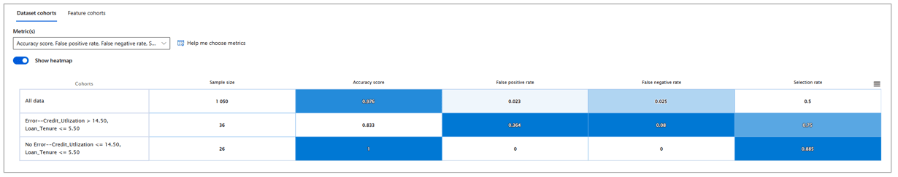
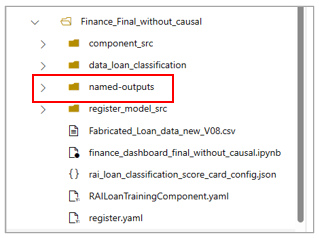

## Financial Services 
This scenario demonstrates how the Azure Machine Learning Responsible AI dashboard (RAI dashboard) 
can be used to improve the customer experience for a home loan applicant. 
Nowadays, many financial institutes and firms use AI-powered credit underwriting platforms for faster and more advanced decision-making. 
Financial professionals want to distinguish between those who are more or less likely to repay the outstanding loan credit, 
to help avoid losses for the firm.

The RAI dashboard can help financial service professionals understand such AI-powered decisions, 
while guiding clients who have had their loan applications denied on how to improve their chances for receiving the AI approval on their next application. 
The RAI dashboard also provides tools that can be used to debug the AI further, 
understanding its decisions and errors and ensure decisions are made in a fair manner. 
These tools can help heavily-regulated financial companies meet their regulatory requirements and provide improved customer service.

## Deploy and run the notebook
This demo relies on the included Jupyter notebook. 
This notebook does the following: 
- Loads and transforms data
- Trains and tests a model
- Creates a Responsible AI dashboard

Once you load this notebook to your Azure ML studio workspace, follow the steps described in the notebook to create your RAI dashboard. 
Then return to this page to explore the dashboard.

For help finding the RAI dashboard, please review this [information](https://learn.microsoft.com/en-us/azure/machine-learning/how-to-responsible-ai-dashboard)

## Synthetic dataset and model 

**Machine learning model** -- The notebook trains Logistic Regression model to predict if an applicant will repay the loan or not (hence predicting loan approval vs. rejection). 

**WARNING: Use of synthetic data**  
This accelerator was developed using synthetic data to emphasize the importance of data privacy when analyzing data about personal finances. For this reason, you my find some anomalies in certain metrics or dashboard components. 
These should not distract from the demonstration. 
The tools and techniques described here remain valid, despite any data shortcomings that may be present. 

Data dictionary 

|Type           | Feature Name          |   Feature Description|
|---------------|-----------------------    |----------------------|
Feature		    |Gender			            |	Gender of the loan applicant
Feature		    |Loan_Requirement (1000\$)  |	The amount of loan requested by the applicant in thousands of dollars
Feature		    |Loan_Tenure		        |	The time period for which the loan is requested in months
Feature		    |Home_Ownership		        |	A boolean variable indicating if the loan applicant owns at least one real estate property
Feature		    |Income(1000$)		        |	The monthly income of the loan applicant in thousands of dollars
Feature		    |Employment_Tenure	        |	The number of years the loan applicant has been employed at their current job
Feature		    |Credit_score		        |	Credit score of the loan applicant as reported by CIBIL
Feature		    |Age			            |	Age of the loan applicant
Feature		    |Credit_Utilization	        |	The percentage of available credit currently being utilized by the loan applicant
Feature		    |Active_Balance (1000\$)	    |	The total outstanding balance on all active loans and credit lines of the loan applicant in thousands of dollars
Feature		    |Open_CreditAcc		        |	The number of open credit accounts the loan applicant has
Feature		    |TotalIncome_to_Debt	    |	The ratio of the loan applicant's total monthly income to their total monthly debt obligations
Feature		    |Pre-Approved		        |	Indicates if the loan applicant has been evaluated by credit bureaus and pre-qualified for the loan
Target Variable	|LoanStatus		            |	Indicates the status of the loan application

Follow this link to find the [data dictionary](./data_dictionaries/data_dictionaries_Finance.xlsx) for this scenario.

## Debugging the classification model 
In data science and software development, 
the word debugging usually refers to finding and removing errors in a piece of code. 
With the RAI dashboard, we can debug a machine learning model and improve its overall performance and responsible AI aspects of its predictions. 

Here is how the Responsible AI dashboard could assist you with debugging this classification model: 

### Error analysis
At the top of the RAI dashboard you will find the error analysis tree map. 
This chart simplifies the process of discovering and highlighting common failure patterns. 
Look for the nodes with the darkest red color (i.e. high error rate) and a high fill line (i.e. high error coverage). Error rate means what percentage of the selected node’s datapoints are receiving erroneous predictions. 
Error coverage defines what percentage of overall errors are concentrated in the given node.  

The Error Tree visualization helps you uncover your model’s “blind spots”. 
In this context, a blind spot is a group of datapoints, or a cohort, for which the model is less accurate and performant. 
This could be any group of observations, that when grouped by a common characteristic, show significantly worse model performance.

Looking at the root node of the tree (representing errors on all data) we see the error rate for all predictions is about 2.4%. 

**Explore nodes** – Look at the left branch shown below with Loan_Tenure <= 5.50 and  Credit_Utilization > 14.5, which has a higher error rate of over 16%, about 8x higher than the base error rate (25/1050). 

This contrasts sharply with loan applicants of identical Loan_Tenure, but with Credit_Utilization <= 14.5, a group with an error rate of 0. 

These two cohorts are two good options to save in order to explore further. Click on the erroneous node again and choose the “Save as new cohort” button, at the upper-right corner of the tree map.

Then pick a useful name for the cohort. 
It can be helpful to copy the node filters directly into the cohort name. 
We call this cohort "Error--Credit_Utilization > 14.50, Loan_Tenure <= 5.50."

Similarly, click on the contrast left node and save that as a new cohort too! We name it "NoError--Credit_Utilization <= 14.50, Loan_Tenure <= 5.50."  

 **Top features leading to errors** – Click on the feature list icon at the top of the error analysis section. This will surface a list of features, ranked by their correlations to the model’s errors.

The Heat map component can also be quite useful. 
Start by selecting heat map. 

The heat map is useful for taking a closer look at certain groups, to explore different “slices” of the data. 
Select up to two features to see how errors are distributed across these groups. 
Find the heat map by selecting the “Heat map” tab, next to the “Feature list” tab shown above. 
Each cell of the heatmap represents a slice of the dataset, 
and the percentage of errors out of the total number of data points in that slice. 
Like the error tree nodes, you can “save a new cohort” based on your selected cells on the heatmap.

As an example, select “Credit_score” as Feature 1 (leave Feature 2 blank) and adjust the binning threshold slider to 3 (to create 3 cohorts based on credit score).

Next, hover over each of the three squares. 
You will see Error Rate and Error Coverage. 
Comparing the error rates, you will see similar values 2.16% - 2.55%. 
The error coverage values have a much higher range, 24.0% - 48%. 

**Custom cohorts** -- Outside the error analysis experience, you can also create custom cohorts. 
Simply click on the “+ New cohort” button near the top of the chart. 
You will be presented with a menu to identify the features and filters that can be used to form a cohort. 

### Model overview and performance analysis
Here we can look at all the data and compare individual cohorts. 
Each of the custom cohorts defined above is included in this view. 
You will see the difference in accuracy metrics in our cohorts. 

**All data grid**

   

Similar investigations can be performed using the visualization options presented below the metrics table.

These will present a variety of options, including several bar chart views and a confusion matrix. These can be customized by different dimensions, such as cohort or metric.

### Fairness 
Does this model consistently approve or reject loan applications from specific population segments? 
The RAI dashboard can help identify if different groups within your overall population are being impacted differently by model results. 
These can be cohorts you previously defined or newly defined groups.  

**Configure the Feature Analysis tool** -- At the top of the Model overview section, select the Feature cohort option. 
This component also allows you look more closely at how the  model performs with respect to certain features. 
Use the Feature(s) drop-down to select gender. 

Here you will see that there are significant differences in model performance across gender. 
The model has similar accuracy, but Males are having a much higher false positive rate, 
and Females are having a much higher False negative rate. 
This indicates that men are more likely to be approved, when they are risky borrowers, 
whereas women are more likely to be rejected, when they are less-risky borrowers. 

Let's create new cohorts, using the gender feature. 
Click on "+ New cohort" button and apply the filters. 
After defining the cohort criteria, click "Add filter" and then "Save." 

Do this for both Female and Male applicants. 
These will be very useful when applying the next dashboard component. 

### Data analysis
Next, we come to the data analysis section. 
This tool allows you to look at the data behind the cohorts 
and can often give you clues as to why some groups are more error-prone than others. 
This information allows you to not just identify where are the blind spots, 
but also understand why. 
For example, your training data may have only a handful of observations for the error-prone cohort.

Start by selecting "Chart view," then:
- Select your cohort
- Select the y-axis and change it to "Count"
- Select the x-axis and change it to "True Y" data  

This will allow us to explore the "ground truth" data from the cohort.

Let's now look at the two cohorts from the error tree. 
Keep the axis labels the same and toggle to the error prone cohort. 
Here we see the data is more heavily weighted to those applicants were approved. 

When you switch the cohort to the group without any errors, 
we see that this population is even more heavily weighted towards approvals. 

This highlights the issue of saliency. 
Most of the people represented in the training data for the less erroneous cohort are approved.
So even a random prediction of approved is going to achieve a high accuracy. 
In the other cohort, the erroneous group, there is a better balance, 
but the overall size of the cohort is small. 
The model doesn't have enough practice distinguishing between Approved and Rejected cases, 
so accuracy suffers. 

To improve performance, the next step is to gather more data for each group and each class 
(Approved vs. Rejected) and retrain the model. 

### Explainability
What factors are causing the model to mark certain applicants as "Rejected?" 
The explainability component shows feature importance values on the global and individual level. 
It consists of two views: Aggregate Feature Importance and Individual Feature Importance.  

1.) **Global explainability (Aggregate feature importance)** -- This dashboard component allows you to see which model features are most influential in determining model outcomes across all datapoints.  

Select the “Aggregate feature importance” option, at the top of the section, 
to analyze the top overall feature importance values. 
Use the slider directly above the chart to select the number of features that are displayed. 
You can activate or deactivate your created cohorts by toggling them on or off, 
using the legend below the chart.  

Click on the legend to remove certain cohorts from the chart. 
For this analysis, use the slider to see the top four most important features, 
and remove all cohorts except the "All Data" cohort. 

Observing the overall feature importance values on the entire test set, we see that "Pre-Approved", "Open_CreditAcc". "Credit_Score", and"Gender" are the dominant features across all datapoints. The model uses them as strong indicators for predicting loan approval or rejection.  

Seeing pre-approval as the most important feature is not surprising. 
We also see that gender is one of the top four. 
This is not the expected behavior of an unbiased model and 
warrants further attention. 

Let's take a closer look at Gender. 
Using the "Class importance weights" dropdown on the right of the chart,
select "Class: Approved" to see how the model is using feature values of Gender for predicting loan approvals.  

We see a very different model prediction pattern between Females and Males. 
The Gender value of ‘Male’ was positively impacting the prediction of approval for Male applicants For Females, 
their gender was a negative indicator of predicting loan approvals (pushing the prediction towards rejection). 
This indicates a significant imbalance in how the model is predicting loan status for Females and Males. 
One action item is to explore and better balance the number of Females in training set with “predicted” vs “rejected” values and retrain the model, 
or use any of the unfairness mitigation algorithms covered in [Fairlearn](https://fairlearn.org/) 
to mitigate the observed fairness issues.

### Counterfactual analysis 
Now let's look at a loan applicant that was rejected by the model and see what changes to the underlying features of a datapoint that would yield a different predicted outcome. 

Begin by updating the y-axis value to "Predicted Y," 
and the x-axis to "Probability: Approved," if not already selected. 

For example, use the "Selected datapoint" drop down to select Index 589. 
Then click on "Create what-if counterfactual." 

This will bring you to a chart where you can see the current scenario at the top, 
where the predicted class is "0", aka "Rejected,"
and the next 10 datapoints showcase several other scenarios that would likely result in an opposite prediction. 
In particular, you can see that this applicant has a relatively low income and
if their income were higher they would likely be approved. 

  

Now, go to the bottom of the chart to perturb any feature values of the selected data point to see how the prediction changes. 
For instance, provide a much higher value for income, such as 22,000, and you will see the predicted value changes to “1”, 
indicating that this higher income would lead to the prediction of approval. 
This is useful information that can be relayed to the applicant to improve their chances of getting an approval from the loan AI on their next application.

To see this alternate outcome on the original chart,
click on "Save as a new datapoint" button, 
at the bottom of the screen. 

## Communicate your model stats with stakeholders

### Scorecard 
The RAI dashboard is accompanied by a scorecard that allows you to easily share information about your model and predictions with people who cannot easily access the Azure ML studio.  

In this example, the scorecard is generated as a named output. 
The easiest way to find it is by navigating to the folder in your Azure ML studio workspace where you saved the Jupyter notebook. 

 Here you will find a PDF document that contains valuable information about the model itself and its performance (see example below). 
 This is only the top portion of the scorecard. 
 The complete version includes more performance metrics, cohort-specific performance, fairness insights, and model explanations. 
 You can easily share it with others for auditing purposes or for helping other stakeholders build trust with your AI systems.

)

## Conclusion
The Responsible AI dashboard provides valuable tools to help you debug model performance and improve customer experience. 
In this example, we saw how RAI dashboard components provided valuable insight into how the model predicted different outcomes for Females and Males. 
Besides the debugging experience, the counterfactual analysis allows you to identify specific scenarios that will result in a different model outcome. 
By incorporating these tools into your model development process, you can help ensure your models are being developed fairly, 
are performant for all groups of people, and at the same time deliver positive outcomes for your clients, and customers.
