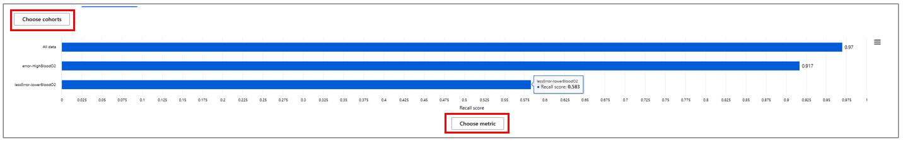

## Health Care
This scenario demonstrates how the Azure Machine Learning Responsible AI dashboard can be used to improve patient care. 
Health care providers are evaluating patients who have tested positive for Covid-19 to determine their likelihood of requiring hospitalization. 
The medical professionals want to distinguish between those who are more or less likely to require additional care,
to help manage limited hospital capacity. 
They also want to ensure these resources are being allocated in a fair and unbiased way. 
The Responsible AI dashboard can help in guiding such processes. 

## Deploy and run the notebook
This demo relies on the included Jupyter notebook. 
This notebook does the following:  
- Loads and transforms data
- Trains and tests a model
- Creates a Responsible AI dashboard

Once you load this notebook to your Azure ML studio workspace, 
follow the steps described in the notebook to create your RAI dashboard. 
Then use this page return to this page to explore the dashboard. 

For help finding the RAI dashboard, please review this [information](https://learn.microsoft.com/en-us/azure/machine-learning/how-to-responsible-ai-dashboard)

## Synthetic dataset and model 

**Machine learning model** -- The notebook trains a Gaussian Naive Bayes classification model to predict if a patient will require hospitalization. 

**WARNING: Use of synthetic data**  
This accelerator was developed using synthetic data to emphasize the importance of data privacy when analyzing data about patient care. For this reason, you my find some anomalies in certain metrics or dashboard components. 
These should not distract from the demonstration. 
The tools and techniques described here remain valid, despite any data shortcomings that may be present. 

Data dictionary 

|Type           | Feature Name          |   Feature Description|
|---------------|-----------------------|----------------------|
Feature         |Age-years              |Age of the patient in years
Feature         |Gender                 |Gender of the patient
Feature	        |Cardiovascular-disease	|Indicates if the patient has a history of cardiovascular disease
Feature	        |Immuno_Compromised	    |Indicates if the patient is immunocompromised
Feature	        |Asthma	                |Indicates if the patient has a history of asthma
Feature	        |Smoking	            |Indicates if the patient is a current or former smoker
Feature	        |Temperature	        |Temperature of the patient in degrees Fahrenheit
Feature	        |Blood_Sugar-mg/dL	    |Blood sugar level of the patient in milligrams per deciliter
Feature	        |Blood_Oxygen-SpO2	    |Blood oxygen saturation level of the patient as a percentage
Feature	        |BP_Systolic	        |Systolic blood pressure of the patient in millimeters of mercury (mmHg)
Feature	        |BP_Diastolic	        |Diastolic blood pressure of the patient in millimeters of mercury (mmHg)
Feature	        |Social_activity	    |Indicates the level of social activity of the patient, ranging from 1 to 5
Target Variable	|InHospital	            |Indicates if the patient is currently hospitalized due to COVID

Follow this link for an [Excel version](.\documentation\data_dictionaries\Data_dictionary_Healthcare.xlsx)
of the data dictionary. 

## Debugging the classification model 
In data science and software development, 
the word debugging usually refers to finding and removing errors in a piece of code. 
With the RAI dashboard, we can debug a machine learning model and improve its overall performance and responsible AI aspects of its predictions. 

Here is how the Responsible AI dashboard could assist you with debugging this classification model: 

### Error analysis
At the top of the RAI dashboard, you will find the error analysis experience which consists of tree map and heat map views. 
Let's investigate each experience: 

**1) Error tree map**

The first view trains an error tree which aims to separate error instances from success instances hierarchically in your test data. 
The tree simplifies the process of discovering and highlighting common failure patterns. 
Look for the tree nodes with the darkest red color (i.e., high error rate) 
and a high fill line (i.e., high error coverage). 
Error rate means what percentage of the selected node’s datapoints are receiving erroneous predictions. 
Error coverage defines what percentage of overall errors are concentrated in the given node. 

The Error Tree visualization helps you uncover your model’s “blind spots”. 
In this context, a blind spot is a group of datapoints, or a cohort, 
for which the model is less performant. This could be any group of observations, 
that when grouped by a common characteristic, show significantly worse model performance.

**Explore nodes** -- Look at the nodes on the right side of the tree map. 
You will see patients with `Social_activity != 1|5` and `Blood_Oxygen-SpO2` values greater than 90.50 have an error rate of over 15%, 
about 5x higher than the base error rate (30/1055). 
As a reminder, `Social_activity` is measured on a 5-point scale, with "5" being the most socially active, i.e. limited social distancing." 

This contrasts sharply with patients of identical social activity, but with `Blood_Oxygen-SpO2 <= 90.50`, 
a group with an error rate of only 1.9%. 
What is driving this difference? 
With further analysis, we might learn that this cohort is predominantly comprised of patients in a certain age group, 
or has a concentration of patients with other sensitive characteristics. 
Exploring different nodes of the tree map allows you to easily find the combinations of features that are more (or less) susceptible to inaccurate decisions. 
The RAI dashboard's Error Analysis tool can be used to proactively identify major and concentrated shortcomings of the model.  

**Save erroneous cohorts** -- When you identify a tree node you would like to explore further, 
you can save this group as its own cohort. 
These cohorts will be transferred to other RAI dashboard components, 
where you could focus on them to diagnose any potential errors or fairness issues occurring. 
To save a cohort, highlight a node and click on the “Save as a new cohort” button, 
to the right of the chart. 
This will open a dialog box, similar to the one shown here.

In this example, we save two Error Tree Cohorts:  
- The erroneous cohort we just identified with Blood_Oxygen-SpO2 > 90.5  and Social_activity != 1|5, 
and name it "Error-HighBloodO2."  
- The erroneous cohort we just identified with Blood_Oxygen-SpO2 <= 90.5  and Social_activity != 1|5, 
and name it "LessError-LowerBloodO2." 

**Top features leading to errors** -- Click on the feature list icon at the top of the error analysis section. 
This will surface a list of features, ranked by their correlations to the model’s errors. 

**2) Heat map** 
The heat map is useful for taking a closer look at certain groups, 
to explore different “slices” of the data. 
Select up to two features to see how errors are distributed across these groups. 
Find the heat map by selecting the “Heat map” tab, next to the “Feature list” tab shown above. 
Each cell of the heatmap represents a slice of the dataset, 
and the percentage of errors out of the total number of data points in that slice. 
Like the error tree nodes, you can “save a new cohort” based on your selected cells on the heatmap. 

**Custom cohorts** -- Outside the error analysis experience, you can also create custom cohorts. 
Simply click on the “+ New cohort” button near the top of the chart. 
You will be presented with a menu to identify the features and filters that can be used to form a cohort.
 
 

### Model overview and performance analysis
Here we can look at all the data and compare individual cohorts. 
Each of the custom cohorts defined above is included in this view. 
You can select the metrics included in the chart. 

**Review performance** -- For our example, we will use the default value. 
For classification tasks, this includes: Sample size, Accuracy score, False positive rate, False negative rate, 
and selection rate (percentage of datapoints predicted to have the positive prediction class, 
not hospitalized). 

With this view, false negatives and false positives can be easily examined. We can see that patients in our erroneous cohort have a high false positive rate. 
They are being falsely predicted at a higher rate to not need hospitalization, when the opposite is true. 
This could result in very serious consequences for these patients. 
This is contrasted with the other cohort. 
It has a relatively higher false negative rate and is also more accurate.

Similar investigations can be performed using the visualization options presented below the metrics table. 

These will present a variety of options, including several bar chart views and a confusion matrix. 
These can be customized by different dimensions, such as cohort or metric. 

### Fairness
Does this model consistently avoid or delay treatment for specific population segments?
The RAI dashboard can help identify if different groups within your overall population are being impacted differently by model results. 
These can be cohorts you previously defined or newly defined groups. 

**Configure the Feature Analysis tool** -- At the top of the Model overview section, 
select the Feature cohort option. 

Next, select up to two features you wish to examine. 
For starters, you could select your sensitive features or those features that were identified to have a higher correlation with errors, 
or those that are identified as the most important features. 
This will enable you to explore how different subgroups compare in terms of model performance metrics. 

In this example, “Gender” was selected. You can easily compare performance metrics across different Gender groups.

The tool also supports comparing multiple features simultaneously. 
Here we select “Gender” and “Age-years” as our features to see the model performance for the intersecting cohorts. 
We observe a false positive rate of 80% for women aging less than 36 years old. 
For men younger than 36 years old, we see a false positive rate of 50%, also quite high.

### Data analysis

Next, we come to the data analysis section. 
This tool allows you to look at the data behind the cohorts and can often give you clues as to why some groups are more error-prone than others. 
This information allows you to not just identify where are the blind spots, 
but also understand and diagnose why. 
For example, the data analysis might reveal the lack of representation in your training data when it comes to certain cohorts or even certain ground truth labels.

**Explore error prone cohort** -- We can quickly build a chart that highlights one of the cohorts we defined earlier. 
Select chart view and then pick your erroneous cohort of interest: error-HighBloodO2. 

As with earlier charts, you can click on axis lables to configure the chart to better support your analysis. 
We select “Count” on the Y axis and “True Y” on the X axis to highlight the ground truth representation of classes “Hospitalized” and “Not Hospitalized”.  
Here we see that the number of “True Y” observations in this cohort is significantly skewed towards those who did not need hospitalization. 
This skewed data is something that could potentially be mitigated with data resampling or balancing techniques.  

### Explainability
Explainability component shows feature importance values on the global and individual level. 
It consists of two views: Aggregate Feature Importance and Individual Feature Importance.

1.) **Global explainability (Aggregate feature importance)** -- This dashboard component allows you to see which model features are most influential in determining model outcomes across all datapoints.  

Select the “Aggregate feature importance” option, at the top of the section, 
to analyze the top overall feature importance values. 
Use the slider directly above the chart to select the number of features that are displayed. 
You can activate or deactivate your created cohorts by toggling them on or off, 
using the legend below the chart.  

Select the “Aggregate feature importance” option, at the top of the section, 
to analyze the top overall feature importance values. 
Use the slider directly above the chart to select the number of features that are displayed. 
You can activate or deactivate your created cohorts by toggling them on or off, 
using the legend below the chart.

Observing the overall feature importance values on the entire test set, 
we see that “Age-years” is the dominant feature. 
The model is using it as a strong indicator of predicting hospitalizations. 

By clicking on each feature’s bar chart, you can look at how it, impacts predictions for each class. 
For instance, by clicking on “Age-years” blue bar chart and picking the "Hospitalized" class under the class importance weights dropdown, 
you can see how this feature impacts the prediction of “Hospitalized”. 

 

Here we see that for patients over 50 years old, age is a stronger positive indicator for predicting hospitalizations. 

 

1.) **Local explainability (Individual feature importance)** -- You can also look at what data the model found most impactful for specific observations. Simply toggle to Individual feature importance and select the observations you want to explore. 

**Reminder** -- This information can help you interpret the results of your model; however it does not show causality. 
Determining causality requires rigorous experiment design and testing methodologies. 
You can learn more about our causal component at the end of this flow.

### Counterfactual analysis 
A what-if counterfactual analysis allows you to see what differences in data would produce different model outcomes. 
It can be very helpful in debugging the model. 
The dashboard allows for both automatic and free-form what-if analysis, 
to help identify the minimal changes that will yield a different model prediction.  

Begin by updating the x-axis value to "Predicted Y," 
and the y-axis to "Age-Years," if not already selected. 
You can explore the data to see the predicted outcome for each datapoint. 
For this example, we are going to take a closer look at the Index 118 datapoint. 

One the lower chart, you can the top features influencing the prediction. 
They are ranked in order by which feature, if perturbed, 
would most likely lead to an opposite model outcome. 
For this patient, the Immuno_Comprimised and Asthma are the features with the strongest influence on the prediction.  

Now return to the upper chart and confirm that Index 118 is selected in the "Selected datapoint" drop down. 
Then click on "Create what-if counterfactual." 

This will bring you to a chart where you can see the current scenario at the top, 
where the predicted class is "InHospital",
and several other scenarios that would likely result in a different prediction. 
In particular, you can see that this applicant has a relatively high social activity and low blood oxygen level. 
In the several scenarios where this patient would likely receive a different predicted outcome, 
you can see social activity is lower and blood oxygen levels are higher. 

Notice the row at the bottom of the chart. 
Here is where you can manually select different values for the patient and 
copy this hypothetical datapoint to the previous chart by clicking on the "Save as a new datapoint" button. 

## Take real-world action
Understanding the model and the impact of certain features on groups and individuals is valuable. 
However, sometimes the priority is to use the historic data to devise useful interventions. 
This is what causal analysis is all about, using the data to take real world actions. 
Let's look at how the data can be applied to inform specific actions for certain groups or individuals. 

### Causal analysis 
The Causal analysis component in the dashboard has three different options. 
We're going to start with aggregate causal effects. 
This is the overall impact of a certain factor on a real-world outcome, 
e.g., doesn't need hospitalization. 

The chart shows us that increasing temperature will only slightly decrease the likelihood that the patient will not need hospitalization. 
Other factors, such as social activity (further left and down, on the chart) 
will have a higher impact on chance of hospitalization. 

Selecting “Individual causal what-if” will provide you with similar information for a specific patient. 

**Treatment policy** 

Finally, treatment policy allows you to explore how you might change the value of a specific feature to change the model real-world outcome. 
This allows health care professionals to quickly focus on factors they can control and suggest interventions that will result in a more favorable patient outcome (less hospitalizations).

In the following example, the healthcare professional selects “social activity” as a factor they would like to provide suggestions around: 

With that selection, they automatically get the optimal policies to get reduced hospitalizations. 
They can see that for patients with lower blood sugar level, 
i.e. a more normal range, who are also younger than 38 years old, 
they can maintain a moderate amount of social activity, e.g., Social_activity = 3. 
For older patients, the suggested treatment is different; they are recommended to self-quarantine, e.g Social_activity = 1.

In contrast, patients with higher blood sugar are recommended to keep more isolated, regardless of their blood oxygen levels, e.g. Social_activity = 1 or 2.

Finally, they can explore which patients will see the greatest impact from the suggested treatment on social activity. 
In our example, the suggested treatment is to reduce social activity and the patients identified as showing the strongest response are all over 60 years old. 
This makes sense, given the data and what we know about Covid-19.

This view shows you which patients will see the greatest impact from the suggested treatment. 
In our example, the suggested treatment is to reduce social activity and the patients identified as showing the strongest response are all over 60 years old. 
This makes sense, given the data and what we know about Covid-19. 

### Scorecard 
The RAI dashboard is accompanied by a scorecard that allows you to easily share information about your model and predictions with people who cannot easily access the Azure ML studio. 

In this example, the scorecard is generated as a named output. 
The easiest way to find it is by navigating to the folder in your Azure ML studio workspace where you saved the Jupyter notebook. 

Here you will find a PDF document that contains valuable information about the model itself and its performance (see example below)
This is only the top portion of the scorecard. 
The complete version includes more performance metrics, cohort specific performance, fairness insights, and model explanations. 
You can easily share it with others for auditing purposes or for helping other stakeholders build trust with your AI systems. 

## Conclusion
The RAI dashboard provides several tools to help data scientists understand and improve their machine learning models, 
while taking responsible data-driven decisions. 
By incorporating these tools into your model development process, 
you can help ensure your models are being developed fairly, are performant for all groups of people, 
and at the same time deliver positive outcomes for your patients, clients, and customers.
