## Text Classification with traditional NLP

One of the many uses of text classification is to categorize news articles.
This can be done on one, or more, of many different dimensions.
Topic, length, source, are just a few possibilities. 
In this example we will focus business news articles related to financial services topics. 

## Deploy and run the notebook
This demo relies on the included Jupyter notebook. 
This notebook does the following: 
- Loads and transforms data
- Trains and tests a model
- Creates a Responsible AI dashboard

Once you load this notebook to your Azure ML studio workspace, follow the steps described in the notebook to create your RAI dashboard. 
Then return to this page to explore the dashboard.

For help finding the RAI dashboard, please review this [information](https://learn.microsoft.com/en-us/azure/machine-learning/how-to-responsible-ai-dashboard)

## Synthetic dataset and model 

**Machine learning model** -- The notebook trains a **()**. 

**WARNING: Use of synthetic data**  
This accelerator was developed using synthetic data to emphasize the importance of data privacy. 
For this reason, you my find some anomalies in certain metrics or dashboard components. 
These should not distract from the demonstration. 
The tools and techniques described here remain valid, despite any data shortcomings that may be present. 

Data dictionary 

|Type           | Feature Name          |   Feature Description|
|---------------|-----------------------|----------------------|
Feature         |Article ID             |Unique identifier for each article
Feature         |Article Heading        |The title or headline of the article
Feature	        |Article Text           |Text from the main body of the article 
Feature	        |Category           	|The category or class to which the article belongs

Here are descriptions of the different article categories: 
- Banking and finance - Debt Market: News and updates related to the debt market within the banking and finance industry
- Stock Market Updates: News and updates about the stock market, including stock prices, market indices, and company earnings
- Business: News and articles about general business topics, such as corporate strategies, management, and industry trends
- Real Estate: News and updates related to the real estate industry, including property market trends and housing prices
- Cryptocurrency: News and information about cryptocurrencies, blockchain technology, and related developments
- Personal Finance: News and tips related to personal finance management, including budgeting, saving, and investing
- Financial Regulations: News and updates about financial regulations, compliance requirements, and legal developments

## Debugging the model 
In data science and software development, 
the word debugging usually refers to finding and removing errors in a piece of code. 
With the RAI dashboard, we can debug a machine learning model and improve its overall performance and responsible AI aspects of its predictions. 

Here is how the Responsible AI dashboard could assist you with debugging this classification model: 

## Pre-built cohorts
The ability to define groups of data points, or cohorts, within the source data is one of the most useful features of the RAI dashboard. 
In a classification scenario like this one, it is often helpful to start by using the class labels to define cohorts.  To do this:
- Click the "+ New cohort" button, near the top of the dashboard
- Select "True Y" as your filter criteria
- Use the "Included values" drop-down menu to select only the "Banking and finance - Debt Market" option
- Click the "Add filter" button
- Rename the cohort to something useful to you, in the "Dataset cohort name" dialog box
- Click "Save" 

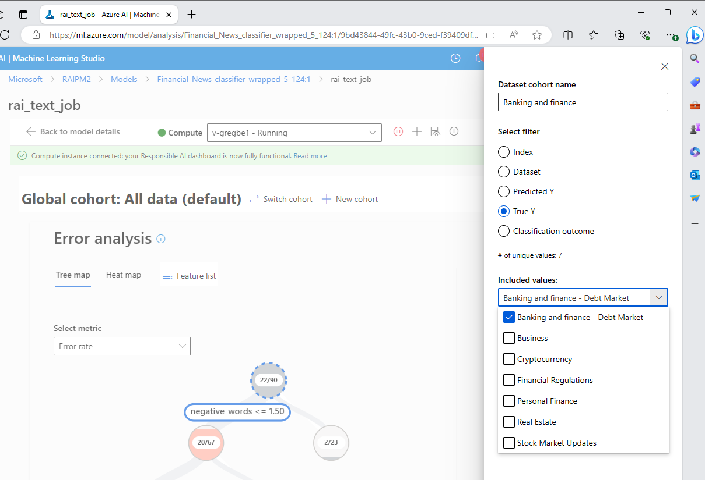

Now repeat this for each of the news article classes, until you have defined seven pre-built cohorts. 

## Error analysis
Next, let's review the error analysis tree map, which you will find at the top of the dashboard.  
This chart simplifies the process of discovering and highlighting common failure patterns. 
Look for the nodes with the darkest red color (i.e. high error rate) and a high fill line (i.e. high error coverage). Error rate means what percentage of the selected node’s datapoints are receiving erroneous predictions. 
Error coverage defines what percentage of overall errors are concentrated in the given node.  

The Error Tree visualization helps you uncover your model’s “blind spots”. 
In this context, a blind spot is a group of datapoints, or a cohort, for which the model is less accurate and performant. 
This could be any group of observations, that when grouped by a common characteristic, show significantly worse model performance.

Looking at the root node of the tree (representing errors on all data) we see the error rate for all predictions is about 24.4%. 

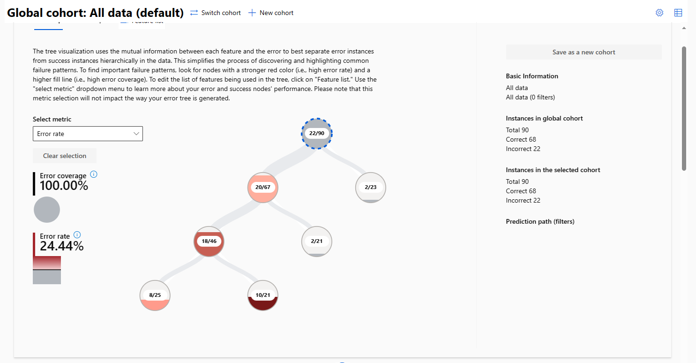 #whole tree

-   Explore nodes 
Look at the left node on the second level of left branch, with less than 1.5 negative words, 
and less than,17.5 positive words. 
This has a high error rate of 39.1%.  

This contrasts sharply with the right node, on the same level, with greater than 17.5 positive words. 
This node has an error rate of only 9.5%.  

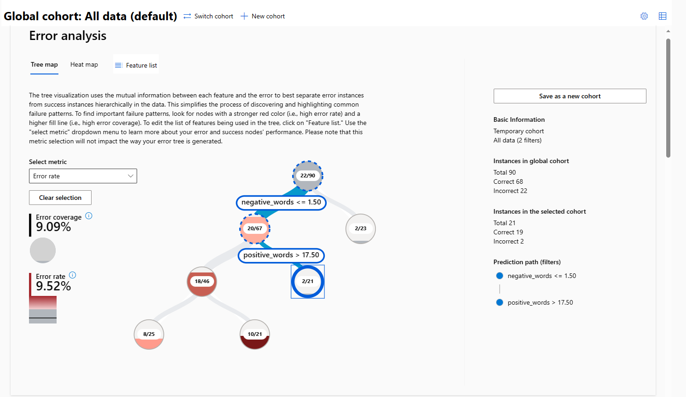

These two cohorts are two good options to save in order to explore further. 
Click on the more erroneous node again and choose the “Save as new cohort” button, at the upper-right corner of the tree map.

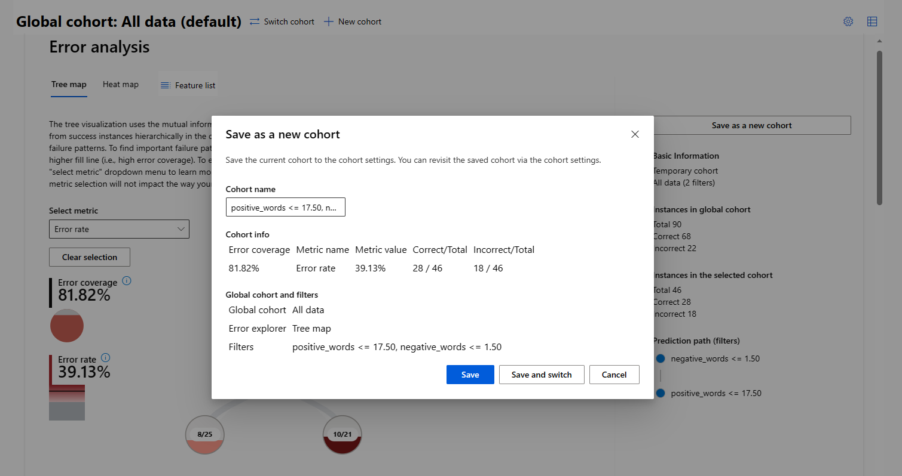

Do the same thing for the lower-right node. 
Here we name it, "positive_words > 17.50, negative_words <= 1.50"

**Top features leading to errors** – Click on the feature list icon at the top of the error analysis section. This will surface a list of features, ranked by their correlations to the model’s errors.

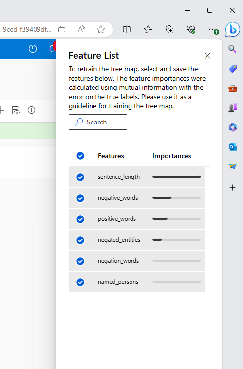

The **Heat map** can also be a very helpful tool to identify areas of lower performance. 
Click on the heat map tab, at the top of the Error analysis section.  

The heat map is useful for taking a closer look at certain groups, to explore different “slices” of the data. 
Select up to two features to see how errors are distributed across these groups. 
Find the heat map by selecting the “Heat map” tab, next to the “Feature list” tab shown above. 
For Feature 1, select "negative_words".
For Feature 2, select "positive_words". 
Make Binning threshold 8.  

Each cell of the heatmap represents a slice of the dataset, 
and the percentage of errors out of the total number of data points in that slice. 
Here we can see that the worst performance tends to happen when there is only one or two negative words. 
It is also interesting to note that accuracy suffers across the board when there are no negative words, 
while accuracy is very good when there are at least three negative words in the article. 

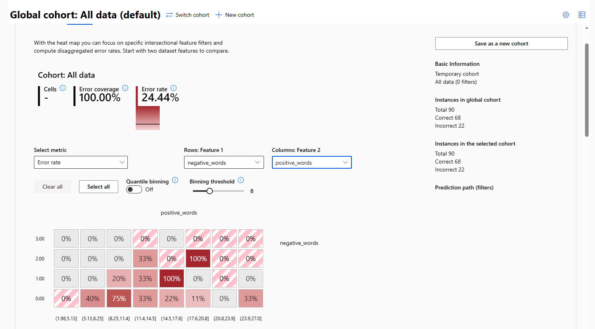

Next, hover over one of the squares. 
You will see Error Rate and Error Coverage. 
Now compare the error rates and error coverage values for different cells. 
You will see that error coverage is not consistent, 
even in cells with the same error rate. 
In this way, the RAI dashboard can help deepen your understanding of different slices of the data. 
And as we saw with error nodes on the tree map, 
you can select individual cells and save the data points as a custom cohort. 

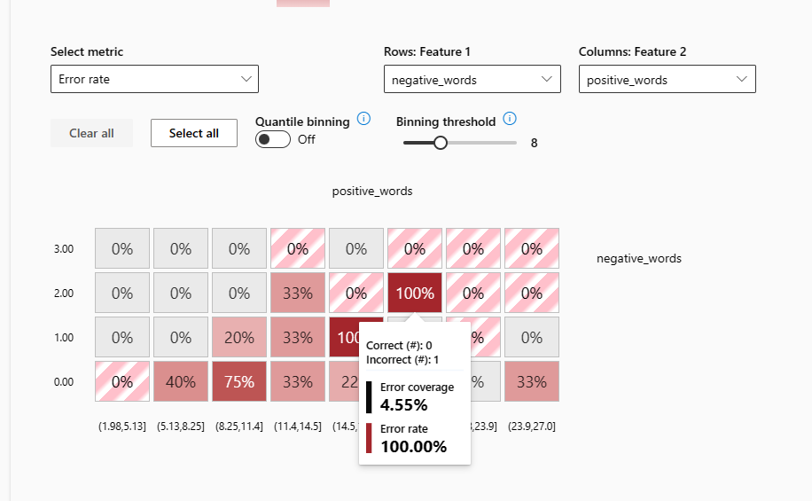 #error coverage 

## Model overview and performance analysis
In the Model overview section, we can look at all the data and compare individual cohorts. 
Each of the pre-built and custom cohorts defined above is included in this view. 
You will see the accuracy score for each cohorts. 

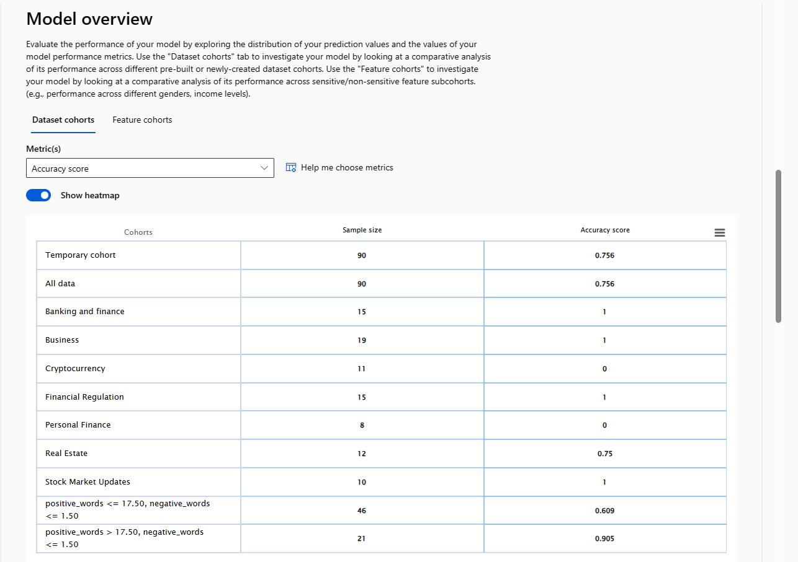 #Grid view

There are also several options for visualizing metrics, 
including a bar chart of accuracy scores and confusion matrix. These can be customized by different dimensions, such as cohort or metric.

**Accuracy for all cohorts**

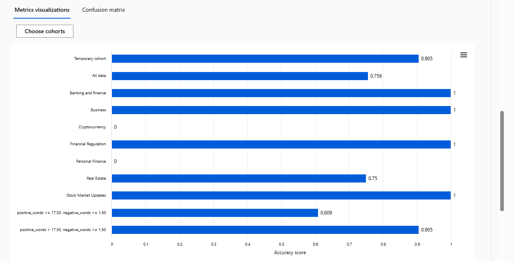  

**Confusion matrix** 

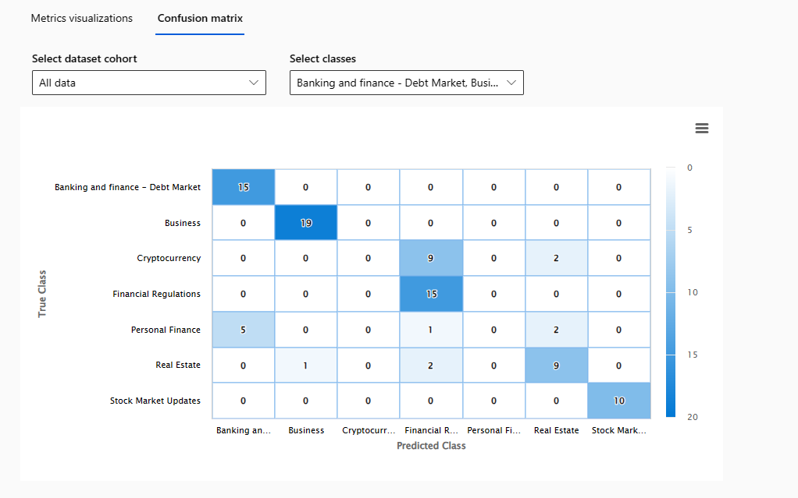 

Similar investigations can be performed using the visualization options presented below the metrics table. 
- Select the "Chart view" tab
- Click on the vertical axis and set the Feature to "positive_words"
- For the horizontal axis, set this value to "True Y" 
- In the "Select a dataset cohort to explore" drop-down, pick the more error prone cohort "positive_words <= 17.50, negative_words <= 1.50"

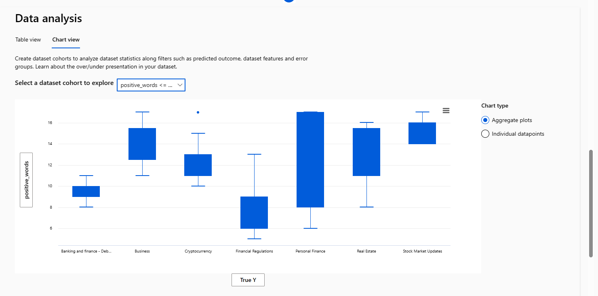 

Now switch the dataset cohort to "positive_words > 17.50, negative_words <= 1.50." 
You will see that only 4 categories have articles that fit these criteria.  

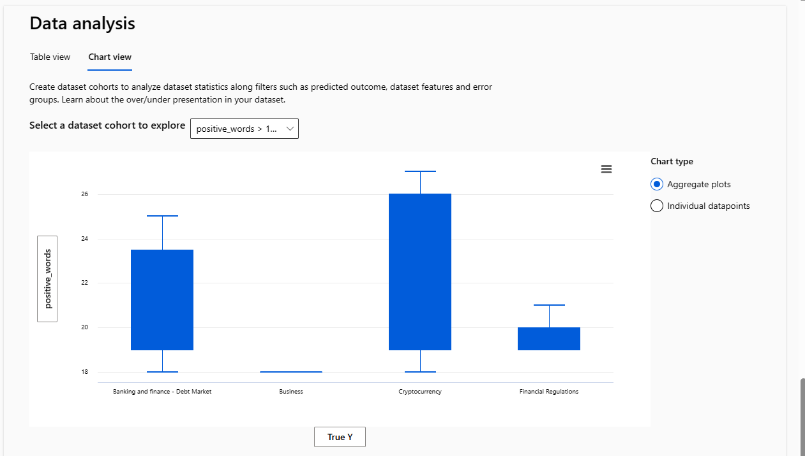 

## Fairness and bias
Does this model consistently classify news articles from across the different news categories? 
The RAI dashboard can help identify if different groups within your overall population are being impacted differently by model results. 
These can be cohorts you previously defined or newly defined groups.  

**Configure the Feature Analysis tool** -- At the top of the Model overview section, select the Feature cohort option. 
This component also allows you look more closely at how the  model performs with respect to certain features. 
Use the Feature(s) drop-down to select positive_words. 

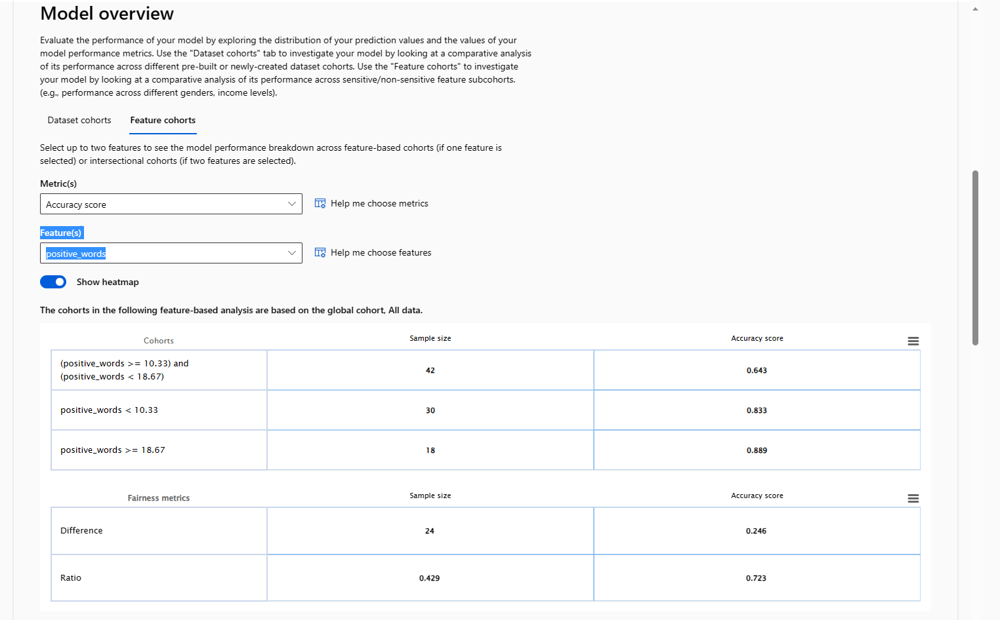

Here you will see that there are differences in performance, depending on the number of positive words in the article. 
Articles with the most positive words, greater than 18.7, have the highest accuracy. 

## Data analysis
Next, we come to the data analysis section. 
This tool allows you to look at the data behind the cohorts 
and can often give you clues as to why some groups are more error-prone than others. 
This information allows you to not just identify where are the blind spots, 
but also understand why. 
For example, your training data may have only a handful of observations for the error-prone cohort.

Start by selecting "Chart view," then:
- Select your cohort
- Select the y-axis and change it to "negative_words"
- Select the x-axis and change it to "True Y" data  

This will allow us to explore the "ground truth" data from the cohort.

Here we see that most categories contain articles with very few negative words. 
In fact, articles about Personal Finance and Real Estate almost always have no negative words, 
and the few that do can be considered outliers. 

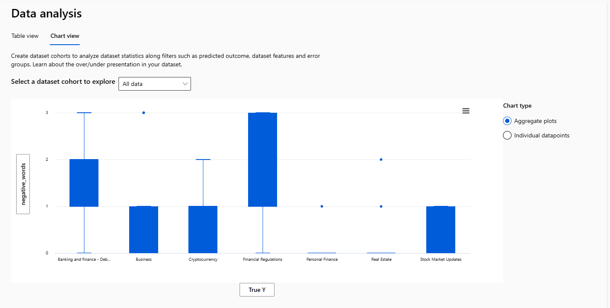

Finally, scroll down to the Feature importances section. 
This tool gives you information about what model inputs, in this case text words, 
are most important in determing the model output. 
- Adjust the slider at the top of the chart to show the "Top 10 feature by their importance" 

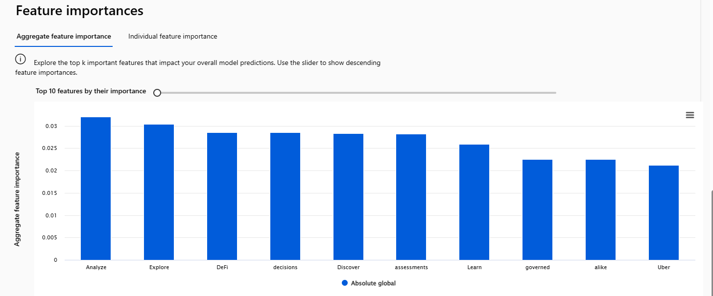

## Conclusion
The Responsible AI dashboard provides valuable tools to help you debug model performance and improve customer experience. 
In this example, we saw how RAI dashboard components provided valuable insight into text classification performance for a variety of business news articles.  
These tools can help you focus your model tuning efforts, 
to make your model development more efficient and your models are performant across a variety of scenarios. 

## Next steps
1) Complete the text classification demo using the Azure OpenAI service and compare your results
1) Make the RAI dashboard part of your regular ML Ops practice