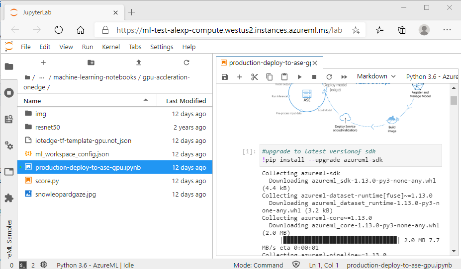

# Deploying model to Kubernetes

This section guides you through the steps needed to deploy a model for inferencing in GPU-enabled Kubernetes cluster.

## Prerequisites

1. Have a valid Microsoft Azure subscription
2. Be able to provision GPU-enabled VMs
3. Have access to VM image repository (DockerHub account, or ACR)
4. Be able to run `kubectl`, configured to your cluster
5. If you are using Edge device, you should be able to complete this step on AS Edge https://docs.microsoft.com/en-us/azure/databox-online/azure-stack-edge-j-series-deploy-stateless-application-kubernetes


Clone this repository somewhere so you can easily access the different source files:

    $ git clone https://github.com/Azure-Samples/azure-intelligent-edge-patterns.git

If you do not have a vm, you need to create one using Azure Portal or Azure CLI. We recommend selecting
'Data Science' images, because they have pre-installed drivers and GPU utilities.

If you already have a VM, you need to be able to validate you have access to GPUs.

You can see the hardware using `lspci`:

    $ lspci
    ...
    0001:00:00.0 3D controller: NVIDIA Corporation GK210GL [Tesla K80] (rev a1)
    ...

And you can use `nvidia-smi` utility to see the gpu driver and CUDA versions:    

    $ nvidia-smi
    Thu Sep 17 18:03:11 2020
    +-----------------------------------------------------------------------------+
    | NVIDIA-SMI 450.36.06    Driver Version: 450.36.06    CUDA Version: 11.0     |
    |-------------------------------+----------------------+----------------------+
    | GPU  Name        Persistence-M| Bus-Id        Disp.A | Volatile Uncorr. ECC |
    | Fan  Temp  Perf  Pwr:Usage/Cap|         Memory-Usage | GPU-Util  Compute M. |
    |                               |                      |               MIG M. |
    |===============================+======================+======================|
    |   0  Tesla K80           On   | 00000001:00:00.0 Off |                    0 |
    | N/A   57C    P0    59W / 149W |  10957MiB / 11441MiB |      0%      Default |
    |                               |                      |                  N/A |
    +-------------------------------+----------------------+----------------------+

    +-----------------------------------------------------------------------------+
    | Processes:                                                                  |
    |  GPU   GI   CI        PID   Type   Process name                  GPU Memory |
    |        ID   ID                                                   Usage      |
    |=============================================================================|
    |    0   N/A  N/A     19918      C   ...5b8c54360196ff/bin/python    10952MiB |
    +-----------------------------------------------------------------------------+

You also can check that your gpus are available from containers.

Please see [NVIDIA webpage](https://docs.nvidia.com/datacenter/kubernetes/kubernetes-upstream/index.html#kubernetes-run-a-workload) if you have any problems. You should see something like this, for example:

    $ sudo docker run --rm --runtime=nvidia nvidia/cuda nvidia-smi
    Unable to find image 'nvidia/cuda:latest' locally
    latest: Pulling from nvidia/cuda
    3ff22d22a855: Pull complete
    e7cb79d19722: Pull complete
    323d0d660b6a: Pull complete
    b7f616834fd0: Pull complete
    c2607e16e933: Pull complete
    46a16da628dc: Pull complete
    4871b8b75027: Pull complete
    e45235afa764: Pull complete
    250da266cf64: Pull complete
    78f4b6d02e6c: Pull complete
    ebf42dcedf4b: Pull complete
    Digest: sha256:0fe0406ec4e456ae682226751434bdd7e9b729a03067d795f9b34c978772b515
    Status: Downloaded newer image for nvidia/cuda:latest
    Thu Sep 17 17:06:27 2020
    +-----------------------------------------------------------------------------+
    | NVIDIA-SMI 418.87.01    Driver Version: 418.87.01    CUDA Version: 11.0     |
    |-------------------------------+----------------------+----------------------+
    | GPU  Name        Persistence-M| Bus-Id        Disp.A | Volatile Uncorr. ECC |
    | Fan  Temp  Perf  Pwr:Usage/Cap|         Memory-Usage | GPU-Util  Compute M. |
    |===============================+======================+======================|
    |   0  Tesla K80           On   | 0000DE85:00:00.0 Off |                    0 |
    | N/A   39C    P8    25W / 149W |      0MiB / 11441MiB |      0%      Default |
    +-------------------------------+----------------------+----------------------+

    +-----------------------------------------------------------------------------+
    | Processes:                                                       GPU Memory |
    |  GPU       PID   Type   Process name                             Usage      |
    |=============================================================================|
    |  No running processes found                                                 |
    +-----------------------------------------------------------------------------+

## Creating one-node Kubernetes cluster

To create a simple one-node Kubernetes cluster, you can use `snap` to install `microk8s`:

    $ sudo snap install microk8s --edge --classic

Add your current user to microk8s group:

    $ sudo usermod -a -G microk8s $USER
    $ sudo chown -f -R $USER ~/.kube

You will also need to re-enter the session for the group update to take place:

    $ su - $USER

Then start it:

    $ microk8s.start --wait-ready

You need to enable its components depending on the desired configuration, for example, dns and dashboard:

    $ microk8s.enable dns storage dashboard

The most important for us is the access to gpu

    $ microk8s.enable gpu

You will be able to see the nodes:

    $ microk8s.kubectl get nodes
    NAME                STATUS   ROLES    AGE   VERSION
    sandbox-dsvm-tor4   Ready    <none>   14h   v1.19.2-34+88df35f6de9eb1

And the gpu-support information in the description of the node:

    $ microk8s.kubectl describe node sandbox-dsvm-tor4
    Capacity:
    ...
    nvidia.com/gpu:     1
    ...
    Allocatable:
    ...
    nvidia.com/gpu:     1
    ...
    Namespace                   Name                                          CPU Requests  CPU Limits  Memory Requests  Memory Limits  AGE
    ---------                   ----                                          ------------  ----------  ---------------  -------------  ---
    ...
    kube-system                 nvidia-device-plugin-daemonset-hmzbl          0 (0%)        0 (0%)      0 (0%)           0 (0%)         14h
    ...
    Allocated resources:
    Resource           Requests    Limits
    --------           --------    ------
    ...
    nvidia.com/gpu     1           1
    ...

After we installed Kubernetes, you should also be able to run NVIDIA's examples,
https://github.com/NVIDIA/k8s-device-plugin, here is a [`gpu-pod`](https://github.com/NVIDIA/k8s-device-plugin/blob/examples/workloads/pod.yml)
example if ran successfully:

    $ git clone -b examples https://github.com/NVIDIA/k8s-device-plugin.git
    $ cd k8-device-plugin/workloads
    $ kubectl create -f pod.yml

    $ kubectl exec -it gpu-pod nvidia-smi
    +-----------------------------------------------------------------------------+
    | NVIDIA-SMI 384.125                Driver Version: 384.125                   |
    |-------------------------------+----------------------+----------------------+
    | GPU  Name        Persistence-M| Bus-Id        Disp.A | Volatile Uncorr. ECC |
    | Fan  Temp  Perf  Pwr:Usage/Cap|         Memory-Usage | GPU-Util  Compute M. |
    |===============================+======================+======================|
    |   0  Tesla V100-SXM2...  On   | 00000000:00:1E.0 Off |                    0 |
    | N/A   34C    P0    20W / 300W |     10MiB / 16152MiB |      0%      Default |
    +-------------------------------+----------------------+----------------------+

    +-----------------------------------------------------------------------------+
    | Processes:                                                       GPU Memory |
    |  GPU       PID   Type   Process name                             Usage      |
    |=============================================================================|
    |  No running processes found                                                 |
    +-----------------------------------------------------------------------------+

If it does not work, please check the instructions at Nvidia's examples page, https://github.com/NVIDIA/k8s-device-plugin/blob/examples/workloads/pod.yml

For generality, we will be using `kubectl` instead of `microk8s.kubectl`, and you are encouraged to alias it to a shortcut.

## Creating serialized model

We will be deploying a model that we created in Azure ML, using a notebook from [../../machine-learning-notebooks](../../machine-learning-notebooks).

If you want to create one yourself, update to your own account and run through
[machine-learning-notebooks/production-deploy-to-ase-gpu.ipyb](../../machine-learning-notebooks/production-deploy-to-ase-gpu.ipyb).

Here is how it would look in Azure ML, you will need to make sure you install `azureml-sdk`:

 


You will need your config file from Azure Machine Learing to be able to create new instances of `workspace`:


If your image is deployed not on a publicly-available image registry, you will need to login with your credentials. You can
retrieve your credentials from the notebook - through your workspace `ws.subscription_id`, and use 
`ContainerRegistryManagementClient`, see the similar cells in [machine-learning-notebooks/production-deploy-to-ase-gpu.ipyb](../../machine-learning-notebooks/production-deploy-to-ase-gpu.ipyb):

    ...
    imagename= "tfgpu"
    imagelabel="1.0"
    package = Model.package(ws, [model], inference_config=inference_config,image_name=imagename, image_label=imagelabel)
    package.wait_for_creation(show_output=True)
    client = ContainerRegistryManagementClient(ws._auth,subscription_id)
    result= client.registries.list_credentials(ws.resource_group, reg_name, custom_headers=None, raw=False)

    print("ACR:", package.get_container_registry)
    print("Image:", package.location)
    print("using username \"" + result.username + "\"")
    print("using password \"" + result.passwords[0].value + "\"")
    ...

It will print out the values(which you could also see at the Portal, in your Azure ML):

    ...
    ACR: 12345678901234567890.azurecr.io
    Image: 1234567dedede1234567ceeeee.azurecr.io/tfgpu:1.0
    using username: "9876543210abcdef"
    using password: "876543210987654321abcdef"
    ...

At the Kubernetes cluster where you want this image to be available, you can create a secret to use later to connect
to your ACR:

    $ kubectl create secret docker-registry secret4acr2infer --docker-server=<your-registry-server>\
        --docker-username=<your-name> --docker-password=<your-pword> --docker-email=<your-email>

Or, alternatively**(do not do this if you already created a secret using kubectl docker-registry secret)**,
you can create the secret by explicitly logging in to your container registry, and then export:

    $ docker login 12345678901234567890.azurecr.io
    Username: c6a1e081293c442e9465100e3021da63
    Password:
    Login Succeeded

This will record the authentication token in your `~/.docker/config.json`, and you will be able to
create a Kubernetes secret to use to access your private repository **(You do not need to do this if
you already created a secret using kubectl docker-registry secret)**:

    $ kubectl create secret generic secret4acr2infer \
        --from-file=.dockerconfigjson=/home/azureuser/.docker/config.json \
        --type=kubernetes.io/dockerconfigjson

For more information, please see [Pull an Image from a Private Registry](https://kubernetes.io/docs/tasks/configure-pod-container/pull-image-private-registry/)  


In the following steps we denote the image as `1234567dedede1234567ceeeee.azurecr.io/tfgpu:1.0`, you can tag your own image adhering to the naming conventions you like.

## Creating a Deployment on an Edge Device or another Kubernetes cluster

We provide the Deployment file, `deploy_infer.yaml`:

    apiVersion: apps/v1
    kind: Deployment
    metadata:
    name: my-infer
    labels:
        app: my-infer
    spec:
    replicas: 1
    selector:
        matchLabels:
        app: my-infer
    template:
        metadata:
        labels:
            app: my-infer
        spec:
        containers:
        - name: my-infer
            image: 1234567dedede1234567ceeeee.azurecr.io/tfgpu:1.0
            ports:
            # we use only 5001, but the container exposes  EXPOSE 5001 8883 8888
            - containerPort: 5001
            - containerPort: 8883
            - containerPort: 8888
            resources:
            limits:
                nvidia.com/gpu:  1
        imagePullSecrets:
        - name: secret4acr2infer

You would need to update the image source, from your own DockerHub accout or ACR you have access to.

You can deploy this Deployment like so:

    $ kubectl create -f deploy_infer.yaml

And you can see it instantiated, with pod creating, etc.:

    $ kubeclt get deployment
    NAME       READY   UP-TO-DATE   AVAILABLE   AGE
    my-infer   1/1     1            1           1m
 
## Creating a Service

You then can expose the deployment to have access to it via a Service:

    $ kubectl expose deployment my-infer --type=LoadBalancer --name=my-service-infer

You should see the Service, and if everything is ok, in a few minutes you will have an External IP address:

    $ kubectl get service
    NAME               TYPE           CLUSTER-IP       EXTERNAL-IP   PORT(S)                                        AGE
    ...
    my-service-infer   LoadBalancer   10.152.183.221   <pending>     5001:30372/TCP,8883:32004/TCP,8888:31221/TCP   1m
    ...

## Running inference

The way our inference server setup, we need to make an http POST request to it, to port 5001.
You are free to use the utility you like(curl, Postman, etc.), we provide a Python script to do it, and to 
convert the numbers into the labels this model(ResNet50) uses.

**IMPOTANT**: In the script you need to put the address of your own server, for example, the cluster-ip from the server we created earlier:

    import requests
    #downloading labels for imagenet that resnet model was trained on
    classes_entries = requests.get("https://raw.githubusercontent.com/Lasagne/Recipes/master/examples/resnet50/imagenet_classes.txt").text.splitlines()

    test_sample = open('snowleopardgaze.jpg', 'rb').read()
    print(f"test_sample size is {len(test_sample)}")

    try:
        #scoring_uri = 'http://<replace with yout edge device ip address>:5001/score'
        scoring_uri = 'http://10.152.183.221:5001/score'

        headers = {'Content-Type': 'application/json'}
        resp = requests.post(scoring_uri, test_sample, headers=headers)

        print("Found: " + classes_entries[int(resp.text.strip("[]")) - 1] )

    except KeyError as e:
        print(str(e))


Run it like so:

    $ python runtest_infer.py
    test_sample size is 62821
    Found: snow leopard, ounce, Panthera uncia

And, it should identify objects on your image. 

## (Optional) Running a notebook as a script

To run Jupyter notebooks you need an environment. Often having a simple Python script is simpler, although you
may use some UI convenience and you need to be aware of the side effects.
Here is a test run of the demo_notebook.ipynb we used for Jupyter server demo, that we exported into a Pyton file, `demo_notebook.py`:
 
```
azureuser@k8s-master-45338567-0:~/src/notebook$ python3 demo_notebook.py
2020-09-28 16:53:26.378225: W tensorflow/stream_executor/platform/default/dso_loader.cc:59] Could not load dynamic library 'libcudart.so.10.1'; dlerror: libcudart.so.10.1: cannot open shared object file: No such file or directory
2020-09-28 16:53:26.378266: I tensorflow/stream_executor/cuda/cudart_stub.cc:29] Ignore above cudart dlerror if you do not have a GPU set up on your machine.
Downloading data from https://storage.googleapis.com/tensorflow/tf-keras-datasets/mnist.npz
11493376/11490434 [==============================] - 0s 0us/step
2020-09-28 16:53:31.831014: W tensorflow/stream_executor/platform/default/dso_loader.cc:59] Could not load dynamic library 'libcuda.so.1'; dlerror: libcuda.so.1: cannot open shared object file: No such file or directory
2020-09-28 16:53:31.831054: W tensorflow/stream_executor/cuda/cuda_driver.cc:312] failed call to cuInit: UNKNOWN ERROR (303)
2020-09-28 16:53:31.831166: I tensorflow/stream_executor/cuda/cuda_diagnostics.cc:156] kernel driver does not appear to be running on this host (k8s-master-45338567-0): /proc/driver/nvidia/version does not exist
2020-09-28 16:53:31.831468: I tensorflow/core/platform/cpu_feature_guard.cc:142] This TensorFlow binary is optimized with oneAPI Deep Neural Network Library (oneDNN)to use the following CPU instructions in performance-critical operations:  AVX2 AVX512F FMA
To enable them in other operations, rebuild TensorFlow with the appropriate compiler flags.
2020-09-28 16:53:31.852320: I tensorflow/core/platform/profile_utils/cpu_utils.cc:104] CPU Frequency: 2593905000 Hz
2020-09-28 16:53:31.852512: I tensorflow/compiler/xla/service/service.cc:168] XLA service 0x487da70 initialized for platform Host (this does not guarantee that XLA will be used). Devices:
2020-09-28 16:53:31.852586: I tensorflow/compiler/xla/service/service.cc:176]   StreamExecutor device (0): Host, Default Version
2020-09-28 16:53:33.116834: W tensorflow/core/framework/cpu_allocator_impl.cc:81] Allocation of 188160000 exceeds 10% of free system memory.
Epoch 1/5
1875/1875 [==============================] - 6s 3ms/step - accuracy: 0.9348 - loss: 0.2199
Epoch 2/5
1875/1875 [==============================] - 6s 3ms/step - accuracy: 0.9711 - loss: 0.0959
Epoch 3/5
1875/1875 [==============================] - 5s 3ms/step - accuracy: 0.9783 - loss: 0.0695
Epoch 4/5
1875/1875 [==============================] - 6s 3ms/step - accuracy: 0.9832 - loss: 0.0532
Epoch 5/5
1875/1875 [==============================] - 6s 3ms/step - accuracy: 0.9855 - loss: 0.0443
313/313 [==============================] - 0s 1ms/step - accuracy: 0.9808 - loss: 0.0674
```

You can export and run your deployment notebook similarly.

Contact your Azure administrator for the credentials and addresses of your ACR and other network information. 


## Links

- https://docs.nvidia.com/datacenter/kubernetes/kubernetes-upstream/index.html#kubernetes-run-a-workload - NVIDIA webpage.
- https://github.com/NVIDIA/k8s-device-plugin/blob/examples/workloads/pod.yml - NVIDIA example repository.
- https://docs.microsoft.com/en-us/azure/container-registry/container-registry-get-started-docker-cli - ACR information.
- https://kubernetes.io/docs/tasks/configure-pod-container/pull-image-private-registry/ - working with private repositories in Kubernetes
