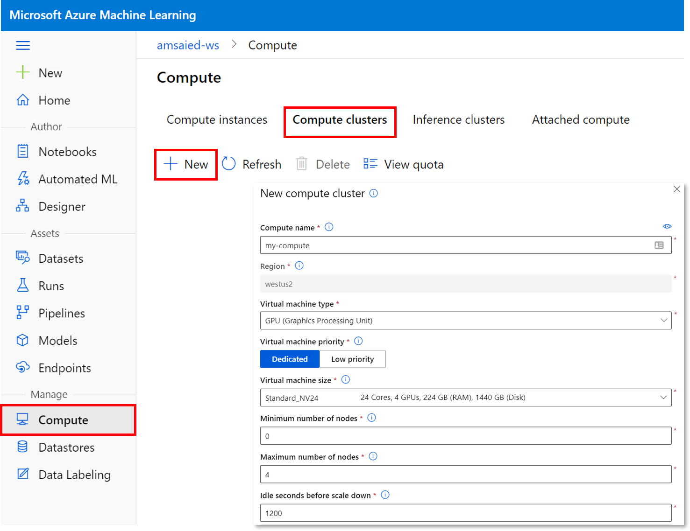
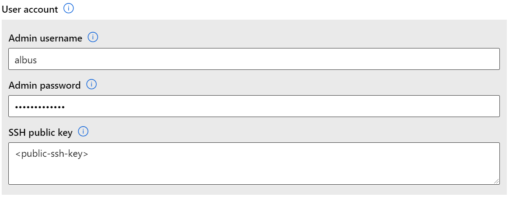

Compute targets are an AML abstraction around the concept of a compute resource.
This can range from your local machine to a cluster of Azure VMs.

### Get Compute Target

To get an existing compute target within a workspace `ws`:

```python
from azureml.core import ComputeTarget
target = ComputeTarget(ws, '<compute_target_name>')
```

### List Existing Compute Targets

To get a list of compute targets within a workspace `ws`

```python
ComputeTarget.list(ws): List[ComputeTarget]
```

### Check availabilty

A very common task - especially if you are sharing a workspace within a team - is
to check the compute resources available within a workspace `ws` prior to submitting
a job.

The easiest way to do this is via the [studio](https://ml.azure.com).


## Creating Compute Targets

The easiest way to create a new Compute Target is via the [studio](https://ml.azure.com)

Select the "Compute" menu > Select "Compute clusters" tab > Select the "+ New" button:



Complete the following info:

- **Compute name**: This will be used later to reference the compute. Name is required. Name must be between 2 to 16 characters. Valid characters are letters, digits, and the - character
- **Virtual Machine type**: Either CPU or GPU
- **Virtual Machine Priority**: Either "Dedicated" or "Low priority"> Low priority virtual machines are cheaper but don't guarantee the compute nodes. Your job may be pre-empted.
- **Virtual Machine Size**: Select from a drop down list. See the full list [here](https://azure.microsoft.com/global-infrastructure/services/?products=virtual-machines)
- **Min / Max number of nodes**: Compute will autoscale between the min and max node count depending on the number of jobs submitted. By setting min nodes = 0 the cluster will scale to 0 when there are no running jobs on the compute - saving you money.
- **Idle seconds before scale down**: Idle time before we scale down the cluster to the minimum node count.

Note: Machine Learning compute is always created in the same region as the Machine Learning service workspace.

### with SSH

Enable SSH access on your compute target by selecting the "Advanced" drop-down and entering the admin
username/password as well as providing the SSH key.



### Low Priority Compute Targets

Low priority compute targets are cheaper but don't guarantee the compute nodes. Your job may be pre-empted.


### via the SDK

To create a compute target in code with the SDK:

```python
from azureml.core import Workspace
from azureml.core.compute import ComputeTarget, AmlCompute
from azureml.core.compute_target import ComputeTargetException

ws = Workspace.from_config() # This automatically looks for a directory .azureml

# Choose a name for your CPU cluster
cpu_cluster_name = "cpu-cluster"

# Verify that the cluster does not exist already
try:
    cpu_cluster = ComputeTarget(workspace=ws, name=cpu_cluster_name)
    print('Found existing cluster, use it.')
except ComputeTargetException:
    compute_config = AmlCompute.provisioning_configuration(vm_size='STANDARD_D2_V2',
                                                           max_nodes=4, 
                                                           idle_seconds_before_scaledown=2400)
    cpu_cluster = ComputeTarget.create(ws, cpu_cluster_name, compute_config)

cpu_cluster.wait_for_completion(show_output=True)
```