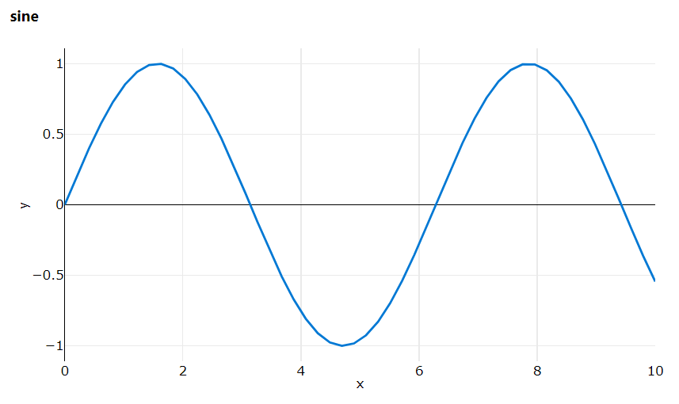

## Concepts

### Run

A run represents a single execution of your code.

Azure ML is a machine-learning service that facilitates running your code in
the cloud. A `Run` is an abstraction layer around each such submission, and is used to
monitor the job in real time as well as keep a history of your results.

### Experiments

An experiment is a light-weight container for `Run`. Use experiments to submit
and track runs.

Create an experiment in your workspace `ws`.

```python
from azureml.core import Experiment
exp = Experiment(ws, '<experiment-name>')
```

## Create Run

### Via ScriptRunConfig

Usually a run is created by submitting a ScriptRunConfig.

```python
from azureml.core import Workspace, Experiment, ScriptRunConfig
ws = Workspace.from_config()
exp = Experiment(ws, '<experiment-name>')

config = ScriptRunConfig(source_directory=<'<path/to/script>'>, script='train.py', ...)
run = exp.submit(config)
```

For more details: [ScriptRunConfig](script-run-config)

### Get Context

Code that is running within Azure ML is associated to a `Run`. The submitted code
can access its own run.

```py
from azureml.core import Run
run = Run.get_context()
```

#### Example: Logging metrics to current run context

A common use-case is logging metrics in a training script.

```py title="train.py"
from azureml.core import Run

run = Run.get_context()

# training code
for epoch in range(n_epochs):
    model.train()
    ...
    val = model.evaluate()
    run.log('validation', val)
```

When this code is submitted to Azure ML (e.g. via ScriptRunConfig) it will log metrics to its assocaited run.

For more details: [Logging Metrics](logging)

### Interactive

In an interactive setting e.g. a Jupyter notebook

```python
run = exp.start_logging()
```

#### Example: Jupyter notebook

A common use case for interacive logging is to train a model in a notebook.

```py
from azureml.core import Workspace
from azureml.core import Experiment
ws = Workspace.from_config()
exp = Experiment(ws, 'example')

run = exp.start_logging()                   # start interactive run
print(run.get_portal_url())                 # get link to studio

# toy example in place of e.g. model
# training or exploratory data analysis
import numpy as np
for x in np.linspace(0, 10):
    y = np.sin(x)
    run.log_row('sine', x=x, y=y)           # log metrics

run.complete()                              # stop interactive run
```

Follow the link to the run to see the metric logging in real time.

